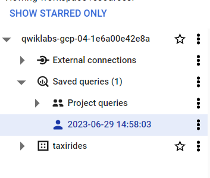

# <https§§§www.cloudskillsboost.google§course_sessions§3751705§labs§383347>

> [https://www.cloudskillsboost.google/course_sessions/3751705/labs/383347](https://www.cloudskillsboost.google/course_sessions/3751705/labs/383347)

# Creating a Streaming Data Pipeline for a Real-Time Dashboard with Dataflow


## Task 1. Source a pre-created Pub/Sub topic and create a BigQuery dataset

### Option 1: The command-line tool

```bash
# create dataset
bq --location=us-west1 mk taxirides

#create table
bq --location=us-west1 mk \
--time_partitioning_field timestamp \
--schema ride_id:string,point_idx:integer,latitude:float,longitude:float,\
timestamp:timestamp,meter_reading:float,meter_increment:float,ride_status:string,\
passenger_count:integer -t taxirides.realtime
```


## Task 2. Create a Cloud Storage bucket


## Task 3. Set up a Dataflow Pipeline

### Restart the connection to the Dataflow API.


### Create a new streaming pipeline:


`projects/<myprojectid>/topics/taxirides-realtime`


```bash
# dataflow run job equivalent
gcloud dataflow jobs run streaming-taxi-pipeline --gcs-location gs://dataflow-templates-us-central1/latest/PubSub_to_BigQuery --region us-central1 --max-workers 2 --num-workers 1 --staging-location gs://qwiklabs-gcp-04-1e6a00e42e8a/tmp/ --parameters inputTopic=projects/qwiklabs-gcp-04-1e6a00e42e8a/topics/taxirides-realtime,outputTableSpec=qwiklabs-gcp-04-1e6a00e42e8a:taxirides.realtime
```

 

## Task 4. Analyze the taxi data using BigQuery

```sql
SELECT * FROM taxirides.realtime LIMIT 10
```

## Task 5. Perform aggregations on the stream for reporting

> In this task, you calculate aggregations on the stream for reporting.

```sql
WITH streaming_data AS (
SELECT
  timestamp,
  TIMESTAMP_TRUNC(timestamp, HOUR, 'UTC') AS hour,
  TIMESTAMP_TRUNC(timestamp, MINUTE, 'UTC') AS minute,
  TIMESTAMP_TRUNC(timestamp, SECOND, 'UTC') AS second,
  ride_id,
  latitude,
  longitude,
  meter_reading,
  ride_status,
  passenger_count
FROM
  taxirides.realtime
ORDER BY timestamp DESC
LIMIT 1000
)
# calculate aggregations on stream for reporting:
SELECT
 ROW_NUMBER() OVER() AS dashboard_sort,
 minute,
 COUNT(DISTINCT ride_id) AS total_rides,
 SUM(meter_reading) AS total_revenue,
 SUM(passenger_count) AS total_passengers
FROM streaming_data
GROUP BY minute, timestamp
```




## Task 6. Stop the Dataflow Job

Click  **Stop** , and then select  **Cancel > Stop Job**

## Task 7. Create a real-time dashboard

```
In BigQuery, click  **Explore Data > Explore with Looker Studio** .
```

## Task 8. Create a time series dashboard

```sql
SELECT
  *
FROM
  taxirides.realtime
WHERE
  ride_status='dropoff'
```

tips https://www.youtube.com/watch?v=OQV1skKQ_Lk


