# <https§§§www.cloudskillsboost.google§course_sessions§3751705§labs§383359>

> [https://www.cloudskillsboost.google/course_sessions/3751705/labs/383359](https://www.cloudskillsboost.google/course_sessions/3751705/labs/383359)

# Predicting Visitor Purchases with a Classification Model with BigQuery ML

## Overview

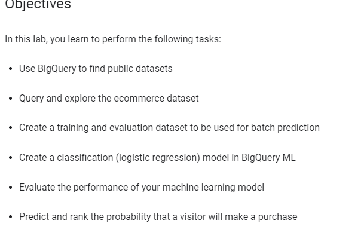

https://console.cloud.google.com/bigquery?p=data-to-insights&d=ecommerce&t=web_analytics&page=table

## Task 1. Explore ecommerce data

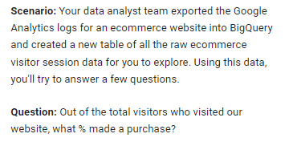

data-to-insights.ecommerce.web_analytics

```
#standardSQL
WITH visitors AS(
SELECT
COUNT(DISTINCT fullVisitorId) AS total_visitors
FROM `data-to-insights.ecommerce.web_analytics`
),
purchasers AS(
SELECT
COUNT(DISTINCT fullVisitorId) AS total_purchasers
FROM `data-to-insights.ecommerce.web_analytics`
WHERE totals.transactions IS NOT NULL
)
SELECT
  total_visitors,
  total_purchasers,
  total_purchasers / total_visitors AS conversion_rate
FROM visitors, purchasers
```

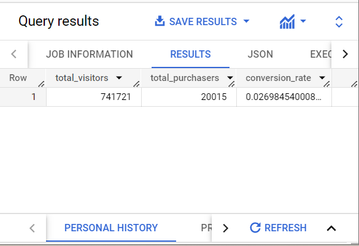


```
SELECT
  p.v2ProductName,
  p.v2ProductCategory,
  SUM(p.productQuantity) AS units_sold,
  ROUND(SUM(p.localProductRevenue/1000000),2) AS revenue
FROM `data-to-insights.ecommerce.web_analytics`,
UNNEST(hits) AS h,
UNNEST(h.product) AS p
GROUP BY 1, 2
ORDER BY revenue DESC
LIMIT 5;
```

```csv
v2ProductName,v2ProductCategory,units_sold,revenue
Nest® Learning Thermostat 3rd Gen-USA - Stainless Steel,Nest-USA,17651,870976.95
Nest® Cam Outdoor Security Camera - USA,Nest-USA,16930,684034.55
Nest® Cam Indoor Security Camera - USA,Nest-USA,14155,548104.47
Nest® Protect Smoke + CO White Wired Alarm-USA,Nest-USA,6394,178937.6
Nest® Protect Smoke + CO White Battery Alarm-USA,Nest-USA,6340,178572.4
```

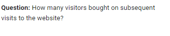

```
# visitors who bought on a return visit (could have bought on first as well
WITH all_visitor_stats AS (
SELECT
  fullvisitorid, # 741,721 unique visitors
  IF(COUNTIF(totals.transactions > 0 AND totals.newVisits IS NULL) > 0, 1, 0) AS will_buy_on_return_visit
  FROM `data-to-insights.ecommerce.web_analytics`
  GROUP BY fullvisitorid
)
SELECT
  COUNT(DISTINCT fullvisitorid) AS total_visitors,
  will_buy_on_return_visit
FROM all_visitor_stats
GROUP BY will_buy_on_return_visit
```

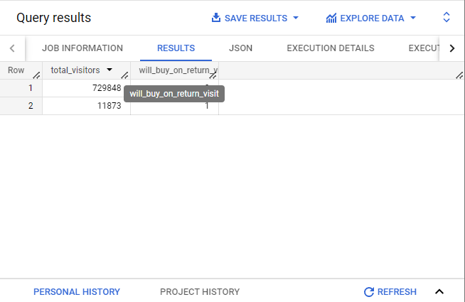

0 and 1

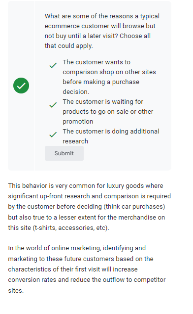

## Task 2. Select features and create your training dataset

Now you will create a Machine Learning model in BigQuery to predict whether or not a new user is likely to purchase in the future. Identifying these high-value users can help your marketing team target them with special promotions and ad campaigns to ensure a conversion while they comparison shop between visits to your ecommerce site.

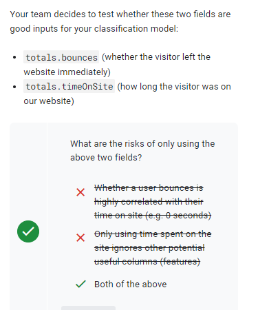

> Machine learning is only as good as the training data that is fed into it.

While training a model on just these two fields is a start, you will see if they're good enough to produce an accurate model.

```sql
SELECT
  * EXCEPT(fullVisitorId)
FROM
  # features
  (SELECT
    fullVisitorId,
    IFNULL(totals.bounces, 0) AS bounces,
    IFNULL(totals.timeOnSite, 0) AS time_on_site
  FROM
    `data-to-insights.ecommerce.web_analytics`
  WHERE
    totals.newVisits = 1)
  JOIN
  (SELECT
    fullvisitorid,
    IF(COUNTIF(totals.transactions > 0 AND totals.newVisits IS NULL) > 0, 1, 0) AS will_buy_on_return_visit
  FROM
      `data-to-insights.ecommerce.web_analytics`
  GROUP BY fullvisitorid)
  USING (fullVisitorId)
ORDER BY time_on_site DESC
LIMIT 10;
```

 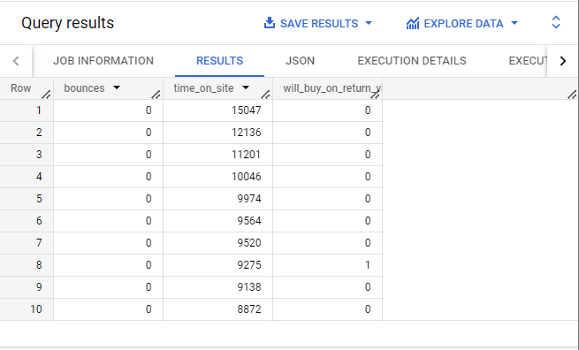

The features are bounces and time_on_site. The label is will_buy_on_return_visit


 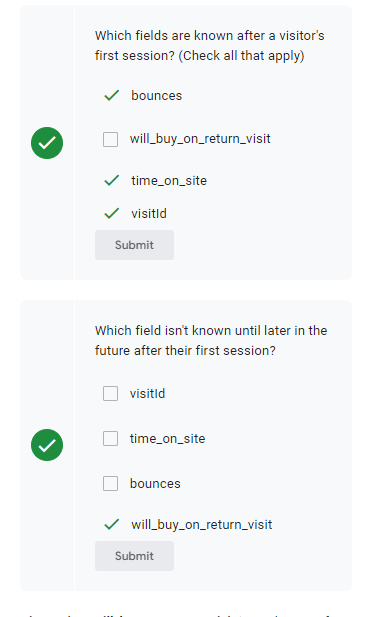

 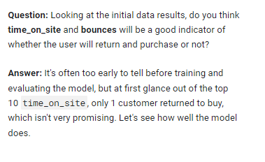


## Task 3. Create a BigQuery dataset to store models

 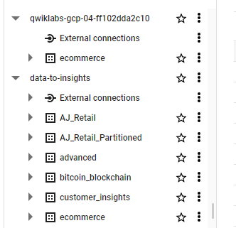


## Task 4. Select a BigQuery ML model type and specify options


 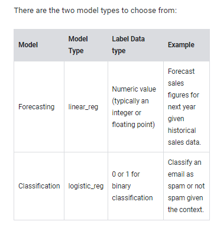

 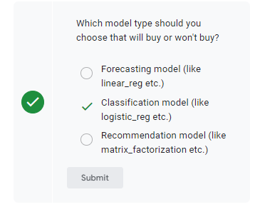


```sql
CREATE OR REPLACE MODEL `ecommerce.classification_model`
OPTIONS
(
model_type='logistic_reg',
labels = ['will_buy_on_return_visit']
)
AS
#standardSQL
SELECT
  * EXCEPT(fullVisitorId)
FROM
  # features
  (SELECT
    fullVisitorId,
    IFNULL(totals.bounces, 0) AS bounces,
    IFNULL(totals.timeOnSite, 0) AS time_on_site
  FROM
    `data-to-insights.ecommerce.web_analytics`
  WHERE
    totals.newVisits = 1
    AND date BETWEEN '20160801' AND '20170430') # train on first 9 months
  JOIN
  (SELECT
    fullvisitorid,
    IF(COUNTIF(totals.transactions > 0 AND totals.newVisits IS NULL) > 0, 1, 0) AS will_buy_on_return_visit
  FROM
      `data-to-insights.ecommerce.web_analytics`
  GROUP BY fullvisitorid)
  USING (fullVisitorId)
;
```

 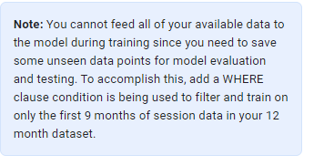

go to model

 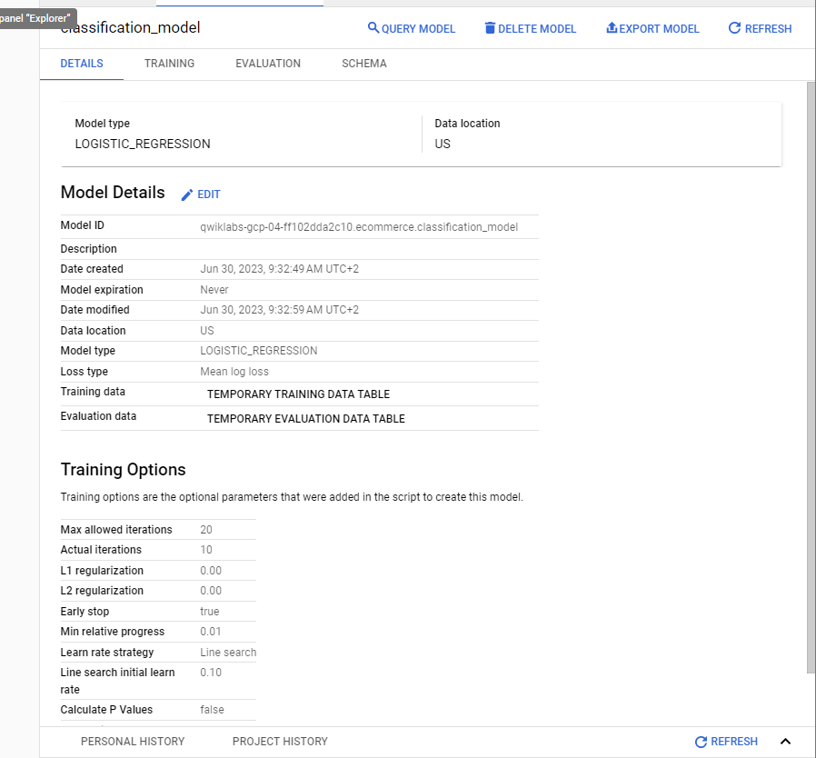

## Task 5. Evaluate classification model performance

 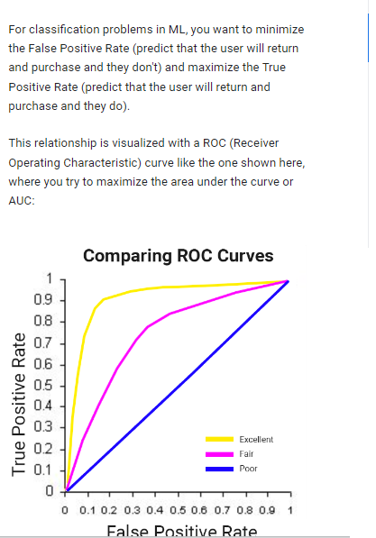


In BigQuery ML, **roc_auc** is simply a queryable field when evaluating your trained ML model.

```sql
SELECT
  roc_auc,
  CASE
    WHEN roc_auc > .9 THEN 'good'
    WHEN roc_auc > .8 THEN 'fair'
    WHEN roc_auc > .7 THEN 'not great'
  ELSE 'poor' END AS model_quality
FROM
  ML.EVALUATE(MODEL ecommerce.classification_model,  (
SELECT
  * EXCEPT(fullVisitorId)
FROM
  # features
  (SELECT
    fullVisitorId,
    IFNULL(totals.bounces, 0) AS bounces,
    IFNULL(totals.timeOnSite, 0) AS time_on_site
  FROM
    `data-to-insights.ecommerce.web_analytics`
  WHERE
    totals.newVisits = 1
    AND date BETWEEN '20170501' AND '20170630') # eval on 2 months
  JOIN
  (SELECT
    fullvisitorid,
    IF(COUNTIF(totals.transactions > 0 AND totals.newVisits IS NULL) > 0, 1, 0) AS will_buy_on_return_visit
  FROM
      `data-to-insights.ecommerce.web_analytics`
  GROUP BY fullvisitorid)
  USING (fullVisitorId)
));
```

 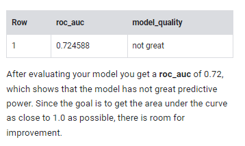


## Task 6. Improve model performance with feature engineering

 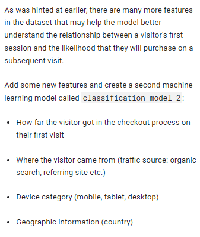

```sql
CREATE OR REPLACE MODEL `ecommerce.classification_model_2`
OPTIONS
  (model_type='logistic_reg', labels = ['will_buy_on_return_visit']) AS
WITH all_visitor_stats AS (
SELECT
  fullvisitorid,
  IF(COUNTIF(totals.transactions > 0 AND totals.newVisits IS NULL) > 0, 1, 0) AS will_buy_on_return_visit
  FROM `data-to-insights.ecommerce.web_analytics`
  GROUP BY fullvisitorid
)
# add in new features
SELECT * EXCEPT(unique_session_id) FROM (
  SELECT
      CONCAT(fullvisitorid, CAST(visitId AS STRING)) AS unique_session_id,
      # labels
      will_buy_on_return_visit,
      MAX(CAST(h.eCommerceAction.action_type AS INT64)) AS latest_ecommerce_progress,
      # behavior on the site
      IFNULL(totals.bounces, 0) AS bounces,
      IFNULL(totals.timeOnSite, 0) AS time_on_site,
      totals.pageviews,
      # where the visitor came from
      trafficSource.source,
      trafficSource.medium,
      channelGrouping,
      # mobile or desktop
      device.deviceCategory,
      # geographic
      IFNULL(geoNetwork.country, "") AS country
  FROM `data-to-insights.ecommerce.web_analytics`,
     UNNEST(hits) AS h
    JOIN all_visitor_stats USING(fullvisitorid)
  WHERE 1=1
    # only predict for new visits
    AND totals.newVisits = 1
    AND date BETWEEN '20160801' AND '20170430' # train 9 months
  GROUP BY
  unique_session_id,
  will_buy_on_return_visit,
  bounces,
  time_on_site,
  totals.pageviews,
  trafficSource.source,
  trafficSource.medium,
  channelGrouping,
  device.deviceCategory,
  country
);
```

 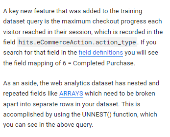


```sql
#standardSQL
SELECT
  roc_auc,
  CASE
    WHEN roc_auc > .9 THEN 'good'
    WHEN roc_auc > .8 THEN 'fair'
    WHEN roc_auc > .7 THEN 'not great'
  ELSE 'poor' END AS model_quality
FROM
  ML.EVALUATE(MODEL ecommerce.classification_model_2,  (
WITH all_visitor_stats AS (
SELECT
  fullvisitorid,
  IF(COUNTIF(totals.transactions > 0 AND totals.newVisits IS NULL) > 0, 1, 0) AS will_buy_on_return_visit
  FROM `data-to-insights.ecommerce.web_analytics`
  GROUP BY fullvisitorid
)
# add in new features
SELECT * EXCEPT(unique_session_id) FROM (
  SELECT
      CONCAT(fullvisitorid, CAST(visitId AS STRING)) AS unique_session_id,
      # labels
      will_buy_on_return_visit,
      MAX(CAST(h.eCommerceAction.action_type AS INT64)) AS latest_ecommerce_progress,
      # behavior on the site
      IFNULL(totals.bounces, 0) AS bounces,
      IFNULL(totals.timeOnSite, 0) AS time_on_site,
      totals.pageviews,
      # where the visitor came from
      trafficSource.source,
      trafficSource.medium,
      channelGrouping,
      # mobile or desktop
      device.deviceCategory,
      # geographic
      IFNULL(geoNetwork.country, "") AS country
  FROM `data-to-insights.ecommerce.web_analytics`,
     UNNEST(hits) AS h
    JOIN all_visitor_stats USING(fullvisitorid)
  WHERE 1=1
    # only predict for new visits
    AND totals.newVisits = 1
    AND date BETWEEN '20170501' AND '20170630' # eval 2 months
  GROUP BY
  unique_session_id,
  will_buy_on_return_visit,
  bounces,
  time_on_site,
  totals.pageviews,
  trafficSource.source,
  trafficSource.medium,
  channelGrouping,
  device.deviceCategory,
  country
)
));
```

 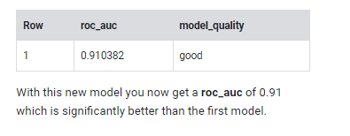


## Task 7. Predict which new visitors will come back and purchase


Next you will write a query to predict which new visitors will come back and make a purchase.

```sql
SELECT
*
FROM
  ml.PREDICT(MODEL `ecommerce.classification_model_2`,
   (
WITH all_visitor_stats AS (
SELECT
  fullvisitorid,
  IF(COUNTIF(totals.transactions > 0 AND totals.newVisits IS NULL) > 0, 1, 0) AS will_buy_on_return_visit
  FROM `data-to-insights.ecommerce.web_analytics`
  GROUP BY fullvisitorid
)
  SELECT
      CONCAT(fullvisitorid, '-',CAST(visitId AS STRING)) AS unique_session_id,
      # labels
      will_buy_on_return_visit,
      MAX(CAST(h.eCommerceAction.action_type AS INT64)) AS latest_ecommerce_progress,
      # behavior on the site
      IFNULL(totals.bounces, 0) AS bounces,
      IFNULL(totals.timeOnSite, 0) AS time_on_site,
      totals.pageviews,
      # where the visitor came from
      trafficSource.source,
      trafficSource.medium,
      channelGrouping,
      # mobile or desktop
      device.deviceCategory,
      # geographic
      IFNULL(geoNetwork.country, "") AS country
  FROM `data-to-insights.ecommerce.web_analytics`,
     UNNEST(hits) AS h
    JOIN all_visitor_stats USING(fullvisitorid)
  WHERE
    # only predict for new visits
    totals.newVisits = 1
    AND date BETWEEN '20170701' AND '20170801' # test 1 month
  GROUP BY
  unique_session_id,
  will_buy_on_return_visit,
  bounces,
  time_on_site,
  totals.pageviews,
  trafficSource.source,
  trafficSource.medium,
  channelGrouping,
  device.deviceCategory,
  country
)
)
ORDER BY
  predicted_will_buy_on_return_visit DESC;
```

 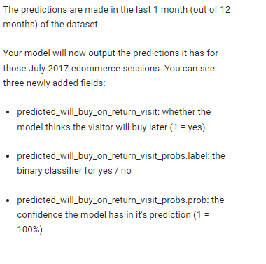

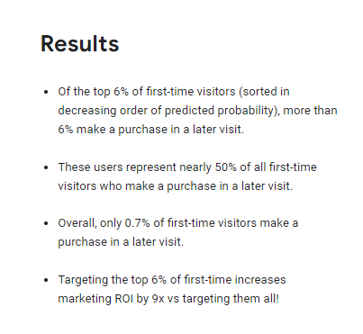

https://en.wikipedia.org/wiki/Precision_and_recall
