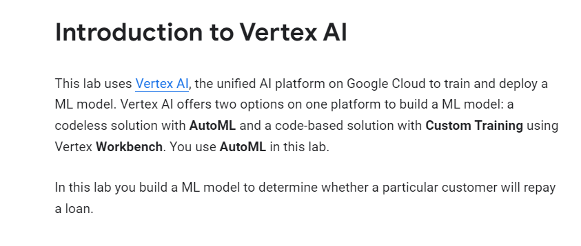
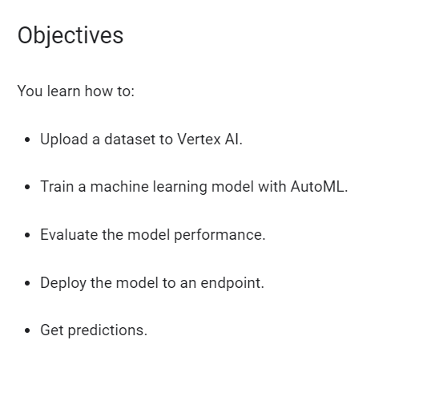
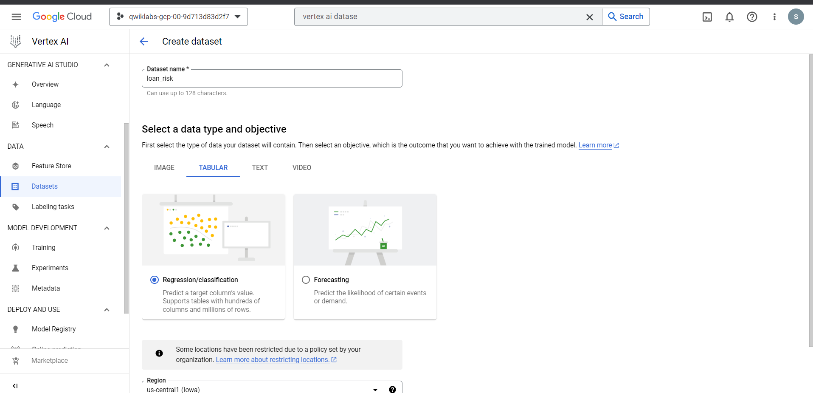
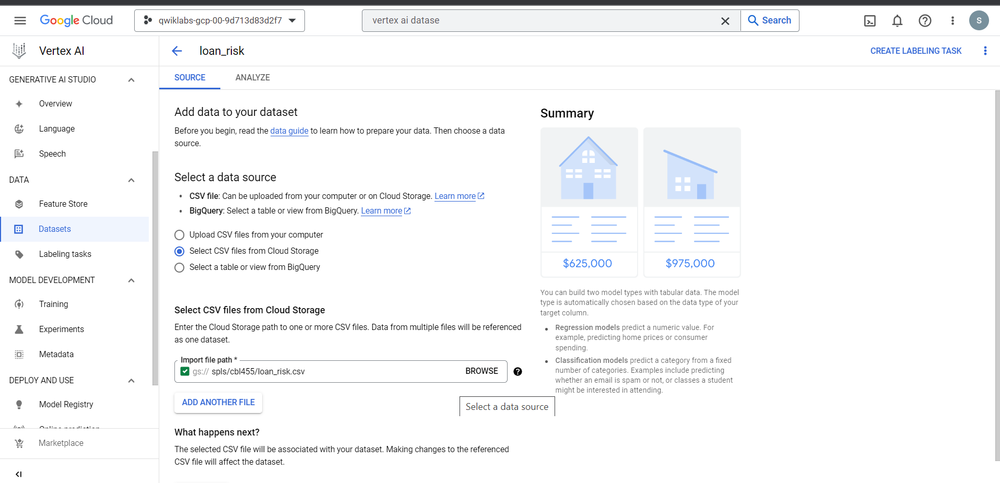
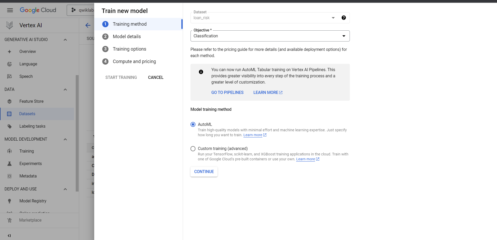
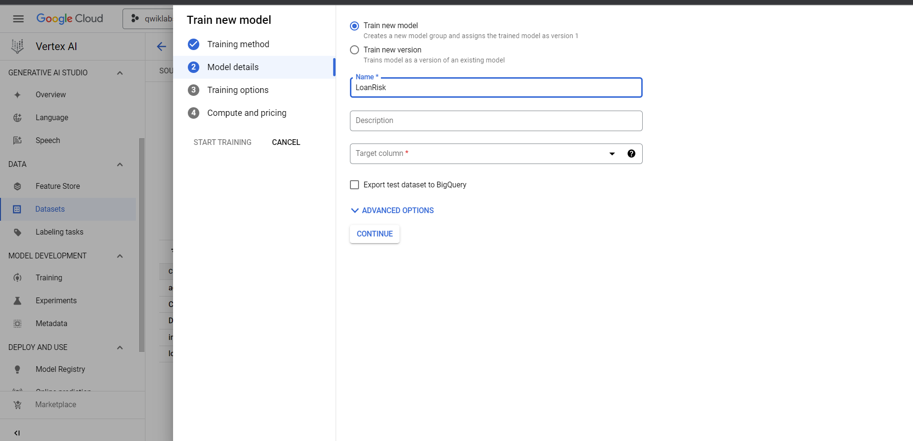
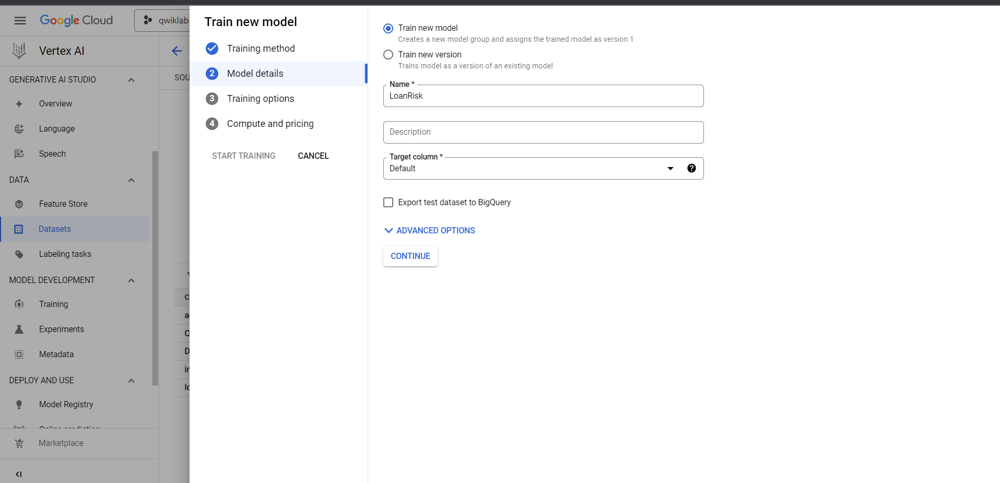
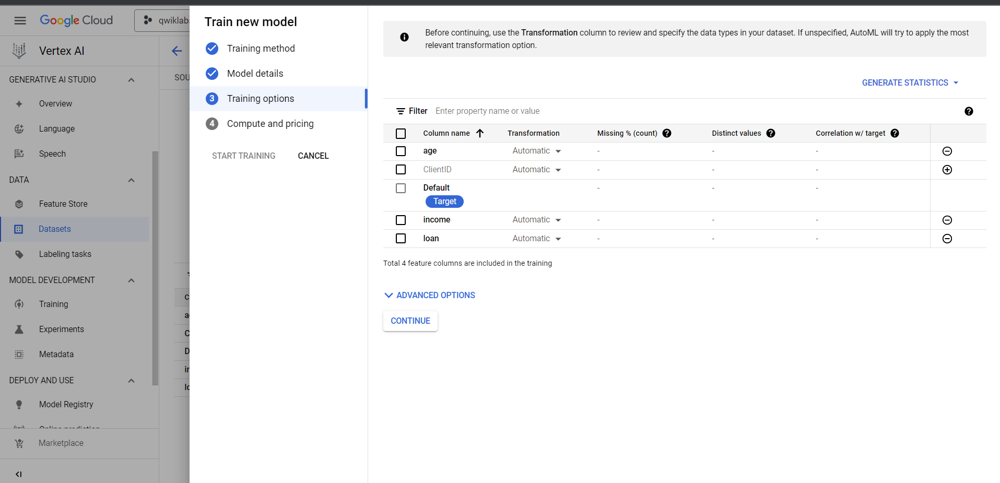
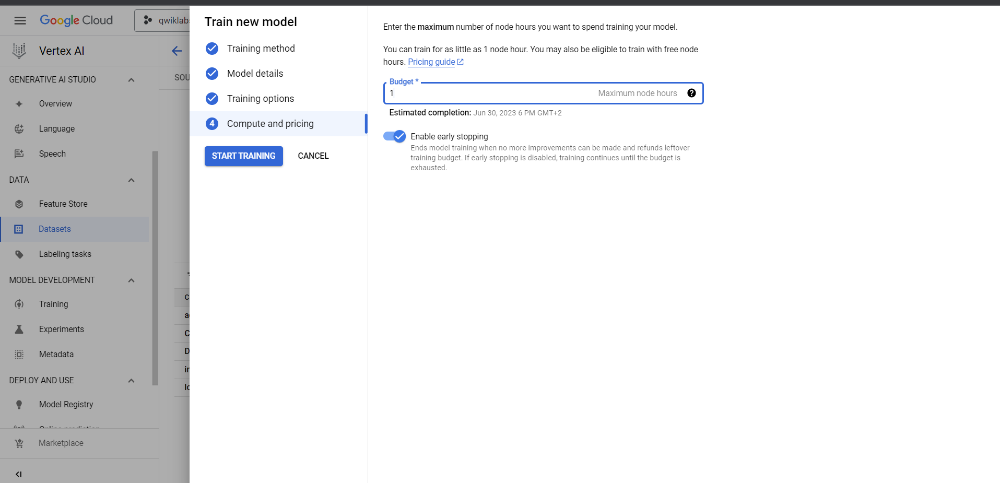
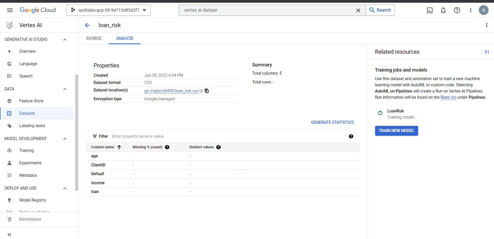

# <https§§§www.cloudskillsboost.google§course_sessions§3751705§labs§383379>

> [https://www.cloudskillsboost.google/course_sessions/3751705/labs/383379](https://www.cloudskillsboost.google/course_sessions/3751705/labs/383379)

# Vertex AI: Predicting Loan Risk with AutoML

 

## Task 1. Prepare the training data

 

 

## Task 2. Train your model

 

 

 

 

 

 

## Task 5. SML Bearer Token

1. Log in to [gsp-auth-kjyo252taq-uc.a.run.app](https://gsp-auth-kjyo252taq-uc.a.run.app/).
2. When logging in, use your student email address and password.
