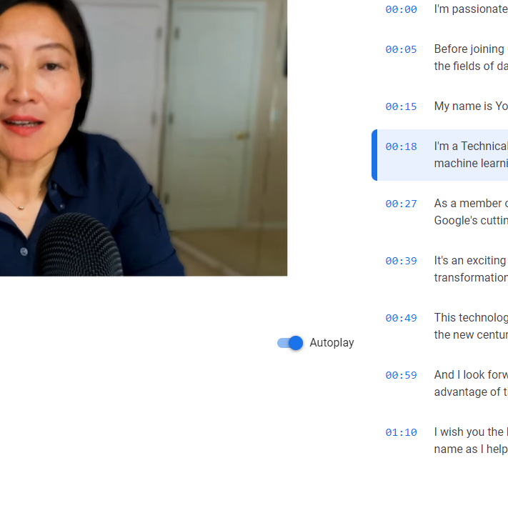
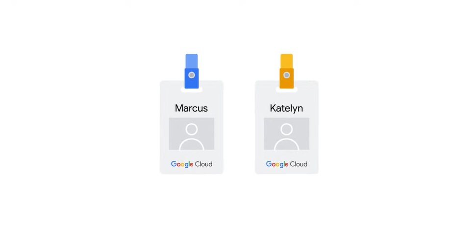
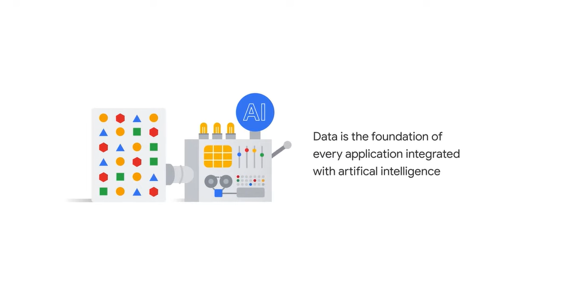
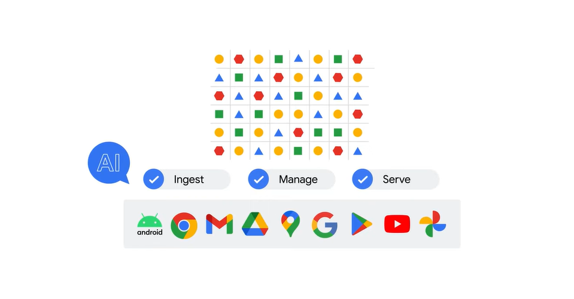
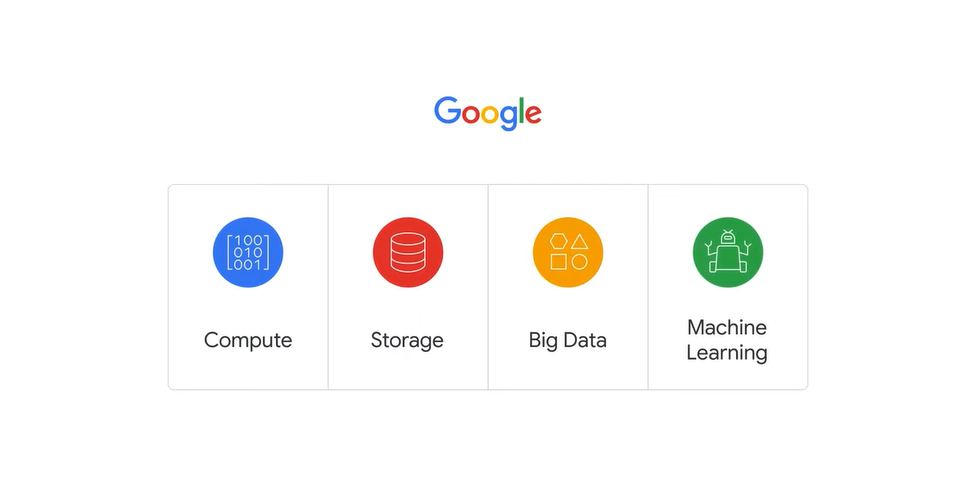
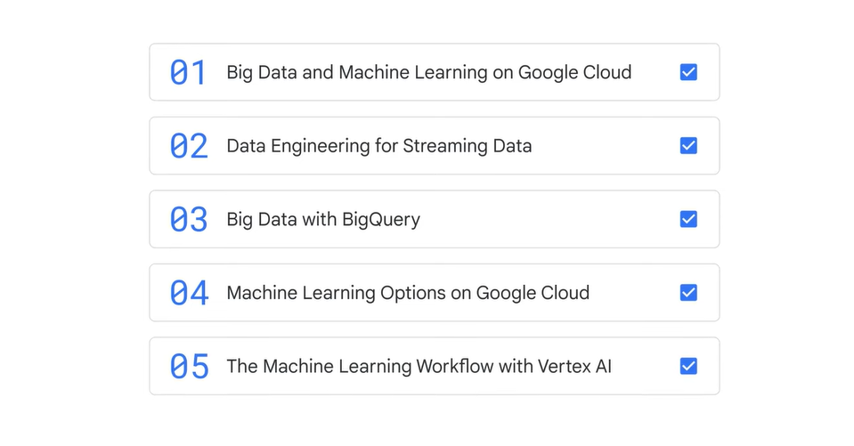
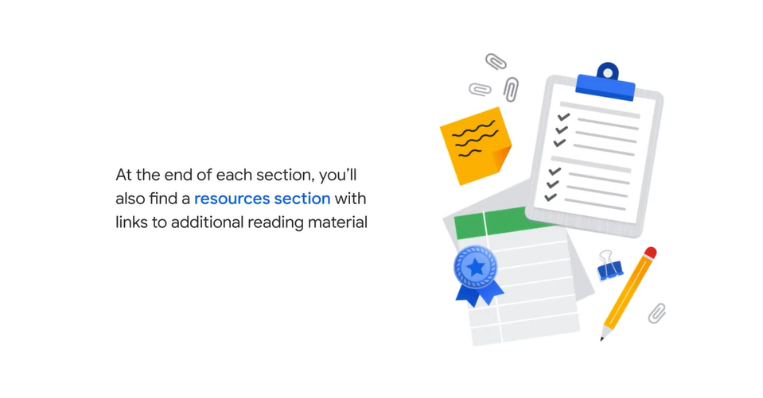
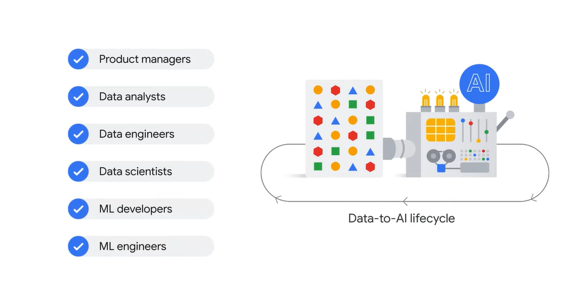
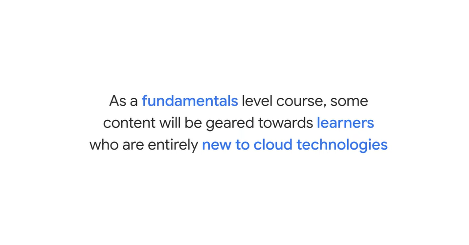
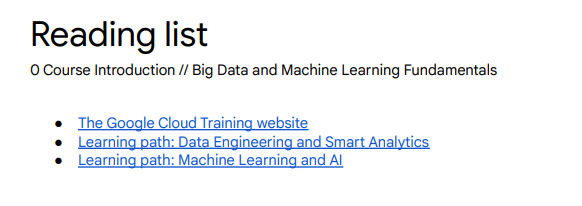

# <https§§§www.cloudskillsboost.google§course_sessions§3751705§video§383324>

> [https://www.cloudskillsboost.google/course_sessions/3751705/video/383324](https://www.cloudskillsboost.google/course_sessions/3751705/video/383324)

# Meet the author

As a member of the Google Cloud team, my goal is to make education on Google's cutting edge technology available to as many learners as possible.

# Course introduction

offering:

in this course

at the end

course for:

> this is a fundamental course
> 

# Reading list

 

[https://cloud.google.com/learn/training?hl=en#learning-paths](https§§§cloud.google.com§learn§training§hl=en#learning-paths/readme.md)

[https://cloud.google.com/learn/training/data-engineering-and-analytics](https§§§cloud.google.com§learn§training§data-engineering-and-analytics/readme.md)

[https://cloud.google.com/learn/training/machinelearning-ai](https§§§cloud.google.com§learn§training§machinelearning-ai/readme.md)
