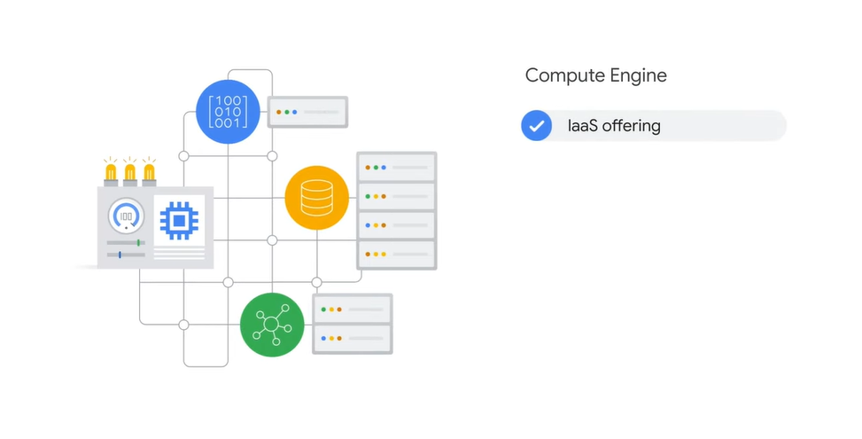
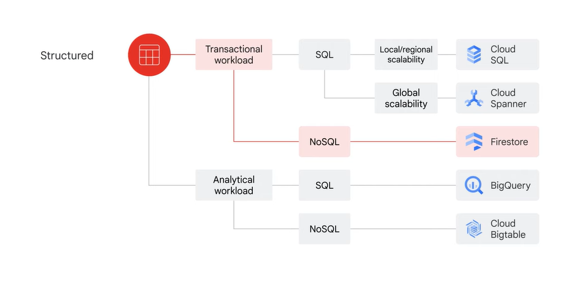
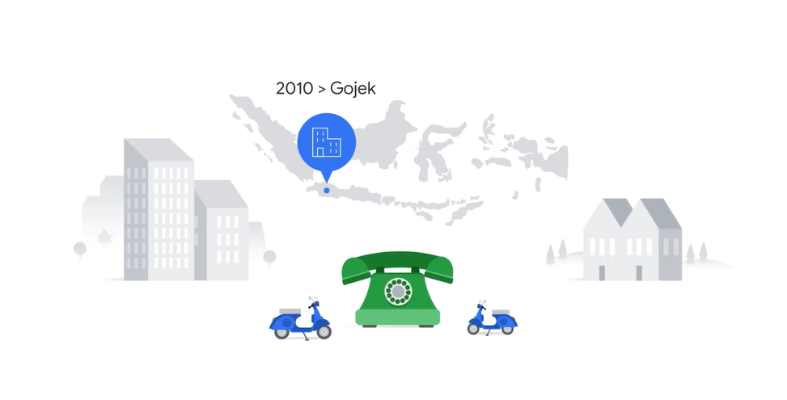
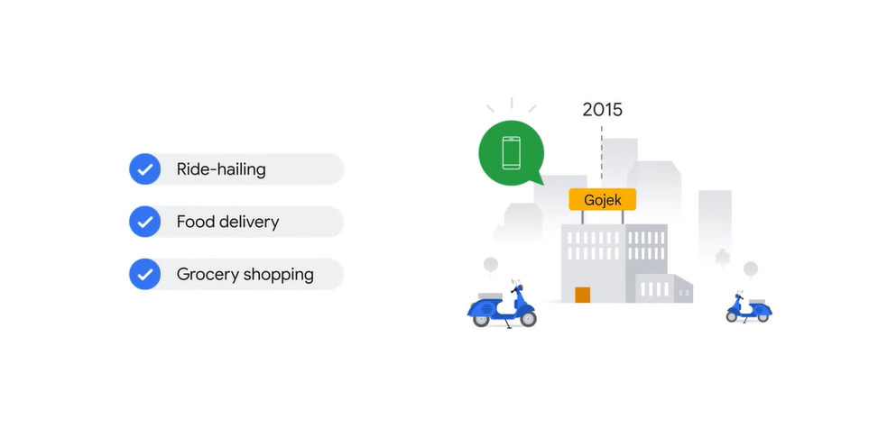

# <https§§§www.cloudskillsboost.google§course_sessions§3751705§video§383327>

> [https://www.cloudskillsboost.google/course_sessions/3751705/video/383327](https://www.cloudskillsboost.google/course_sessions/3751705/video/383327)

# Introduction

google started in 98

in 08 offeriung with gcloud

structured as

- base of networking and security
- decouple compute and storage
- top layer with big data and ml

we focus in this course on:

# Google Cloud infrastructure

gcloud has 5 major geo locations

this affects qualities like availability, durability, and latency, which measures the time a packet of information takes to travel from its source to its destination

regions are indip geo areas and theya re composed of zones

ex

a zone is area where reosurces are deployed

rosource will run in the zone

a zone operatre in single zone

In many cases, you can even specify the location on a zonal, regional, or multi-regional level.

multi region allows data to be replicated in zones in multiple regions

curr:

[https://cloud.google.com/about/locations](https§§§cloud.google.com§about§locations/readme.md)

2023/06

# Compute

Compute Engine is an IaaS offering, or infrastructure as a service, which provides compute, storage,
00:33
and network resources virtually that are similar to physical data centers. You use the virtual compute and storage resources the same as you manage them locally. Compute Engine provides maximum flexibility for those who prefer to manage server instances
00:47
themselves

> you need to manage them

The second is Google Kubernetes Engine, or GKE GKE runs containerized applications in a cloud environment, as opposed to on an individual virtual machine, like Compute Engine. A container represents code packaged up with all its dependencies.

The third computing service offered by Google is App Engine, a fully managed PaaS offering, or platform as a service. PaaS offerings bind code to libraries that provide access to the infrastructure application
01:20
needs. This allows more resources to be focused on application logic

Then there is Cloud Functions, which executes code in response to events, like when a new file is uploaded to Cloud Storage.
01:33
It’s a completely serverless execution environment, which means you don’t need to install any software locally to run the code and you are free from provisioning and managing servers. Cloud Functions is often referred to as functions as a service.

Cloud Run, a fully managed compute platform that enables you to run request or event-driven stateless workloads without having to worry about servers. It abstracts away all infrastructure management so you can focus on writing code.
02:02
It automatically scales up and down from zero, so you never have to worry about scale configuration. Cloud Run charges you only for the resources you use so you never pay for over provisioned
02:13
resources

 

tpus

 

# Storage

offering

 

These include: Cloud Storage
00:47
Cloud Bigtable Cloud SQL Cloud Spanner Firestore And BigQuery

 

what to choose it depends on the nature of the data

 

Unstructured data is usually suited to Cloud Storage, but BigQuery now offers the capability to store unstructured data as well. Cloud Storage is a managed service for storing unstructured data.

 

Cloud Storage is a service for storing your objects in Google Cloud. An object is an immutable piece of data consisting of a file of any format. You store objects in containers called buckets.
02:02
All buckets are associated with a project, and you can group your projects under an organization. Each project, bucket, and object in Google Cloud is a resource in Google Cloud, as are
02:13
things such as Compute Engine instances. After you create a project, you can create Cloud Storage buckets, upload objects to your buckets, and download objects from your buckets

storage classes:

 

Cloud Storage has four primary storage classes. The first is Standard Storage. Standard Storage is considered best for frequently accessed, or “hot,” data.
02:49
It’s also great for data that is stored for only brief periods of time. The second storage class is Nearline Storage. This is best for storing infrequently accessed data, like reading or modifying data once
03:02
per month or less, on average. Examples include data backups, long-tail multimedia content, or data archiving. The third storage class is Coldline Storage. This is also a low-cost option for storing infrequently accessed data.
03:19
However, as compared to Nearline Storage, Coldline Storage is meant for reading or modifying data, at most, once every 90 days. The fourth storage class is Archive Storage. This is the lowest-cost option, used ideally for data archiving, online backup, and disaster
03:39
recovery. It’s the best choice for data that you plan to access less than once a year, because it has higher costs for data access and operations and a 365-day minimum storage duration

structure data:

 

Alternatively, there is structured data, which represents information stored in tables, rows, and columns. Structured data comes in two types: transactional workloads and analytical workloads. Transactional workloads stem from Online Transaction Processing systems, which are used when fast
04:13
data inserts and updates are required to build row-based records. This is usually to maintain a system snapshot. They require relatively standardized queries that impact only a few records.

 

then there are analytical workloads, which stem from Online Analytical Processing systems,
04:31
which are used when entire datasets need to be read. They often require complex queries, for example, aggregations. 

> Once you’ve determined if the workloads are transactional or analytical, you’ll need to identify whether the data will be accessed using SQL or not.
>

 

 

So, if your data is transactional and you need to access it using SQL, then Cloud SQL and Cloud Spanner are two options. Cloud SQL works best for local to regional scalability, while Cloud Spanner, it best
05:02
to scale a database globally. If the transactional data will be accessed without SQL, Firestore might be the best option. Firestore is a transactional NoSQL, document-oriented database.

 

 

If you have analytical workloads that require SQL commands, BigQuery is likely the best
05:22
option. BigQuery, Google’s data warehouse solution, lets you analyze petabyte-scale datasets. Alternatively, Cloud Bigtable provides a scalable NoSQL solution for analytical workloads. It’s best for real-time, high-throughput applications that require only millisecond
05:41
latency.

# The history of big data and ML products

 

history:

 

 

 

dremel for queryig data on clusters

 

colossus fs and bq for querying data

 

 

tpu and automl

The list goes on till Vertex AI, a unified ML platform released in 2021

 

Cloud Storage Dataproc Cloud Bigtable BigQuery Dataflow Firestore Pub/Sub Looker Cloud Spanner AutoML, and Vertex AI, the unified platform

# Big data and ML product categories

4 categories

 

 

The first category is ingestion and process, which include products that are used to digest both real-time and batch data. The list includes Pub/Sub Dataflow Dataproc Cloud Data Fusion 

You’ll explore how Dataflow and Pub/Sub can ingest streaming data later in this course.

The second product category is data storage, and you’ll recall from earlier that there are five storage products: Cloud Storage Cloud SQL Cloud Spanner Cloud Bigtable, and Firestore Cloud SQL and Cloud Spanner are relational databases, while
01:11
Bigtable and Firestore are NoSQL databases

 

The major analytics tool is BigQuery. BigQuery is a fully managed data warehouse that can be used to analyze data through SQL
01:26
commands. In addition to BigQuery, you can analyze data and visualize results using: Looker, and Looker Studio

 

 

 

And the final product category is machine learning, or ML.
01:44
ML products include both the ML development platform and the AI solutions: The primary product of the ML development platform is Vertex AI, which includes the products and technologies: AutoML
02:01
Vertex AI Workbench, and TensorFlow AI solutions are built on the ML development platform and include state-of-the-art products to meet both horizontal and vertical market needs. These include: Document AI
02:14
Contact Center AI Retail Product Discovery, and Healthcare Data Engine These products unlock insights that only large amounts of data can provide. We’ll explore the machine learning options and workflow together with these products
02:30
in greater detail later.

# Customer example: Gojek

 

 

started as 

 

unicorn

 

in 2015

 

at start

 

challenge

 

now

 

# Lab introduction: Exploring a BigQuery Public Dataset

# Exploring a BigQuery Public Dataset

[https://www.cloudskillsboost.google/course_sessions/3751705/labs/383335](https§§§www.cloudskillsboost.google§course_sessions§3751705§labs§383335/readme.md)

# Summary

 

next layer

 

below big data and ml

 

# Quiz

 

# Reading list

[here](T-GCPBDML-B-m1-l12-file-en-13-1.pdf)
