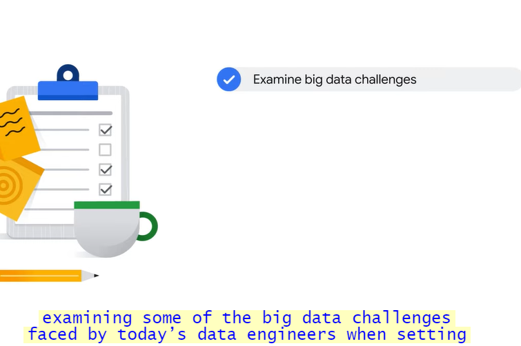
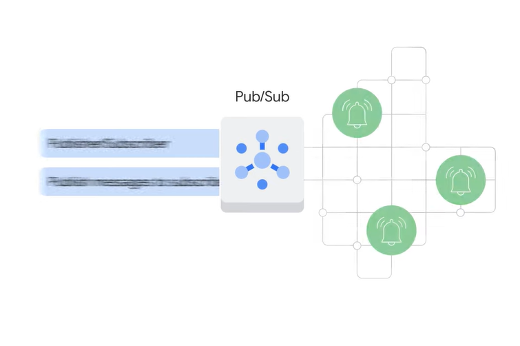

# <https§§§www.cloudskillsboost.google§course_sessions§3751705§video§383339>

> [https://www.cloudskillsboost.google/course_sessions/3751705/video/383339](https://www.cloudskillsboost.google/course_sessions/3751705/video/383339)

# Introduction

using 3 components

challenges

msg oriented architecture

streaming piplines with bema

lookers visualization

end to end datapip with pub/sub and lookder studio

on a set of stored data

ex payroll and billing system

flow of data

analysis and report as they happen

near realtime and action taken as quickly as possible

evolution:

ex

straming music // no download any more

# Big data challenges

in modern org data eng and data sciencits manage 4vs

var sensors

increase magnitude variety + volume

datapip needs to be acble to scale

process in near realtime

veracity about data quality

manage inconsistency and uncertainity

so in summary

By the end of this section, the goal is for you to better understand the tools available
01:55
to help successfully build a streaming data pipeline and avoid these challenges.

# Message-oriented architecture

iot apps like sensors sending msg every n sec, sensors in house

challeges:

- data can be streamed from a lot of indip sensors
- event msg to  be sent to  the right subscriber
- can arrive quickly and with burst
- reliable and secure service

in gcloud we use pub/sub

- It ensures at-least-once delivery of received messages to subscribing applications, with no provisioning required. Pub/Sub’s APIs are open, the service is global by default, and it offers end-to-end encrytion

Pub/Sub reads, stores, broadcasts to any subscribers of this data topic that new messages are available. As a subscriber of Pub/Sub, Dataflow can ingest and transform those messages in an elastic streaming pipeline and output the results into an analytics data warehouse like BigQuery. Finally, you can connect a data visualization tool, like Looker, to visualize and monitor the results of a pipeline, or an AI or ML tool such as Vertex AI to explore the data

topic is like radio antenna

similarly, a publisher can send data to a topic that has no subscriber to receive it.
03:11
Or a subscriber can be waiting for data from a topic that isn’t getting data sent to it, like listening to static from a bad radio frequency. Or you could have a fully operational pipeline where the publisher is sending data to a topic
03:23
that an application is subscribed to. That means there can be zero, one, or more publishers, and zero, one or more subscribers related to a topic. And they’re completely decoupled, so they’re free to break without affecting their counterparts.

ex

Now, let’s assume that there are two different types of employees: a full-time employee and a contractor. Both sources of employee data could have no knowledge of the other but still publish their
04:13
events saying “this employee joined” into the Pub/Sub HR topic. After Pub/Sub receives the message, downstream applications like the directory service, facilities system, account provisioning, and badge activation systems can all listen and process their own
04:29
next steps independent of one another. Pub/Sub is a good solution to buffer changes for lightly coupled architectures, like this one, that have many different publishers and subscribers. Pub/Sub supports many different inputs and outputs, and you can even publish a Pub/Sub
04:44
event from one topic to another

# Designing streaming pipelines with Apache Beam

After messages have been captured from the streaming input sources you need a way to pipe that data into a data warehouse for analysis. This is where Dataflow comes in.

etl

challenge on coding and scale the datapip

- compatible with batch ad screaming
- rich sdk with windowing and late arrival

apache beam

unified programming model for batch and streamign data

portable on dataflow and spark

extensible to connect

pipeline templates // no need to start from zero

sdk is collection to provide transformantiona nd sink connectors

model represantation is portable

# Implementing streaming pipelines on Cloud Dataflow

identify execution engine to run the beam datapip

how much manaiatance

reliable

scaling

monitor

loked in in a service provider

Dataflow handles much of the complexity relating to infrastructure setup and maintenance and is built on Google’s infrastructure. This allows for reliable auto scaling to meet data pipeline demands.
00:56
Dataflow is serverless and NoOps, which means No Operations. But what does that mean exactly? A NoOps environment is one that doesn't require management from an operations team, because maintenance, monitoring, and scaling
01:09
are automated. Serverless computing is a cloud computing execution model. This is when Google Cloud, for example, manages infrastructure tasks on behalf of the users. This includes tasks like resource provisioning, performance tuning,
01:25
and ensuring pipeline reliability

no-ops and serveless computing

ensuring pipeline reliability. Dataflow means that you can spend more time analyzing the insights from your datasets and less time provisioning resources to ensure that your pipeline will successfully complete its next cycles.

Let’s explore the tasks Dataflow performs when a job is received. It starts by optimizing a pipeline model's execution graph to remove any inefficiencies.
01:56
Next, it schedules out distributed work to new workers and scales as needed. After that, it auto-heals any worker faults. From there, it automatically rebalances efforts to most efficiently use its workers.
02:13
And finally, it outputs data to produce a result  as ex in bq

dflow templates divided in 3 categories

or

and utility

# Visualization with Looker

data is diffcult to interptert

2 solution

looker

semanyc model layer with lookerml

web based

looker api to use in apps

dashboard

Dashboards, like the Business Pulse dashboard, for example, can visualize data in a way that makes insights easy to understand. For a sales organization, it shows figures that many might want to see at the start of
01:31
the week, like the number of new users acquired, monthly sales trends, and even the number of year-to-date orders. Information like this can help align teams, identify customer frustrations, and maybe
01:44
even uncover lost revenue. Based on the metrics that are important to your business, you can create Looker dashboards that provide straightforward presentations to help you and your colleagues quickly see
01:56
a high-level business status

ex

time based dashbaord

map shown data

# Visualization with Data Studio

looker studio

This means that leveraging Looker Studio doesn’t require support from an administrator to establish a data connection, which is a requirement with Looker.

ex in google analytics

3 steps for dashobarbaord

# Lab introduction: Creating a streaming data pipeline for a Real-Time dashboard with Dataflow

# Creating a Streaming Data Pipeline for a Real-Time Dashboard with Dataflow

[https://www.cloudskillsboost.google/course_sessions/3751705/labs/383347](https§§§www.cloudskillsboost.google§course_sessions§3751705§labs§383347/readme.md)

# Quiz

 

# Reading list

 

[https://cloud.google.com/pubsub/docs/](https§§§cloud.google.com§pubsub§docs§/readme.md)

[https://cloud.google.com/dataflow/docs/](https§§§cloud.google.com§dataflow§docs§/readme.md)

[https://developers.google.com/looker-studio](https§§§developers.google.com§looker-studio/readme.md)

[https://cloud.google.com/looker/docs](https§§§cloud.google.com§looker§docs/readme.md)
