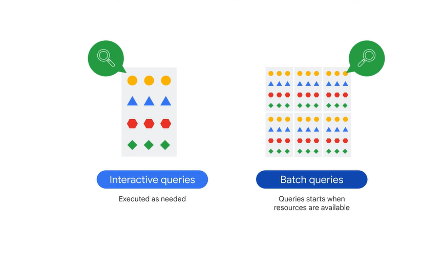
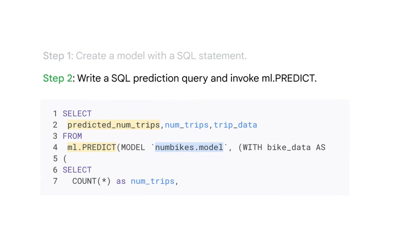

# <https§§§www.cloudskillsboost.google§course_sessions§3751705§video§383351>

> [https://www.cloudskillsboost.google/course_sessions/3751705/video/383351](https://www.cloudskillsboost.google/course_sessions/3751705/video/383351)

# Introduction

what is bq

it’s useful to consider what the main difference is between a data warehouse
01:00
and a data lake. A data lake is just a pool of raw, unorganized, and unclassified data, which has no specified purpose. A data warehouse on the other hand, contains structured and organized data, which can be
01:13
used for advanced querying

managed

BigQuery provides two services in one: storage plus analytics. It’s a place to store petabytes of data.
01:41
For reference, 1 petabyte is equivalent to 11,000 movies at 4k quality. BigQuery is also a place to analyze data, with built-in features like machine learning, geospatial analysis, and business intelligence, which we will look at a bit later on.
01:58
BigQuery is a fully managed serverless solution, meaning that you don’t need to worry about provisioning any resources or managing servers in the backend but only focus on using SQL
02:07
queries to answer your organization's questions in the frontend. If you’ve never written SQL before, don’t worry. This course provides resources and labs to help.

BigQuery has a flexible pay-as-you-go pricing model where you pay for the number of bytes
02:22
of data your query processes and for any permanent table storage. If you prefer to have a fixed bill every month, you can also subscribe to flat-rate pricing where you have a reserved amount of resources for use.
02:35
Data in BigQuery is encrypted at rest by default without any action required from a customer. By encryption at rest, we mean encryption used to protect data that is stored on a disk,
02:46
including solid-state drives, or backup media

BigQuery has built-in machine learning features so you can write ML models directly in BigQuery using SQL. Also, if you decide to use other professional tools—such as Vertex AI from Google Cloud—to train your ML models, you can export datasets from BigQuery directly into Vertex AI for a seamless integration across the data-to-AI lifecycle

So what does a typical data warehouse solution architecture look like?:

in modern organizations the data can be in any format (variety), any size (volume), any
03:34
speed (velocity), and possibly inaccurate (veracity). If it's streaming data, which can be either structured or unstructured, high speed, and large volume, Pub/Sub is needed to digest the data. If it’s batch data, it can be directly uploaded to Cloud Storage.

After that, both pipelines lead to Dataflow to process the data. That’s the place we ETL – extract, transform, and load – the data if needed

BigQuery outputs usually feed into two buckets: business intelligence tools and AI/ML tools. If you’re a business analyst or data analyst, you can connect to visualization tools like
04:42
Looker, Looker Studio, Tableau, or other BI tools

BigQuery is like a common staging area for data analytics workloads. When your data is there, business analysts, BI developers, data scientists, and machine learning engineers can be granted access to your data for their own insights.

# Storage and analytics

bq is 2 service connected by  gnet

 

that allows BigQuery to scale both storage and compute independently, based on demand

b1 can ingest

 

replicated and backed up and set to auto scale

 

That means a raw CSV file in Cloud Storage or a Google Sheet can be used to write a query without being ingested by BigQuery first.
 

 

you can ingest from aws and azure or public data set

you can ingest as batch load

 

you can create a new table or append data

 

or streaming data where smaller batches of data are streamed continuously so that the data is available for querying in near-real time. 

bq is to analyze data o TB of data and Pb in minutes

 

image

 

 

def is interactive queries

 

batch queries when idle resoruce are avialable  // min

# BigQuery demo - San Francisco bike share

 

...

# Introduction to BigQuery ML

bq is dwh but it supports feature for ml inisde

 

doing a mk model can be quite very time consuming

steps:

 

back and forth to get more data and create new features

 

 

2 steps:

 

 

Step 1: Create a model with a SQL statement. Here we use the bikeshare dataset as an example. 

Step 2: Write a SQL prediction query and invoke ml.Predict.

BigQuery ML was designed to be simple, like building a model in two steps. That simplicity extends to defining the machine learning hyperparameters, which let you tune the model to achieve the best training result.

Hyperparameters are the settings applied to a model before the training starts, like the learning rate. With BigQuery ML, you can either manually control the hyperparameters or hand it to bq

types of models

 

BigQuery supports supervised models and unsupervised models. Supervised models are task-driven and identify a goal. Alternatively, unsupervised models are data-driven and identify a pattern. 

 

if your goal is to classify data, like whether an email is spam, use logistic regression. If your goal is to predict a number, like shoe sales for the next three months, use linear regression

 

if your goal is to identify patterns or clusters and then determine the best way to group them, like grouping random pictures of flowers into categories, you should use cluster analysis.

decide the  best model

 

start with

 

n addition to providing different types of machine learning models, BigQuery ML supports features to deploy, monitor, and manage the ML production, called ML Ops, which is short
04:03
for machine learning operations. Options include: Importing TensorFlow models for batch prediction Exporting models from BigQuery ML for online prediction And hyperparameter tuning using Vertex AI Vizier We discuss ML Ops in more detail later in this course.

 

# Using BigQuery ML to predict customer lifetime value

 

 

use ecommerce 

 

 

some fields are useful to feed the ml

 

observation

label = correct answer to train the model

 

linear regression

 

 

the othe columns

> too many ingridients can ruin a disk

 

combine some of them // feature eng

 

BigQuery ML does much of the hard work for you, like automatically one-hot encoding categorical values. One-hot encoding is a method of converting categorical data to numeric data to prepare
04:03
it for model training. From there, BigQuery ML automatically splits the dataset into training data and evaluation data

 

predicting data is finding the value for label columns

# BigQuery ML project phases

 

Let’s walk through the key phases of a machine learning project. In phase 1, you extract, transform, and load data into BigQuery, if it isn’t there already. If you’re already using other Google products, like YouTube for example, look out for easy
00:15
connectors to get that data into BigQuery before you build your own pipeline. You can enrich your existing data warehouse with other data sources by using SQL joins. 

 

In phase 2, you select and preprocess features.
00:31
You can use SQL to create the training dataset for the model to learn from. You’ll recall that BigQuery ML does some of the preprocessing for you, like one-hot encoding of your categorical variables.
00:44
One-hot encoding converts your categorical data into numeric data that is required by a training model. 

 

In phase 3, you create the model inside BigQuery. This is done by using the “CREATE MODEL” command.
00:58
Give it a name, specify the model type, and pass in a SQL query with your training dataset. From there, you can run the query.

 

 In phase 4, after your model is trained, you can execute an ML.EVALUATE query to evaluate
01:15
the performance of the trained model on your evaluation dataset. It’s here that you can analyze loss metrics like a Root Mean Squared Error for forecasting models and area-under-the-curve, accuracy, precision, and recall, for classification
01:31
models. We’ll explore these metrics later in this course. 

 

In phase 5, the final phase, when you’re happy with your model performance, you can then use it to make predictions.
01:43
To do so, invoke the ml.PREDICT command on your newly trained model to return with predictions and the model’s confidence in those predictions. With the results, your label field will have “predicted” added to the field name.
01:58
This is your model’s prediction for that label

# BigQuery ML key commands

 

options // model type

 

The output of ML.WEIGHTS is a numerical value, and each feature has a weight from -1 to 1.
00:42
That value indicates how important the feature is for predicting the result, or label. If the number is closer to 0, the feature isn't important for the prediction. However, if the number is closer to -1 or 1, then the feature is more important for
00:57
predicting the result

 

 

for supervised 

 

Now let’s explore a consolidated list of BigQuery ML commands for supervised models. First in BigQuery ML, you need a field in your training dataset titled LABEL, or you need to specify which field or fields are your labels using the input_label_cols in
01:39
your model OPTIONS. Second, your model features are the data columns that are part of your SELECT statement after your CREATE MODEL statement. After a model is trained, you can use the ML.FEATURE_INFO command to get statistics
01:55
and metrics about that column for additional analysis. Next is the model object itself. This is an object created in BigQuery that resides in your BigQuery dataset. You train many different models, which will all be objects stored under your BigQuery
02:12
dataset, much like your tables and views. Model objects can display information for when it was last updated or how many training runs it completed. Creating a new model is as easy as writing CREATE MODEL, choosing a type, and passing
02:28
in a training dataset. Again, if you’re predicting on a numeric field, such as next year's sales, consider linear regression for forecasting. If it's a discrete class like high, medium, low, or spam/not-spam, consider using logistic
02:45
regression for classification. While the model is running, and even after it’s complete, you can view training progress with ML.TRAINING_INFO. As mentioned earlier, you can inspect weights to see what the model learned about the importance
03:01
of each feature as it relates to the label you’re predicting. The importance is indicated by the weight of each feature. You can see how well the model performed against its evaluation dataset by using ML.EVALUATE.
03:14
And lastly, getting predictions is as simple as writing ML.PREDICT and referencing your model name and prediction dataset.

# Lab introduction: Predicting Visitor Purchases Using BigQuery ML

 

lab:

 

# Predicting Visitor Purchases with a Classification Model with BigQuery ML
