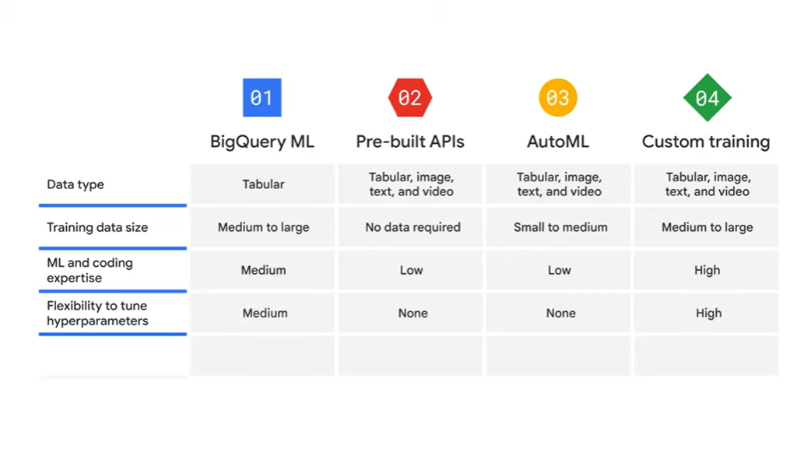

# <https§§§www.cloudskillsboost.google§course_sessions§3751705§video§383363>

> [https://www.cloudskillsboost.google/course_sessions/3751705/video/383363](https://www.cloudskillsboost.google/course_sessions/3751705/video/383363)

# Introduction

 

Now let’s switch our focus to machine learning. In this section, we’ll explore the different options Google Cloud offers for building ml models

 

over 10 years in AI

 

ex of AI

 

behind the scenes

# Options to build ML models

4 options

 

ml in bq using sql

 

using model created by google on a lot of data

 

no code solution

 

full control on ml pipeline

how to choice

 

 

 

 

 

select the best option:

Selecting the best option will depend on your business needs and ML expertise.
02:37
If your data engineers, data scientists, and data analysts are familiar with SQL and already have your data in BigQuery, BigQuery ML lets you develop SQL-based models. If your business users or developers have little ML experience,
02:52
using pre-built APIs is likely the best choice. Pre-built APIs address common perceptual tasks such as vision, video, and natural language. They are ready to use without any ML expertise or model development effort.
03:06
If your developers and data scientists want to build custom models with your own training data while spending minimal time coding, then AutoML is your choice. AutoML provides a code-less solution to enable you to focus on business problems instead
03:21
of the underlying model architecture and ML provisioning. If your ML engineers and data scientists want full control of ML workflow, Vertex AI custom training lets you train and serve custom models with code on Vertex Workbench. 

# Pre-built APIs

 

Pre-built APIs are offered as services. In many cases they can act as building blocks to create the application you want without expense or complexity of creating your own models.
00:26
They save the time and effort of building, curating, and training a new dataset so you can just jump right ahead to predictions

ex of ml models exposed as api:

 

trained on google dataset

 

As you might expect, Google has a lot of images, text, and ML researchers to train it’s pre-built models. This means less work for you. Let’s take a minute and try out the Vision API in a browser.

 

# AutoML

 

If you've worked with ML models before, you know that training and deploying ML models
00:11
can be extremely time consuming, because you need to repeatedly add new data and features, try different models, and tune parameters to achieve the best result. To solve this problem, when AutoML was first announced in January of 2018, the goal was
00:27
to automate machine learning pipelines to save data scientists from manual work, such as tuning hyperparameters and comparing against multiple models

 

It all starts with gathering the right information. For AutoML, two technologies are vital. The first is known as transfer learning. With transfer learning, you build a knowledge base in the field.

You can think of this like gathering lots of books to create a library. Transfer learning is a powerful technique that lets people with smaller datasets, or less computational power, achieve state-of-the-art results by taking advantage of pre-trained models that have been trained on similar, larger data sets. Because the model learns via transfer learning, it doesn’t have to learn from scratch, so it can generally reach higher accuracy with much less data and computation time than models that don’t use transfer learning. The second technology is neural architecture search. The goal of neural architecture search is to find the optimal model for the relevant project. Think of this like finding the best book in the library to help you learn what you need to. AutoML is powered by the latest machine-learning research, so although a model performs training, the AutoML platform actually trains and evaluates multiple models and compares them to each other.

 

 

 

The second technology is neural architecture search. The goal of neural architecture search is to find the optimal model for the relevant project. Think of this like finding the best book in the library to help you learn what you need to 

AutoML is powered by the latest machine-learning research, so although a model performs training, the AutoML platform actually trains and evaluates multiple models and compares them to each other.

 

this allows data scientists to focus their time on tasks like defining business problems
02:20
or evaluating and improving model results.

 

4 types of data

For each data type, AutoML solves different types of problems, called objectives

 

image data 

 

For example, you could train a model to find the location of the dogs in image data. 

 

For tabular data: You can use a regression model to analyze tabular data and return a numeric value.

For example, you could train a model to estimate a house’s value or rental price based on a set of factors such as location, size of the house, and number of bedrooms.

 

For example, you can classify customer questions and comments to different categories and then redirect them to corresponding departments.

 

For example, you could train a model that analyzes video data to identify whether the video is of a soccer, baseball, basketball, or football game

In reality, you may not be restricted to just one data type and one objective but rather need to combine multiple data types and different objectives to solve a business problem.
06:48
AutoML is a powerful tool that can help across these different data types and objectives.

# Custom training

last option is custom training with vertex ai wb

 

Before any coding begins, you need to determine what environment you want your ML training code to use.

There are two options: a pre-built container or a custom container. 

 

Imagine that a container is a kitchen. A pre-built container would represent a fully furnished room with cabinets and appliances (which represent the dependencies) that includes all the cookware (which represents the libraries) you need to make a meal. So, if your ML training needs a platform like TensorFlow, Pytorch, Scikit-learn, or XGboost, and Python code to work with the platform, a pre-built container is probably your best sol

 

A custom container, alternatively, is like an empty room with no cabinets, appliances, or cookware. You define the exact tools that you need to complete the job.

# Vertex AI

 

As an AI-first company, Google has applied AI technologies to many of its products and services, like Gmail, Google Maps, Google Photos, and Google Translate, just to name a few:

 

ml chalngese:

 

 

google solution:

 

Google’s solution to many of the production and ease-of-use challenges is Vertex AI, a
01:31
unified platform that brings all the components of the machine learning ecosystem and workflow together

 

ex

 

During the data readiness stage, users can upload data from wherever it’s stored– Cloud Storage, BigQuery, or a local machine.

 

 

 

Vertex AI allows users to build machine learning models with either AutoML, a code-less solution or Custom Training,
02:44
a code-based solution.

 

benefits:

It’s seamless.
03:12
Vertex AI provides a smooth user experience from uploading and preparing data all the way to model training and production. It’s scalable. The Machine Learning Operations (MLOps) provided by Vertex AI helps to monitor and manage the
03:27
ML production and therefore scale the storage and computing power automatically. It’s sustainable. All of the artifacts and features created using Vertex AI can be reused and shared. And it’s speedy.
03:43
Vertex AI produces models that have 80% fewer lines of code than competitors.

 

# AI Solutions

 

bottom layer

middle layer

top layer

Horizontal solutions usually apply to any industry that would like to solve the same problem. Examples include Document AI and CCAI. 

Document AI uses computer vision and optical character recognition, along with natural
00:56
language processing, to create pretrained models to extract information from documents. The goal is to increase the speed and accuracy of document processing to help organizations make better decisions faster, while reducing costs.
01:11
Another example of a horizontal solution is Contact Center AI, or CCAI.

The goal of CCAI is to improve customer service in contact centers through the use of artificial intelligence.
01:24
It can help automate simple interactions, assist human agents, unlock caller insights, and provide information to answer customer questions. 

And the second group is vertical, or industry solutions. These represent solutions that are relevant to specific industries.
01:42
Examples include: Retail Product Discovery, which gives retailers the ability to provide Google-quality search and recommendations on their own digital properties, helping to increase conversions and reduce search abandonment, Google Cloud Healthcare Data Engine, which generates healthcare insights and analytics
02:00
with one end-to-end solution, and Lending DocAI, which aims to transform the home loan experience for borrowers and lenders by automating mortgage document processing. You can learn more about Google Cloud’s growing list of AI solutions at cloud.google.com/solutions/ai.

# Summary

 

 

Next, we introduced Vertex AI, a tool that combines the functionality of AutoML, which is codeless, and custom training, which is code-based, to solve production and ease-of-use problems.

You’ll recall that selecting the best ML option will depend on your business needs and ML expertise:

 

and 

 

# Quiz

 

# Reading list

 

https://www.fast.ai/posts/2018-07-23-auto-ml-3.html
