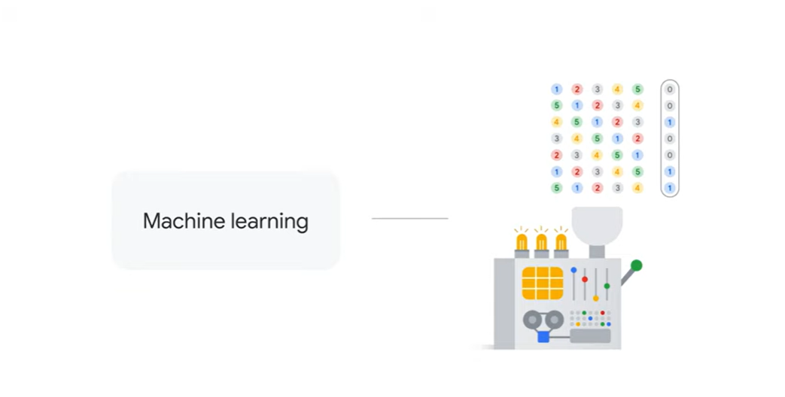
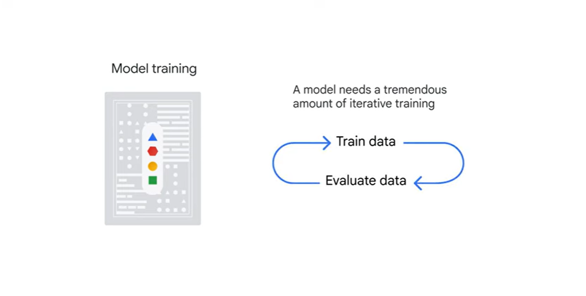
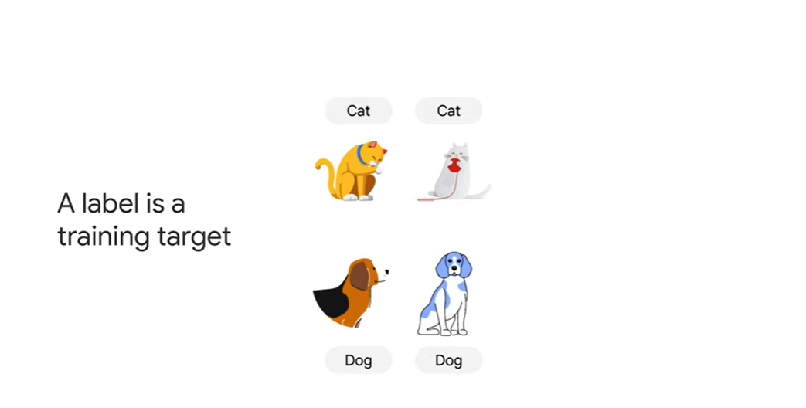
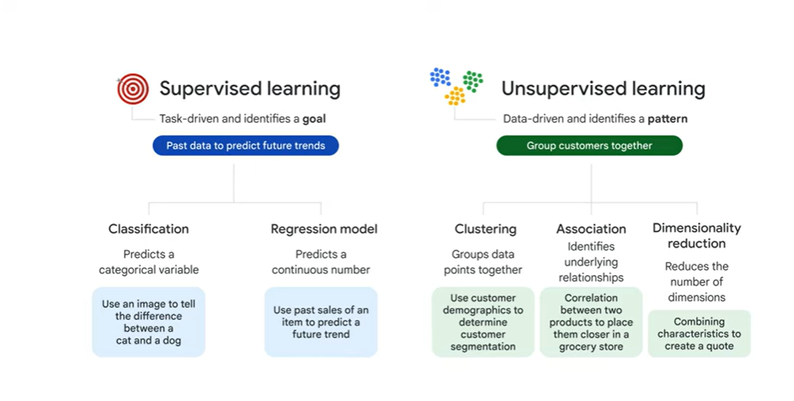
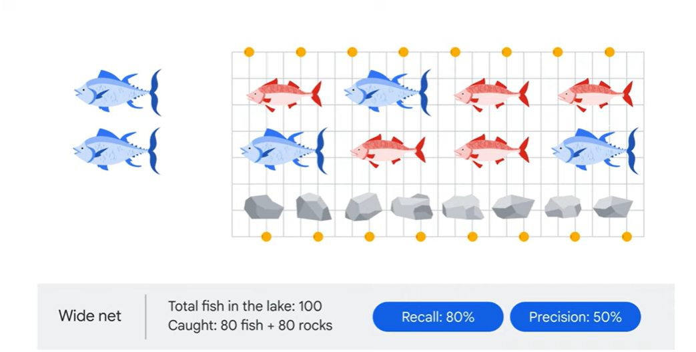
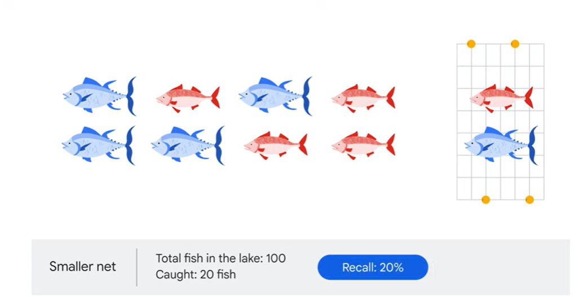
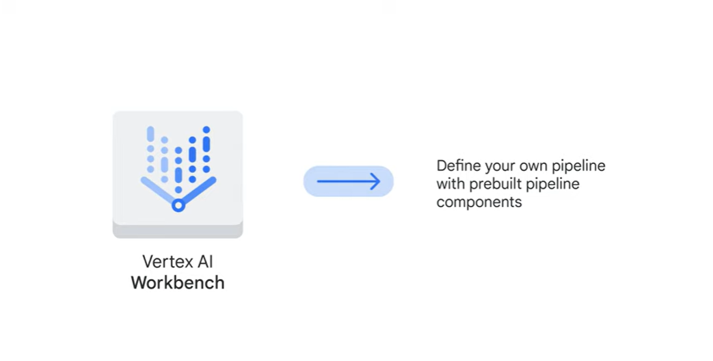

# <https§§§www.cloudskillsboost.google§course_sessions§3751705§video§383373>

> [https://www.cloudskillsboost.google/course_sessions/3751705/video/383373](https://www.cloudskillsboost.google/course_sessions/3751705/video/383373)

# Introduction

 

Now let’s switch our focus to the machine learning Workflow with Vertex AI

 

later

 

 

With machine learning, we feed a machine a large amount of data, along with answers that we would expect a model to conclude from that data. Then, we show the machine a learning method by selecting a machine learning model.

From there, we expect the machine to learn from the provided data and examples to solve the puzzle on its own. 

 

give examples

 

ml needs storage and fast calc

1st stage:

2nd stage

 

3rd stage

 

and managed

you need to use the model in prod

 

ex as a restautant

if you compare these steps to running a restaurant, data preparation is when you prepare the raw ingredients, model training is when you experiment with different recipes,
04:02
and model serving is when you finalize the menu to serve the meal to lots of hungry customers.

> Now it’s important to note that an ML workflow isn’t linear, it’s iterative.

 

 

2 options

Vertex AI provides many features to support the ML workflow, all of which are accessible through either AutoML or Vertex AI workbench:

 

# Data preparation

 

When you upload a dataset in the Vertex AI user interface, you’ll need to provide a meaningful name for the data and then select the data type and objective.

 

 

2nd phase:

 

 

Your data is like your ingredients, such as carrots, onions, and tomatoes.
01:39
Before you start cooking, you'll need to peel the carrots, chop the onions, and rinse the tomatoes.
01:44
This is what feature engineering is like: the data must be processed before the model starts training.

 

Feature Store is a centralized repository to organize, store, and serve machine learning features.

It aggregates all the different features from different sources and updates them to make them available from a central repository.

Then, when engineers need to model something, they can use the features available in the Feature Store dictionary to build a dataset.

benefits:

 

Features are managed and served from a central repository, which helps maintain consistency across your organization.

This helps save time and reduces duplicative efforts, especially for high-value features.

Features automatically scale to provide low-latency serving, so you can focus on developing the logic to create the features without worrying about deployment.

Feature Store is built on an easy-to-navigate user interface.

# Model training

time now for:

 

 

clarify

 

Artificial intelligence, or AI, is an umbrella term that includes anything related to computers

mimicking human intelligence. For example, in an online word processor, robots performing human actions all the way down to spell check.

Machine learning is a subset of AI that mainly refers to supervised and unsupervised learning.
mimicking human intelligence. 

For example, in an online word processor, robots performing human actions all the way down to spell check.

 

An easy way to distinguish between the two is that supervised learning provides each data point with a label, or an answer, while unsupervised does not. For example, if we were given sales data from an online retailer, we could use supervised learning to predict the sales trend for the next couple of months and use unsupervised learning to group customers together based on common characteristics. There are two major types of supervised learning: The first is classification, which predicts a categorical variable, like using an image to tell the difference between a cat and a dog. The second type is a regression model, which predicts a continuous number, like using past sales of an item to predict a future trend

 

 

There are three major types of unsupervised learning: The first is clustering, which groups together data points with similar characteristics and
02:16
assigns them to "clusters," like using customer demographics to determine customer segmentation. The second is association, which identifies underlying relationships, like a correlation between two products to place them closer together in a grocery store for a promotion.
02:34
And the third is dimensionality reduction, which reduces the number of dimensions, or features, in a dataset to improve the efficiency of a model. For example, combining customer characteristics like age, driving violation history, or car
02:50
type, to create an insurance quote. If too many dimensions are included, it can consume too many compute resources, which might make the model inefficient.

 

with AutoML and pre-built APIs you don’t need to specify a machine learning model

 

With the other two options, BigQuery ML and custom training, you’ll need to specify which model you want to train your data on and assign something called hyperparameters. You can think of hyperparameters as user-defined knobs in a machine that helps guide the machine
03:34
learning process

# Model evaluation

While we are experimenting with a recipe, we need to keep tasting it constantly to make sure it meets our expectations.

 

Among the metrics are two sets of measurements.

 

A confusion matrix is a specific performance measurement for machine learning classification problems.

- It’s a table with combinations of predicted and actual values.

 

The model predicted that this is an image of a cat, and it actually is.

 

The model predicted that a dog is not a cat, and it actually isn’t.

 false positve - type 1 error

“The model predicted positive, and that’s false.”

there is the false negative combination, otherwise known as a Type 2 Error, which can be interpreted as, “The model predicted negative, and that’s false.”

 

A confusion matrix is the foundation for many other metrics used to evaluate the performance of a machine learning model.

 

 

Imagine you’re fishing with a net.:

 

 

 

Using a wide net, you caught both fish and rocks: 80 fish out of 100 total fish in the lake, plus 80 rocks.
02:36
The recall in this case is 80%, which is calculated by the number of fish caught, 80, divided by the total number of fish in the lake, 100.
02:46
The precision is 50%, which is calculated by taking the number of fish caught, 80, and dividing it by the number of fish and rocks collected, 160.

Let’s say you wanted to improve the precision, so you switched to a smaller net.

 

 

> Precision and recall are often a trade-off.
>
>  

Consider a classification model where Gmail separates emails into two categories: spam and not-spam.

if the goal is to catch as many potential spam emails as possible, Gmail may want to prioritize recall.
03:43
In contrast, if the goal is to only catch the messages that are definitely spam without blocking other emails, Gmail may want to prioritize precision.

 

In Vertex AI, feature importance is displayed through a bar chart to illustrate how each feature contributes to a prediction.

This information helps decide which features are included in a machine learning model to predict the goal.

 

Feature importance is just one example of Vertex AI’s comprehensive machine learning functionality called Explainable AI.

# Model deployment and monitoring

final stage:

 

 

First, model deployment, which we can compare
00:14
to serving the meal to a hungry customer, and second, model monitoring, which we can compare to checking with the waitstaff to ensure that the restaurant is operating efficiently.

> This lets data scientists focus on what to do, rather than how to do it

 

 

Practicing MLOps means advocating for automation and monitoring at each step of the ML system construction. This means adopting a process to enable continuous integration, continuous training, and continuous delivery.

 

Well, let’s start with model deployment, which is the exciting time when a model is implemented.

 

In our restaurant analogy, it’s when the food is put on the table for the customer
01:42
to eat! MLOps provides a set of best practices on the backend to automate this process.

3 options to deploy:

 

noe focus on model monitoring

 

ex

 

Vertex AI Pipelines is displaying the production data onscreen. If something goes wrong, it automatically triggers warnings based on a predefined threshold.

 

Vertex AI Workbench, which is a notebook tool, you can define your own pipeline

# Lab introduction: Predicting loan risk with AutoML

 

The dataset used in the lab relates to loans from a financial institution and has 2,050 data points.
00:18
AutoML requires at least 1,000 data points in a dataset.

 

# Vertex AI: Predicting Loan Risk with AutoML

[https://www.cloudskillsboost.google/course_sessions/3751705/labs/383379](https§§§www.cloudskillsboost.google§course_sessions§3751705§labs§383379/readme.md)

# Lab recap: Predicting loan risk with AutoML

 

The true positives were 100%. This represents the percentage of people the model predicted would repay their loan who
00:28
actually did pay it back. The true negatives were 87%. This represents the percentage of people the model predicted would not repay their loan who indeed did not pay it back.
00:44
The false negatives were 0%. This represents the percentage of people the model predicted would not repay their loan, but who actually did pay it back. And finally, the false positives were 13%.
00:58
This represents the percentage of people the model predicted would repay their loan, but who actually did not pay it back. As a general principle, it’s good to have high true positives and true negatives, and
01:11
low false positives and false negatives. However, how high or low they need to be really depends on the business goals you’re looking to achieve. There are different ways to improve the performance of a model, which might include using a more
01:24
accurate data source, using a larger dataset, choosing a different type of ML model, or tuning the hyperparameters. 

 

Let’s also review the precision-recall curve from the AutoML lab. The confidence threshold determines how a machine learning model counts the positive
01:42
cases. A higher threshold increases the precision, but decreases recall. A lower threshold decreases the precision, but increases recall. Moving the threshold to zero produces the highest recall of 100%, and the lowest precision
01:58
of 50%. So, what does that mean? That means the model predicts that 100% of loan applicants will be able to repay a loan they take out. However, in actuality, only 50% of people were able to repay the loan.
02:16
Using this threshold to identify the default cases in this example can be risky, because it means that you’re only likely to get half of the loan investment back. 

 

Now let’s move to the other extreme by moving the threshold to 1.
02:30
This will produce the highest precision of 100% with the lowest recall of 1%. What does this mean? It means that of all the people who were predicted to repay the loan, 100% of them actually did.
02:43
However, you rejected 99% of loan applicants by only offering loans to 1% of them. That’s a pretty big loss of business for your company. 

 

These are both extreme examples, but it’s important that you always try to set an appropriate
02:57
threshold for your model.

# Summary

 

 

This translated to gathering our ingredients and then chopping and prepping them in the kitchen.

 

This is where we experimented with our recipes and tasted the meal to make sure it turned out as expected.

 

This translates to serving the meal to the hungry customers and adjusting the menu as more people tried the dish.

Quiz

 

# Reading list

 

[https://cloud.google.com/architecture/mlops-continuous-delivery-and-automation-pipelines-in-machine-learning#mlops_level_1_ml_pipeline_automation](https§§§cloud.google.com§architecture§mlops-continuous-delivery-and-automation-pipelines-in-machine-learning#mlops_level_1_ml_pipeline_automation/readme.md)
