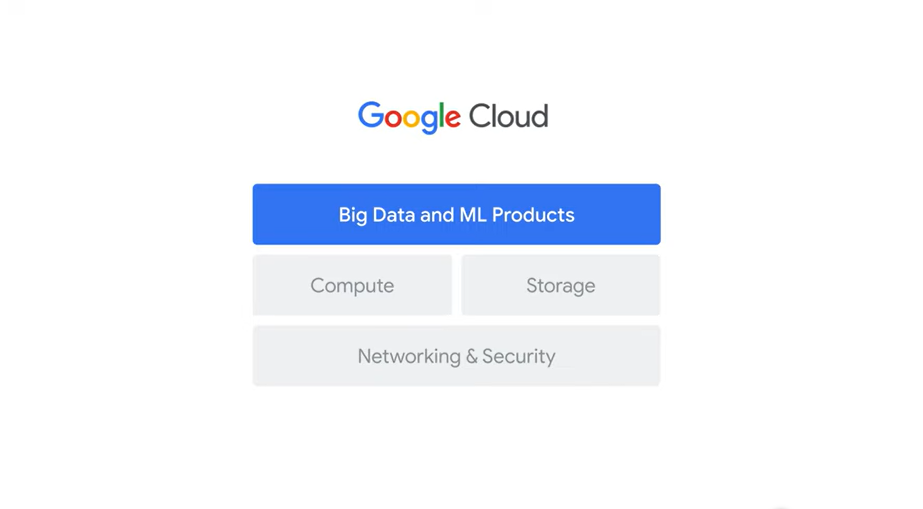
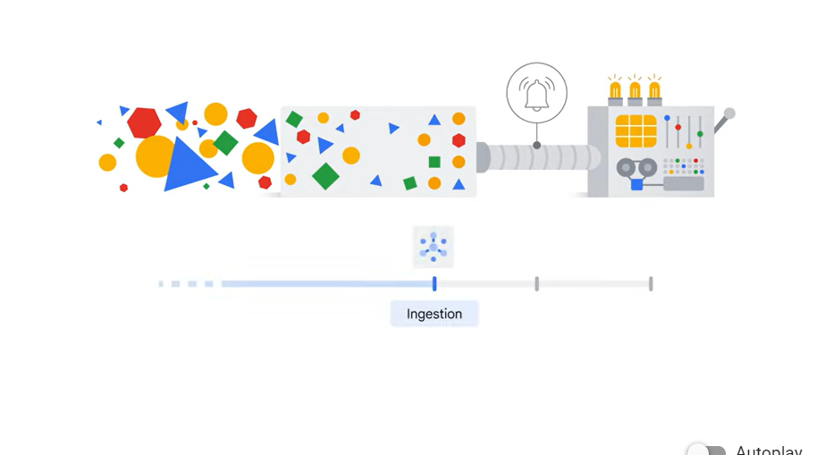
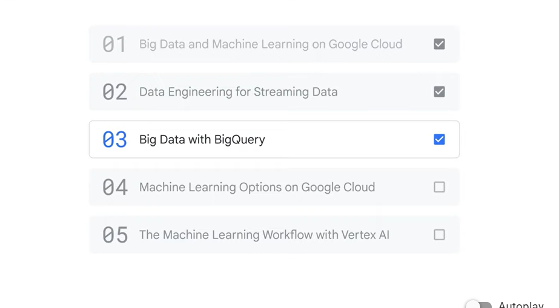
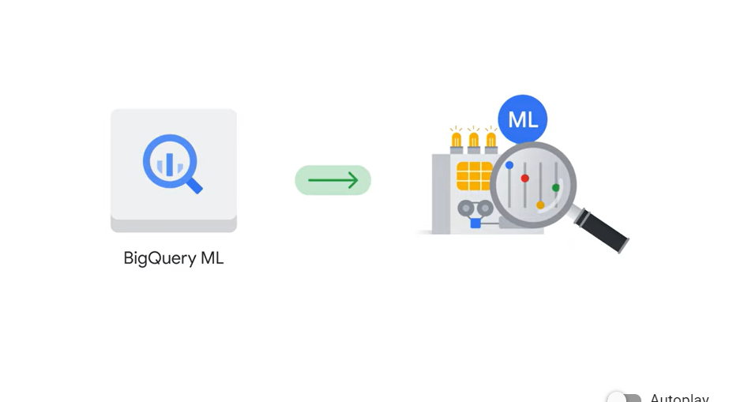
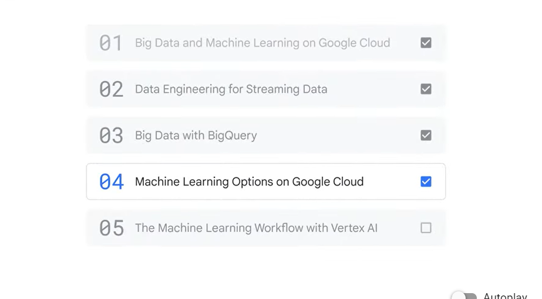
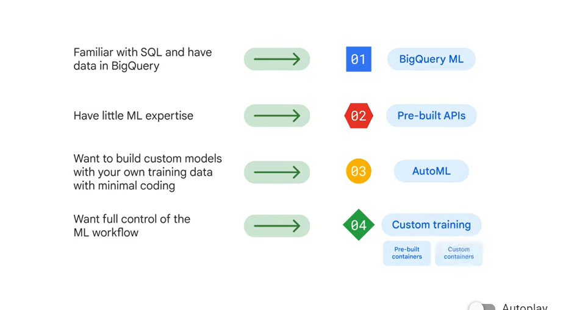
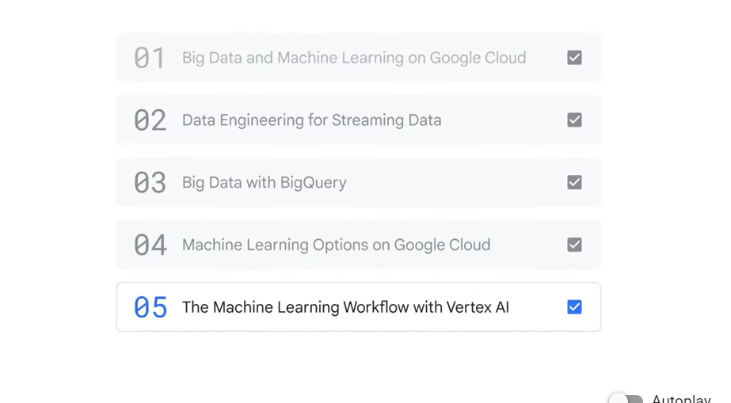
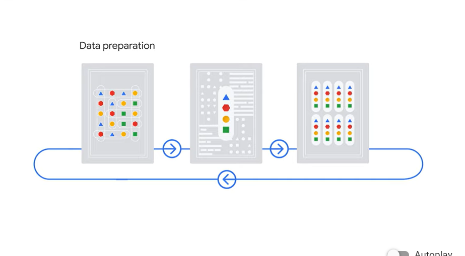
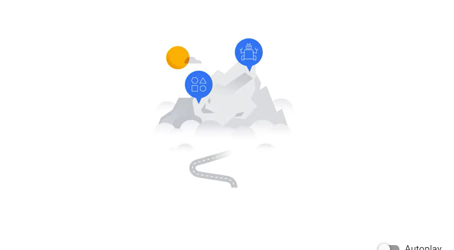

# <https§§§www.cloudskillsboost.google§course_sessions§3751705§video§383384>

> [https://www.cloudskillsboost.google/course_sessions/3751705/video/383384](https://www.cloudskillsboost.google/course_sessions/3751705/video/383384)

# Course summary

 

And on the top layer sit the big data and machine learning products, which enable you to perform tasks to ingest, store, process, and deliver business insights, data pipelines,
00:55
and machine learning models.

 

In the second section of the course, you explored data engineering for streaming data. This included how to build a streaming data pipeline– from ingestion with Pub/Sub,
01:08
to processing with Dataflow, to visualization using Looker and Looker Studio.

 

After that, in the third section of the course, you were introduced to BigQuery, which is Google’s fully-managed data warehouse.

 

You also learned about BigQuery ML, the machine learning tool used for developing machine learning models directly in BigQuery

 

 

 

In the final section of the course, you learned about the machine learning workflow using
02:50
Vertex AI, a unified platform that brings all the components of the machine learning ecosystem and workflow together.

 

The machine learning workflow comprises three stages. In stage one, data preparation, data is uploaded and feature engineering is applied.
03:08
In stage two, model training, the model is trained and evaluated. And in stage three, model serving, the model is deployed and monitored

 

[https://cloud.google.com/training/machinelearning-ai](https§§§cloud.google.com§training§machinelearning-ai/readme.md)
