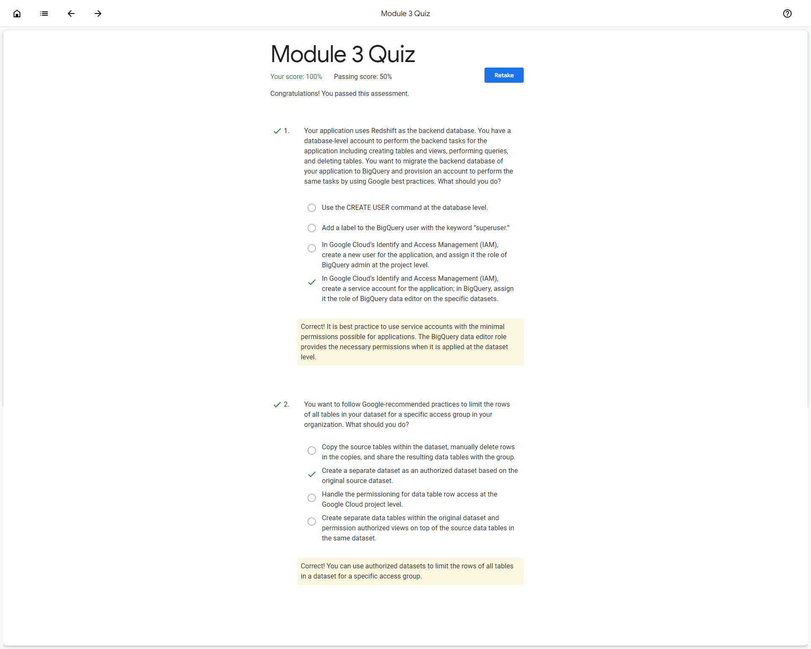

# <https§§§www.cloudskillsboost.google§course_sessions§3777998§documents§375041>

> [https://www.cloudskillsboost.google/course_sessions/3777998/documents/375041](https://www.cloudskillsboost.google/course_sessions/3777998/documents/375041)

# BigQuery and Google Cloud IAM

[https://storage.googleapis.com/cloud-training/cls-html5-courses/T-BQRS-I/M3/index.html#/](https§§§storage.googleapis.com§cloud-training§cls-html5-courses§T-BQRS-I§M3§index.html#§/readme.md)

# Module 3 Quiz

 

# Securing and Sharing BigQuery Datasets and Tables

[https://www.cloudskillsboost.google/course_sessions/3777998/labs/375043](https§§§www.cloudskillsboost.google§course_sessions§3777998§labs§375043/readme.md)
