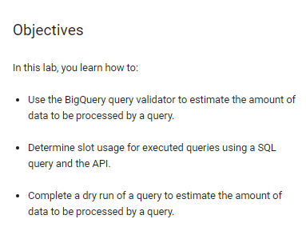
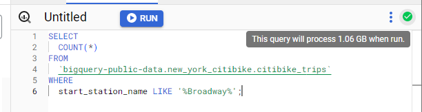
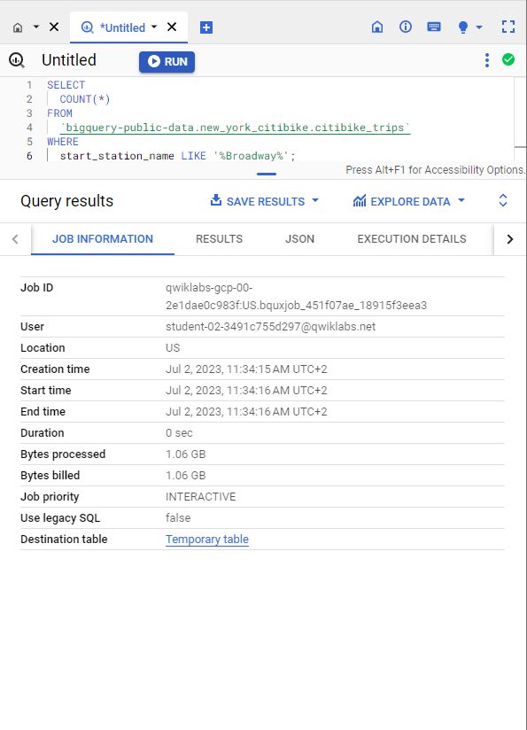
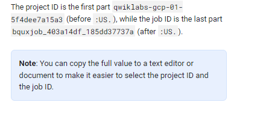
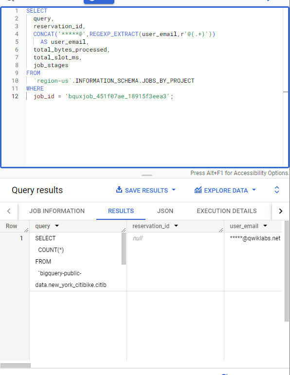
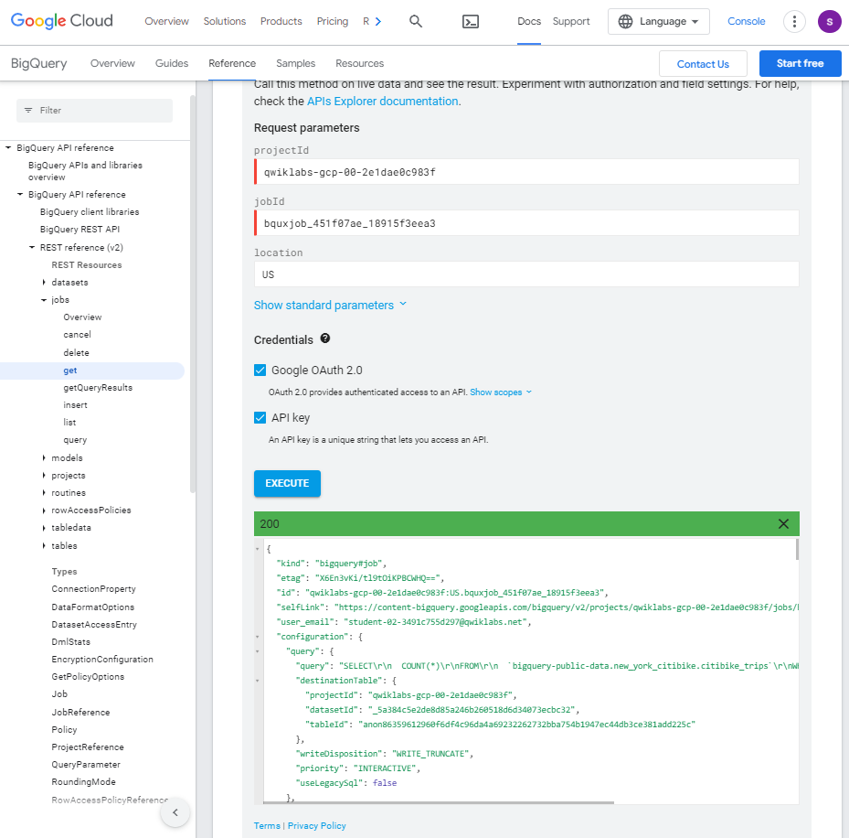
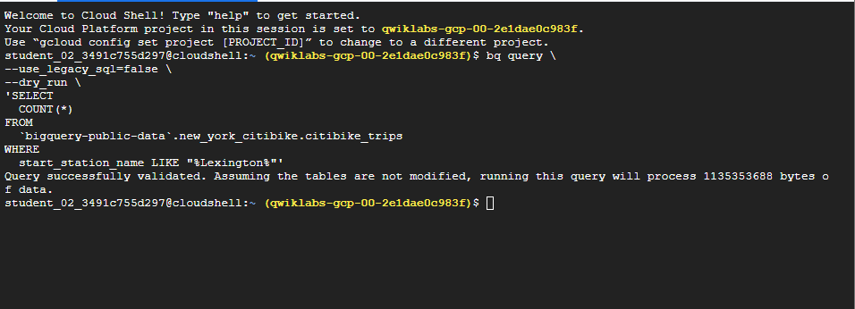

# <https§§§www.cloudskillsboost.google§course_sessions§3777998§labs§375038>

> [https://www.cloudskillsboost.google/course_sessions/3777998/labs/375038](https://www.cloudskillsboost.google/course_sessions/3777998/labs/375038)

# BigQuery Fundamentals for Redshift Professionals.Monitoring BigQuery Workloads

## Overview

[https://cloud.google.com/bigquery/docs/estimate-costs#estimate_query_costs](https§§§cloud.google.com§bigquery§docs§estimate-costs#estimate_query_costs/readme.md)

[https://cloud.google.com/bigquery/docs/dry-run-queries#bq](https§§§cloud.google.com§bigquery§docs§dry-run-queries#bq/readme.md)

[https://cloud.google.com/products/calculator/](https§§§cloud.google.com§products§calculator§/readme.md)



## Task 1. Use the query validator to estimate the amount of data to be processed

```
SELECT
  COUNT(*)
FROM
  `bigquery-public-data.new_york_citibike.citibike_trips`
WHERE
  start_station_name LIKE '%Broadway%';
```



## Task 2. Determine slot usage using a SQL query

[https://cloud.google.com/bigquery/docs/slots](https§§§cloud.google.com§bigquery§docs§slots/readme.md)

After you run a query in the Google Cloud console, you receive both the results and a summary of the amount of resources that were used to execute the query.



qwiklabs-gcp-00-2e1dae0c983f:US.bquxjob_451f07ae_18915f3eea3



```sql
SELECT
  query,
  reservation_id,
  CONCAT('*****@',REGEXP_EXTRACT(user_email,r'@(.+)')) 
    AS user_email,
  total_bytes_processed,
  total_slot_ms,
  job_stages
FROM
  `region-us`.INFORMATION_SCHEMA.JOBS_BY_PROJECT
WHERE
  job_id = 'YOUR_ID';
```

The output of this query provides a table that shows the query stages and the associated slot usage for each stage.

Since an individual task in a query is executed by one slot, the sum of values in the column named **job_stages.completed_parallel_inputs** is the number of total slots used to run the query.



as json

```json
[{
  "query": "SELECT\r\n  COUNT(*)\r\nFROM\r\n  `bigquery-public-data.new_york_citibike.citibike_trips`\r\nWHERE\r\n  start_station_name LIKE \u0027%Broadway%\u0027;",
  "reservation_id": null,
  "user_email": "*****@qwiklabs.net",
  "total_bytes_processed": "1135353688",
  "total_slot_ms": "7534",
  "job_stages": [{
    "name": "S00: Input",
    "id": "0",
    "start_ms": "1688290456127",
    "end_ms": "1688290456617",
    "input_stages": [],
    "wait_ratio_avg": "0.48029556650246308",
    "wait_ms_avg": "195",
    "wait_ratio_max": "0.97536945812807885",
    "wait_ms_max": "396",
    "read_ratio_avg": "0.15763546798029557",
    "read_ms_avg": "64",
    "read_ratio_max": "0.24876847290640394",
    "read_ms_max": "101",
    "compute_ratio_avg": "0.10837438423645321",
    "compute_ms_avg": "44",
    "compute_ratio_max": "0.16748768472906403",
    "compute_ms_max": "68",
    "write_ratio_avg": "0.0024630541871921183",
    "write_ms_avg": "1",
    "write_ratio_max": "0.0049261083743842365",
    "write_ms_max": "2",
    "shuffle_output_bytes": "531",
    "shuffle_output_bytes_spilled": "0",
    "records_read": "58937715",
    "records_written": "59",
    "parallel_inputs": "59",
    "completed_parallel_inputs": "59",
    "status": "COMPLETE",
    "steps": [{
      "kind": "READ",
      "substeps": ["$1:start_station_name", "FROM bigquery-public-data.new_york_citibike.citibike_trips", "WHERE like($1, \u0027%Broadway%\u0027)"]
    }, {
      "kind": "AGGREGATE",
      "substeps": ["$20 :\u003d COUNT_STAR()"]
    }, {
      "kind": "WRITE",
      "substeps": ["$20", "TO __stage00_output"]
    }],
    "slot_ms": "7517",
    "compute_mode": "BIGQUERY"
  }, {
    "name": "S01: Output",
    "id": "1",
    "start_ms": "1688290456525",
    "end_ms": "1688290456602",
    "input_stages": ["0"],
    "wait_ratio_avg": "1.0",
    "wait_ms_avg": "406",
    "wait_ratio_max": "1.0",
    "wait_ms_max": "406",
    "read_ratio_avg": "0.0",
    "read_ms_avg": "0",
    "read_ratio_max": "0.0",
    "read_ms_max": "0",
    "compute_ratio_avg": "0.017241379310344827",
    "compute_ms_avg": "7",
    "compute_ratio_max": "0.017241379310344827",
    "compute_ms_max": "7",
    "write_ratio_avg": "0.012315270935960592",
    "write_ms_avg": "5",
    "write_ratio_max": "0.012315270935960592",
    "write_ms_max": "5",
    "shuffle_output_bytes": "9",
    "shuffle_output_bytes_spilled": "0",
    "records_read": "59",
    "records_written": "1",
    "parallel_inputs": "1",
    "completed_parallel_inputs": "1",
    "status": "COMPLETE",
    "steps": [{
      "kind": "READ",
      "substeps": ["$20", "FROM __stage00_output"]
    }, {
      "kind": "AGGREGATE",
      "substeps": ["$10 :\u003d SUM_OF_COUNTS($20)"]
    }, {
      "kind": "WRITE",
      "substeps": ["$10", "TO __stage01_output"]
    }],
    "slot_ms": "17",
    "compute_mode": "BIGQUERY"
  }]
}]
```

So understanding the total slot time used to run the query (value provided in the column named  **total_slot_ms** ) is also important. Specifically, the slot time (in milliseconds, or ms) is provided for the entire query job and for each stage of the query, which represents the amount of slot time used to complete that stage.

```
"total_slot_ms": "7534",
```

## Task 3. Determine slot usage using an API call

[https://cloud.google.com/bigquery/docs/reference/rest/v2/jobs/get](https§§§cloud.google.com§bigquery§docs§reference§rest§v2§jobs§get/readme.md)



```json
{
  "kind": "bigquery#job",
  "etag": "X6En3vKi/tl9tOiKPBCWHQ==",
  "id": "qwiklabs-gcp-00-2e1dae0c983f:US.bquxjob_451f07ae_18915f3eea3",
  "selfLink": "https://content-bigquery.googleapis.com/bigquery/v2/projects/qwiklabs-gcp-00-2e1dae0c983f/jobs/bquxjob_451f07ae_18915f3eea3?location=US",
  "user_email": "student-02-3491c755d297@qwiklabs.net",
  "configuration": {
    "query": {
      "query": "SELECT\r\n  COUNT(*)\r\nFROM\r\n  `bigquery-public-data.new_york_citibike.citibike_trips`\r\nWHERE\r\n  start_station_name LIKE '%Broadway%';",
      "destinationTable": {
        "projectId": "qwiklabs-gcp-00-2e1dae0c983f",
        "datasetId": "_5a384c5e2de8d85a246b260518d6d34073ecbc32",
        "tableId": "anon86359612960f6df4c96da4a69232262732bba754b1947ec44db3ce381add225c"
      },
      "writeDisposition": "WRITE_TRUNCATE",
      "priority": "INTERACTIVE",
      "useLegacySql": false
    },
    "jobType": "QUERY"
  },
  "jobReference": {
    "projectId": "qwiklabs-gcp-00-2e1dae0c983f",
    "jobId": "bquxjob_451f07ae_18915f3eea3",
    "location": "US"
  },
  "statistics": {
    "creationTime": "1688290455920",
    "startTime": "1688290456048",
    "endTime": "1688290456728",
    "totalBytesProcessed": "1135353688",
    "query": {
      "queryPlan": [
        {
          "name": "S00: Input",
          "id": "0",
          "startMs": "1688290456127",
          "endMs": "1688290456617",
          "waitRatioAvg": 0.48029556650246308,
          "waitMsAvg": "195",
          "waitRatioMax": 0.97536945812807885,
          "waitMsMax": "396",
          "readRatioAvg": 0.15763546798029557,
          "readMsAvg": "64",
          "readRatioMax": 0.24876847290640394,
          "readMsMax": "101",
          "computeRatioAvg": 0.10837438423645321,
          "computeMsAvg": "44",
          "computeRatioMax": 0.16748768472906403,
          "computeMsMax": "68",
          "writeRatioAvg": 0.0024630541871921183,
          "writeMsAvg": "1",
          "writeRatioMax": 0.0049261083743842365,
          "writeMsMax": "2",
          "shuffleOutputBytes": "531",
          "shuffleOutputBytesSpilled": "0",
          "recordsRead": "58937715",
          "recordsWritten": "59",
          "parallelInputs": "59",
          "completedParallelInputs": "59",
          "status": "COMPLETE",
          "steps": [
            {
              "kind": "READ",
              "substeps": [
                "$1:start_station_name",
                "FROM bigquery-public-data.new_york_citibike.citibike_trips",
                "WHERE like($1, '%Broadway%')"
              ]
            },
            {
              "kind": "AGGREGATE",
              "substeps": [
                "$20 := COUNT_STAR()"
              ]
            },
            {
              "kind": "WRITE",
              "substeps": [
                "$20",
                "TO __stage00_output"
              ]
            }
          ],
          "slotMs": "7517",
          "computeMode": "BIGQUERY"
        },
        {
          "name": "S01: Output",
          "id": "1",
          "startMs": "1688290456525",
          "endMs": "1688290456602",
          "inputStages": [
            "0"
          ],
          "waitRatioAvg": 1,
          "waitMsAvg": "406",
          "waitRatioMax": 1,
          "waitMsMax": "406",
          "readRatioAvg": 0,
          "readMsAvg": "0",
          "readRatioMax": 0,
          "readMsMax": "0",
          "computeRatioAvg": 0.017241379310344827,
          "computeMsAvg": "7",
          "computeRatioMax": 0.017241379310344827,
          "computeMsMax": "7",
          "writeRatioAvg": 0.012315270935960592,
          "writeMsAvg": "5",
          "writeRatioMax": 0.012315270935960592,
          "writeMsMax": "5",
          "shuffleOutputBytes": "9",
          "shuffleOutputBytesSpilled": "0",
          "recordsRead": "59",
          "recordsWritten": "1",
          "parallelInputs": "1",
          "completedParallelInputs": "1",
          "status": "COMPLETE",
          "steps": [
            {
              "kind": "READ",
              "substeps": [
                "$20",
                "FROM __stage00_output"
              ]
            },
            {
              "kind": "AGGREGATE",
              "substeps": [
                "$10 := SUM_OF_COUNTS($20)"
              ]
            },
            {
              "kind": "WRITE",
              "substeps": [
                "$10",
                "TO __stage01_output"
              ]
            }
          ],
          "slotMs": "17",
          "computeMode": "BIGQUERY"
        }
      ],
      "estimatedBytesProcessed": "1135353688",
      "timeline": [
        {
          "elapsedMs": "574",
          "totalSlotMs": "7534",
          "pendingUnits": "0",
          "completedUnits": "60",
          "activeUnits": "0",
          "estimatedRunnableUnits": "59"
        },
        {
          "elapsedMs": "576",
          "totalSlotMs": "7534",
          "pendingUnits": "0",
          "completedUnits": "60",
          "estimatedRunnableUnits": "59"
        }
      ],
      "totalPartitionsProcessed": "0",
      "totalBytesProcessed": "1135353688",
      "totalBytesBilled": "1135607808",
      "billingTier": 1,
      "totalSlotMs": "7534",
      "cacheHit": false,
      "referencedTables": [
        {
          "projectId": "bigquery-public-data",
          "datasetId": "new_york_citibike",
          "tableId": "citibike_trips"
        }
      ],
      "statementType": "SELECT",
      "transferredBytes": "0",
      "metadataCacheStatistics": {
        "tableMetadataCacheUsage": [
          {
            "tableReference": {
              "projectId": "bigquery-public-data",
              "datasetId": "new_york_citibike",
              "tableId": "citibike_trips"
            },
            "unusedReason": "OTHER_REASON"
          }
        ]
      }
    },
    "totalSlotMs": "7534",
    "finalExecutionDurationMs": "507"
  },
  "status": {
    "state": "DONE"
  },
  "principal_subject": "user:student-02-3491c755d297@qwiklabs.net"
}
```

## Task 4. Complete a dry run of a query to estimate the amount of data processed

In the `bq` command-line tool, you can use the `--dry_run` flag to estimate the number of bytes read by the query *before* you run the query. You can also use the `dryRun` parameter when submitting a query job using the API or client libraries. Dry runs of queries do not use query slots, and you are not charged for performing a dry run.

```bash
bq query \
--use_legacy_sql=false \
--dry_run \
'SELECT 
  COUNT(*)
FROM
  `bigquery-public-data`.new_york_citibike.citibike_trips 
WHERE 
  start_station_name LIKE "%Lexington%"'
```



ex


