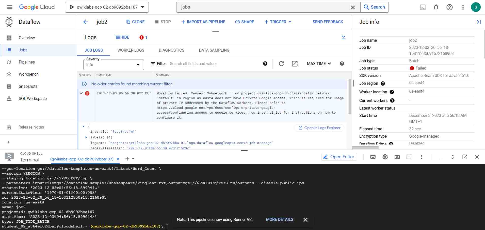
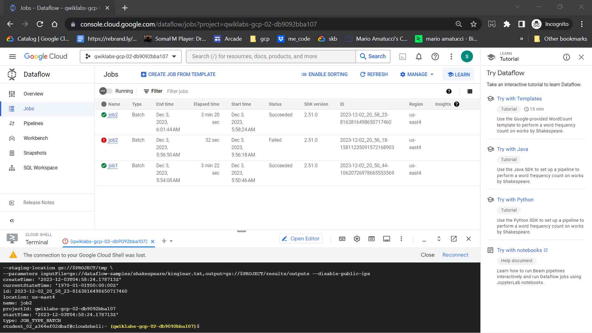

# <https§§§www.cloudskillsboost.google§course_templates§218>
> <https://www.cloudskillsboost.google/course_templates/218>

# Serverless Data Processing with Dataflow: Foundations

## Introduction


## Beam Portability


## Separating Compute and Storage with Dataflow


## IAM, Quotas, and Permissions


## Security

### Setup IAM and Networking for your Dataflow Jobs

[https://www.cloudskillsboost.google/course_sessions/5993620/labs/325927](../https§§§www.cloudskillsboost.google§course_sessions§5993620§labs§325927/readme.md)

[here](./Setup%20IAM%20and%20Networking%20for%20your%20Dataflow%20Jobs%20_%20Google%20Cloud%20Skills%20Boost%20__%20Reader%20View.pdf)

```bash
## Task 1. Create a Cloud Storage bucket

PROJECT=`gcloud config list --format 'value(core.project)'`
USER_EMAIL=`gcloud config list account --format "value(core.account)"`
REGION="REGION"

## Task 2. Launch a Dataflow job

gcloud projects get-iam-policy $PROJECT  \
--format='table(bindings.role)' \
--flatten="bindings[].members" \
--filter="bindings.members:$USER_EMAIL"

gcloud dataflow jobs run job1 \
--gcs-location gs://dataflow-templates-"REGION"/latest/Word_Count \
--region $REGION \
--staging-location gs://$PROJECT/tmp \
--parameters inputFile=gs://dataflow-samples/shakespeare/kinglear.txt,output=gs://$PROJECT/results/outputs

gcloud projects add-iam-policy-binding $PROJECT --member=user:$USER_EMAIL --role=roles/dataflow.admin

## Task 3. Launch in private IPs

gcloud dataflow jobs run job2 \
--gcs-location gs://dataflow-templates-"REGION"/latest/Word_Count \
--region $REGION \
--staging-location gs://$PROJECT/tmp \
--parameters inputFile=gs://dataflow-samples/shakespeare/kinglear.txt,output=gs://$PROJECT/results/outputs --disable-public-ips

gcloud projects add-iam-policy-binding $PROJECT --member=user:$USER_EMAIL --role=roles/compute.networkAdmin
gcloud compute networks subnets update default \
--region=$REGION \
--enable-private-ip-google-access


```






## Summary

[here](./T-SDPDFF-I-Locales-m5-l2-file-en-18.pdf)