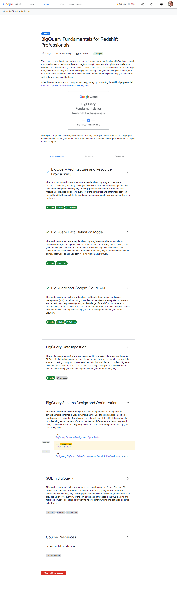

# <https§§§www.cloudskillsboost.google§course_templates§512§catalog_rank=%7B%22rank%22%3A4%2C%22num_filters%22%3A0%2C%22has_search%22%3Atrue%7D&search_id=26818326>
> <https://www.cloudskillsboost.google/course_templates/512?catalog_rank=%7B%22rank%22%3A4%2C%22num_filters%22%3A0%2C%22has_search%22%3Atrue%7D&search_id=26818326>

# BigQuery Fundamentals for Redshift Professionals

TODO:

## BigQuery Architecture and Resource Provisioning

[https://storage.googleapis.com/cloud-training/cls-html5-courses/T-BQRS-I/M1/index.html](../https§§§storage.googleapis.com§cloud-training§cls-html5-courses§T-BQRS-I§M1§index.html/readme.md)
 
[https://www.cloudskillsboost.google/course_sessions/3777998/labs/375038](../https§§§www.cloudskillsboost.google§course_sessions§3777998§labs§375038/readme.md)

## BigQuery Data Definition Model

[https://storage.googleapis.com/cloud-training/cls-html5-courses/T-BQRS-I/M2/index.html](../https§§§storage.googleapis.com§cloud-training§cls-html5-courses§T-BQRS-I§M2§index.html/readme.md)

## BigQuery and Google Cloud IAM

[https://storage.googleapis.com/cloud-training/cls-html5-courses/T-BQRS-I/M3/index.html](../https§§§storage.googleapis.com§cloud-training§cls-html5-courses§T-BQRS-I§M3§index.html/readme.md)

[https://www.cloudskillsboost.google/course_sessions/3777998/labs/375043](../https§§§www.cloudskillsboost.google§course_sessions§3777998§labs§375043/readme.md)

## BigQuery Data Ingestion

[https://storage.googleapis.com/cloud-training/cls-html5-courses/T-BQRS-I/M4/index.html](../https§§§storage.googleapis.com§cloud-training§cls-html5-courses§T-BQRS-I§M4§index.html/readme.md)

## BigQuery Schema Design and Optimization

[https://storage.googleapis.com/cloud-training/cls-html5-courses/T-BQRS-I/M5/index.html](../https§§§storage.googleapis.com§cloud-training§cls-html5-courses§T-BQRS-I§M5§index.html/readme.md)

[https://www.cloudskillsboost.google/course_sessions/3777998/labs/375048](../https§§§www.cloudskillsboost.google§course_sessions§3777998§labs§375048/readme.md)

## SQL in BigQuery

[https://storage.googleapis.com/cloud-training/cls-html5-courses/T-BQRS-I/M6/index.html](../https§§§storage.googleapis.com§cloud-training§cls-html5-courses§T-BQRS-I§M6§index.html/readme.md)

[https://www.cloudskillsboost.google/course_sessions/3777998/labs/375051](../https§§§www.cloudskillsboost.google§course_sessions§3777998§labs§375051/readme.md)

## Course Resources

[https://www.cloudskillsboost.google/course_sessions/3777998/documents/375052](../https§§§www.cloudskillsboost.google§course_sessions§3777998§documents§375052/readme.md)
