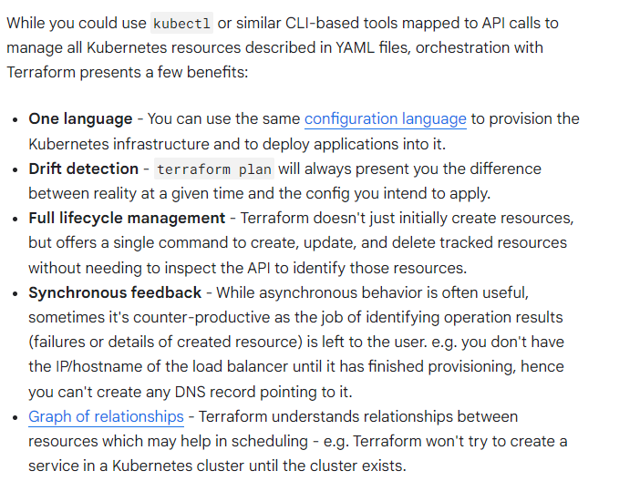
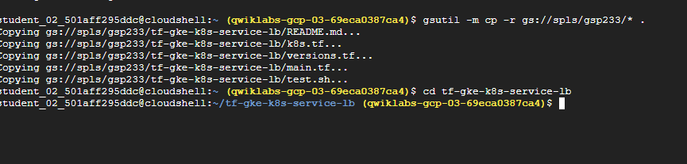
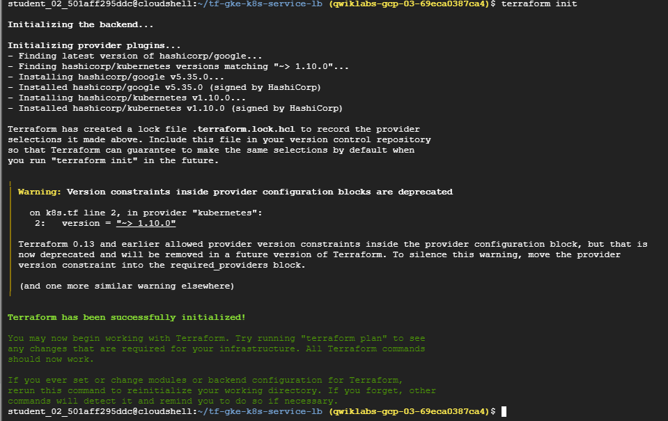
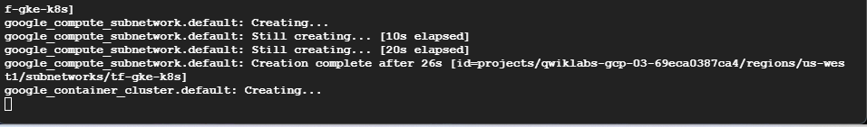
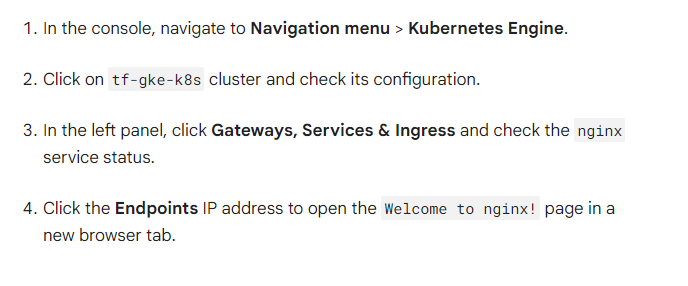
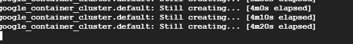
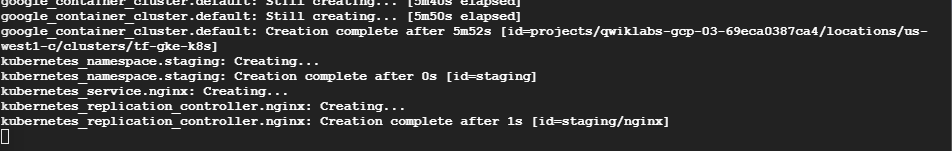
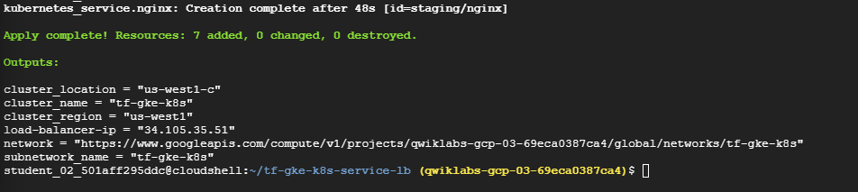
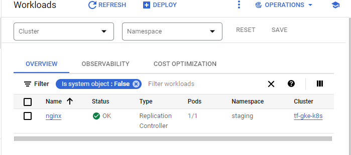
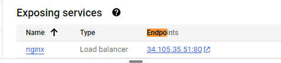

# <https§§§www.cloudskillsboost.google§course_templates§746§labs§447166>
> <https://www.cloudskillsboost.google/course_templates/746/labs/447166>

# Deploy Kubernetes Load Balancer Service with Terraform

Deploy a Kubernetes cluster along with a service using Terraform

Kubernetes services
A service is a grouping of pods that are running on the cluster. Services are "cheap" and you can have many services within the cluster. Kubernetes services can efficiently power a microservice architecture.

Services provide important features that are standardized across the cluster: load-balancing, service discovery between applications, and features to support zero-downtime application deployments.

Each service has a pod label query which defines the pods which will process data for the service. This label query frequently matches pods created by one or more replication controllers. Powerful routing scenarios are possible by updating a service's label query via the Kubernetes API with deployment software.

Why Terraform?

## Task 1. Clone the sample code

gsutil -m cp -r gs://spls/gsp233/* .

## Task 2. Understand the code

info 

[here](./info.md)

cat main.tf

[here](./main.tf)

Variables are defined for region, zone, and network_name. These will be used to create the Kubernetes cluster.
The Google Cloud provider will let us create resources in this project.
There are several resources defined to create the appropriate network and cluster.
At the end, there are some outputs which you'll see after running terraform apply.

cat k8s.tf

[here](./k8s.tf)

The script configures a Kubernetes provider with Terraform and creates the service, namespace and a replication_controller resource.
The script returns an nginx service IP as an output.

## Task 3. Initialize and install dependencies

terraform init

terraform apply -var="region=us-west1" -var="location=us-west1-c"

### Verify resources created by Terraform

