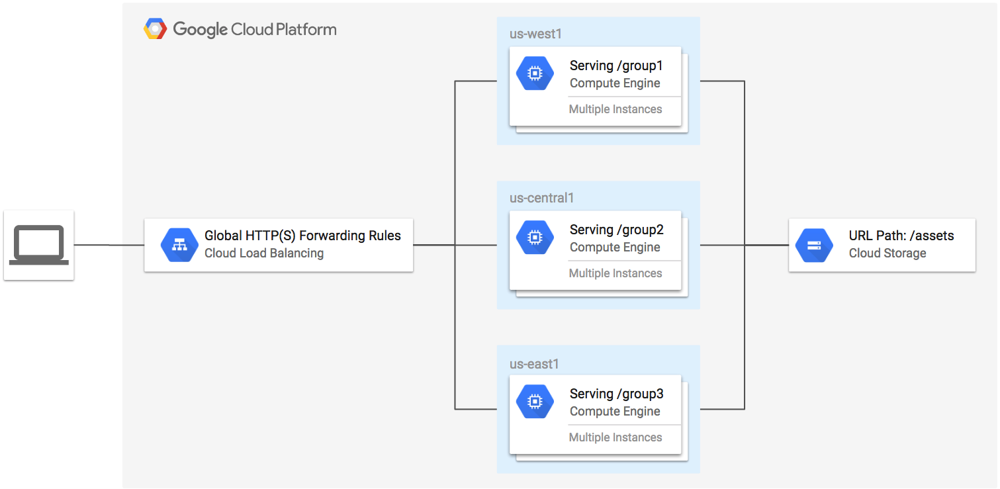
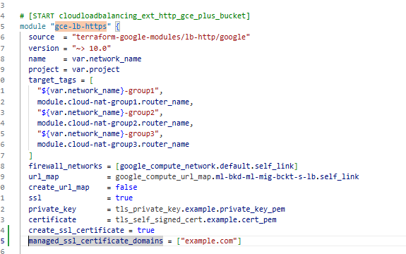
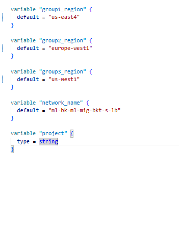
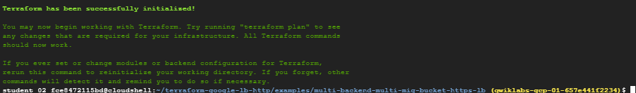
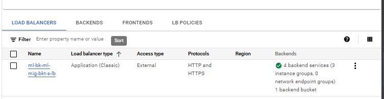
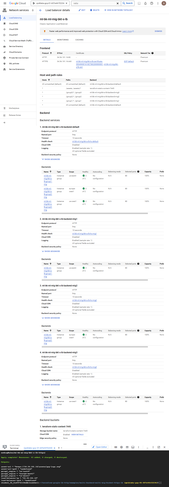
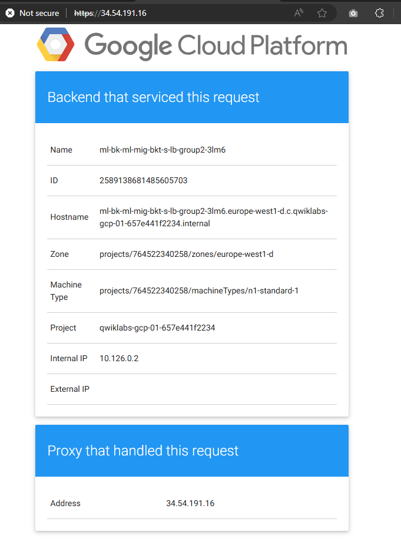
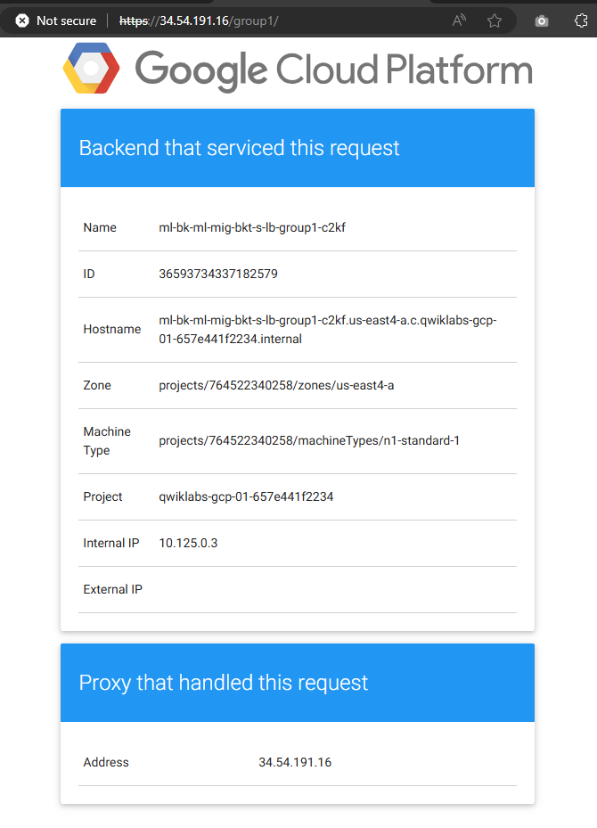
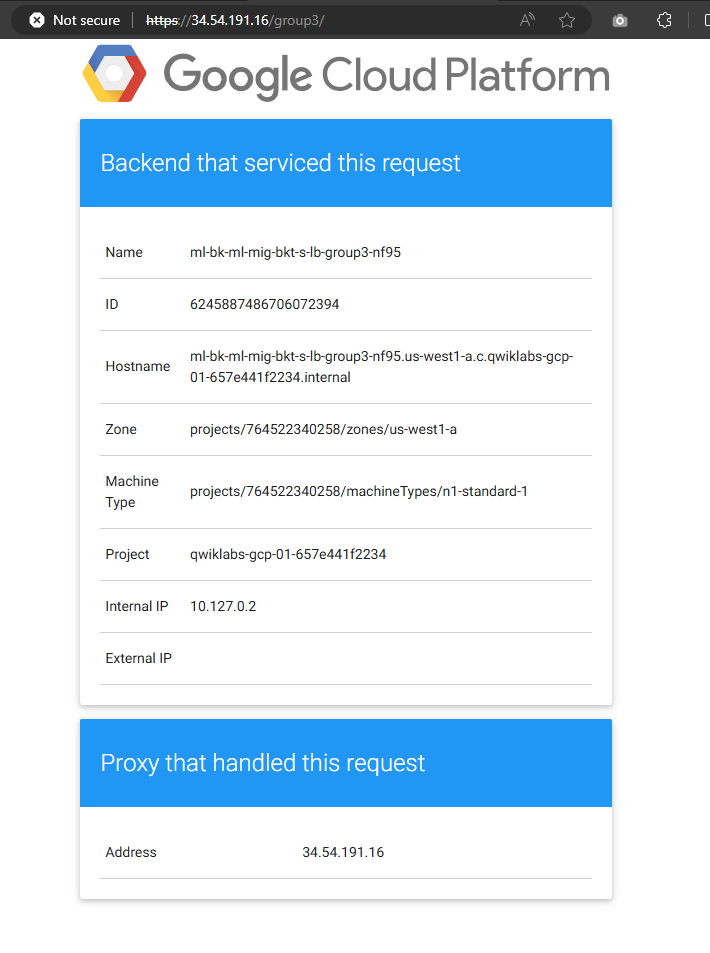

# <https§§§www.cloudskillsboost.google§course_templates§746§labs§447167>
> <https://www.cloudskillsboost.google/course_templates/746/labs/447167>

# HTTPS Content-Based Load Balancer with Terraform

In this lab, you will create an HTTPS load balancer to forward traffic to a custom URL map. The URL map sends traffic to the region closest to you with static assets being served from a Cloud Storage bucket. The TLS key and certificate is generated by Terraform using the TLS provider.

Objectives
In this lab, you will:

Learn about the load balancing modules for Terraform
Configure Terraform in the Google Cloud environment
Create a global HTTPS Content-Based Load Balancer

## Task 1. Clone the sample repository

git clone https://github.com/GoogleCloudPlatform/terraform-google-lb-http.git

[here](./_artifacts/multi-backend-multi-mig-bucket-https-lb/)

cd ~/terraform-google-lb-http/examples/multi-backend-multi-mig-bucket-https-lb

## Task 2. Run Terraform

terraform init

The terraform plan command is used to create an execution plan. Terraform performs a refresh, unless explicitly disabled, and then determines what actions are necessary to achieve the desired state specified in the configuration files.

terraform plan -out=tfplan -var 'project=qwiklabs-gcp-01-657e441f2234'

The terraform apply command is used to apply the changes required to reach the desired state of the configuration, or the pre-determined set of actions generated by a terraform plan execution plan.

terraform apply tfplan

EXTERNAL_IP=$(terraform output | grep load-balancer-ip | cut -d = -f2 | xargs echo -n)

group1

...

group3
