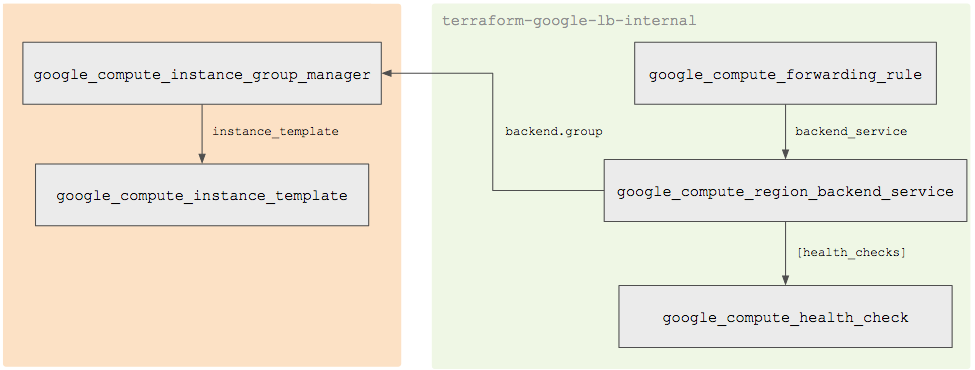

# <https§§§www.cloudskillsboost.google§course_templates§746§labs§447168>
> <https://www.cloudskillsboost.google/course_templates/746/labs/447168>

# Modular Load Balancing with Terraform - Regional Load Balancer

Objectives
In this lab, you will learn how to:

Use load balancing modules for Terraform
Create a regional TCP load balancer
Create a regional internal TCP load balancer
Create a global HTTP load balancer with Kubernetes Engine
Create a global HTTPS content-based load balancer

## Terraform modules overview

terraform-google-lb (regional forwarding rule)

https://cloud.google.com/compute/docs/load-balancing/network/example

terraform-google-lb-internal (regional internal forwarding rule)

terraform-google-lb-http (global HTTP(S) forwarding rule)

## Task 1. Clone the examples repository

git clone https://github.com/GoogleCloudPlatform/terraform-google-lb
cd ~/terraform-google-lb/examples/basic

## Task 2. Create a TCP load balancer with a regional forwarding rule

export GOOGLE_PROJECT=$(gcloud config get-value project)

terraform init

export REGION=REGION
sed -i 's/us-central1/'"$REGION"'/g' variables.tf

terraform plan

terraform apply

EXTERNAL_IP=$(terraform output | grep load_balancer_default_ip | cut -d = -f2 | xargs echo -n)

echo "http://${EXTERNAL_IP}"