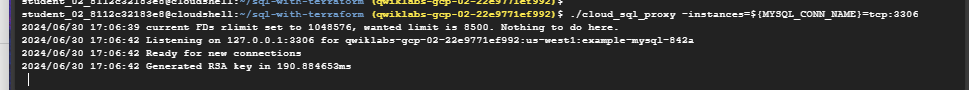

# <https§§§www.cloudskillsboost.google§course_templates§746§labs§447169>
> <https://www.cloudskillsboost.google/course_templates/746/labs/447169>

# Cloud SQL with Terraform

mkdir sql-with-terraform
cd sql-with-terraform
gsutil cp -r gs://spls/gsp234/gsp234.zip .

[here](./_artifacts/sql-with-terraform/)

terraform init

terraform plan -out=tfplan

terraform apply tfplan

## Task 5. Installing the Cloud SQL Proxy

wget https://dl.google.com/cloudsql/cloud_sql_proxy.linux.amd64 -O cloud_sql_proxy
chmod +x cloud_sql_proxy

## Task 6. Test connection to the database

export GOOGLE_PROJECT=$(gcloud config get-value project)

MYSQL_DB_NAME=$(terraform output -json | jq -r '.instance_name.value')
MYSQL_CONN_NAME="${GOOGLE_PROJECT}:us-west1:${MYSQL_DB_NAME}"

./cloud_sql_proxy -instances=${MYSQL_CONN_NAME}=tcp:3306

mysql -udefault -p --host 127.0.0.1 default

echo MYSQL_PASSWORD=$(terraform output -json | jq -r '.generated_user_password.value')

mysql -udefault -p --host 127.0.0.1 default

back to other tab

## Task 7. Test your understanding

