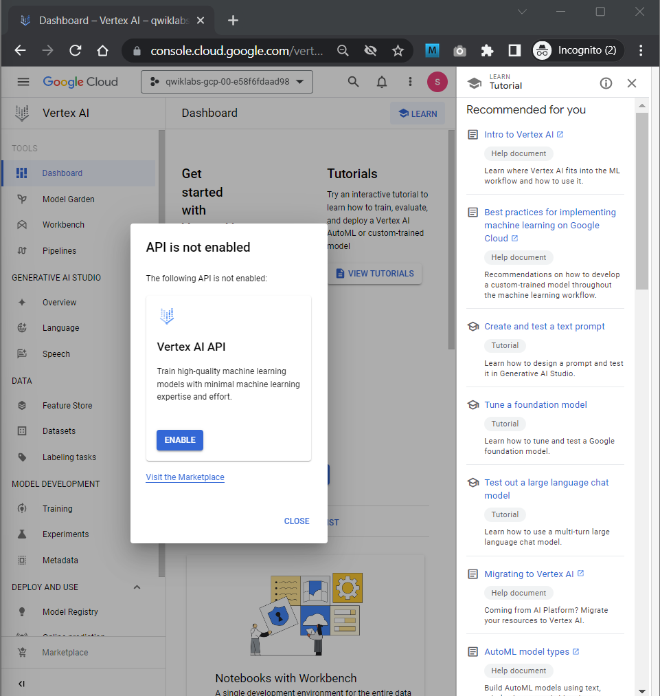
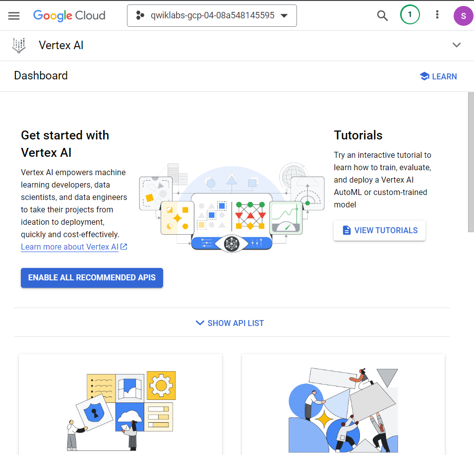
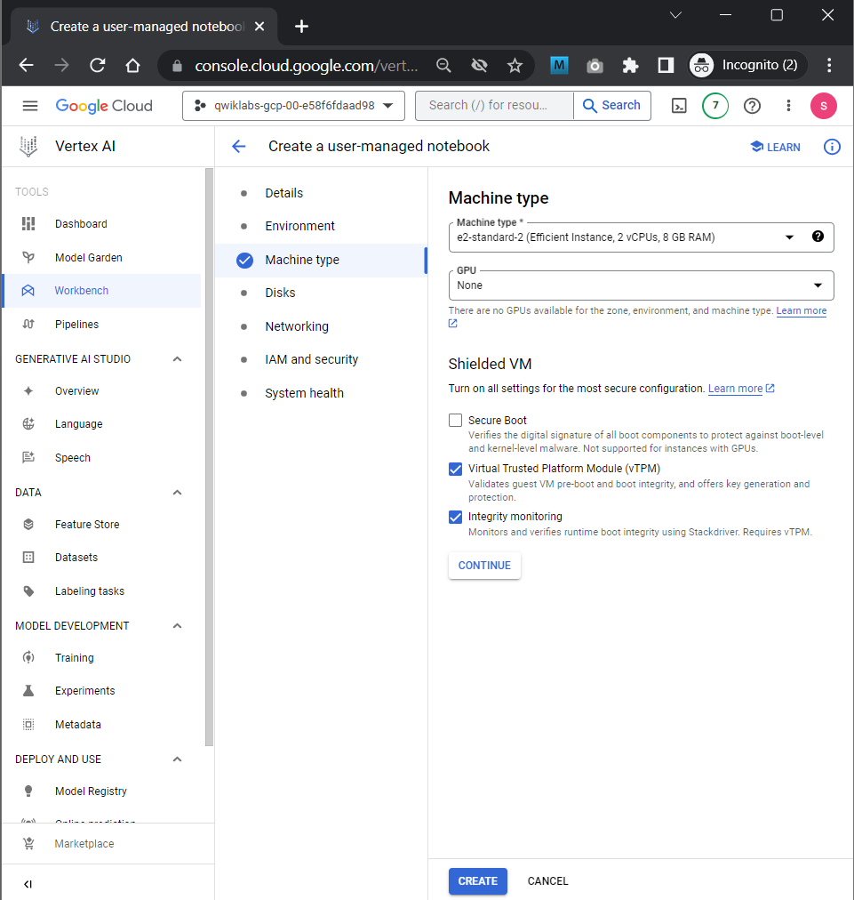
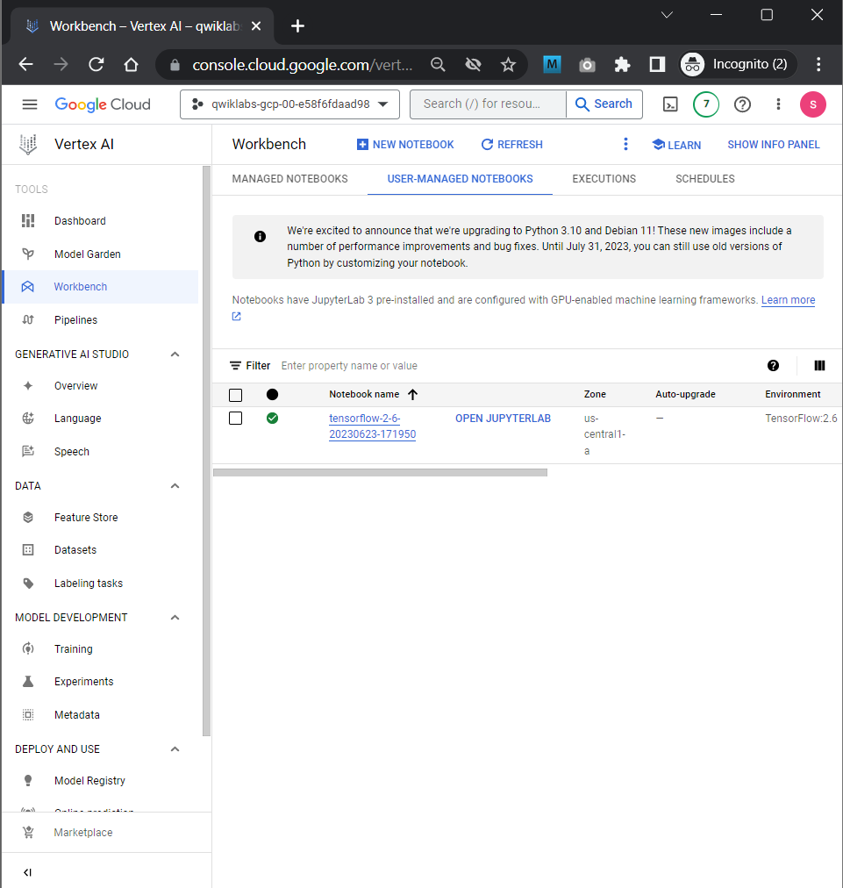

# <https§§§www.cloudskillsboost.google§focuses§10285§parent=catalog>

> [https://www.cloudskillsboost.google/focuses/10285?parent=catalog](https://www.cloudskillsboost.google/focuses/10285?parent=catalog)

# Reinforcement Learning: Qwik Start

## Task 1. Reinforcement learning 101

https://en.wikipedia.org/wiki/Reinforcement_learning

https://gymnasium.farama.org/

## Task 2. Set up your environment

 

 

## Task 3. Launch Vertex AI Notebooks

 

FIX: be sure to enable all the api to see alll the machine types

 

## Task 4. Clone the sample code

git clone https://github.com/GoogleCloudPlatform/training-data-analyst

From the left-hand menu, select  **training-data-analyst** >  **quests** > **rl** > **early_rl** >  **early_rl.ipynb** . This will open a new tab.

## Task 5. Run through the notebook
