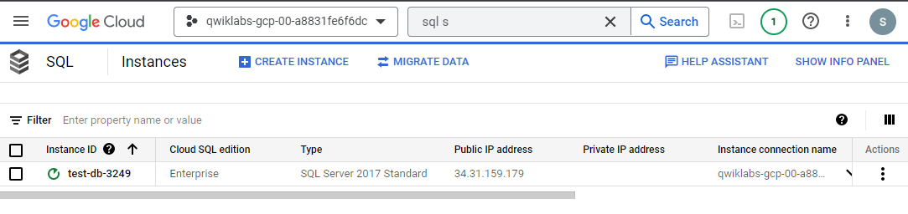
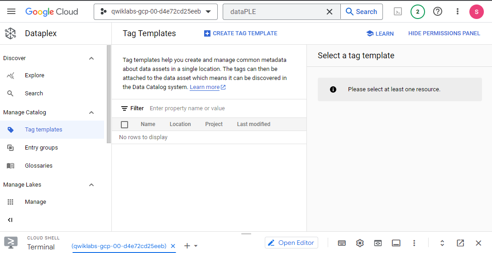
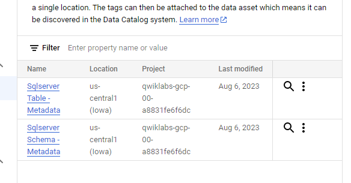
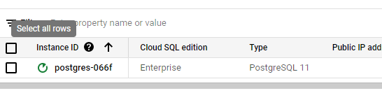
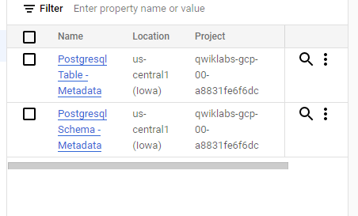
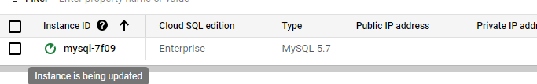

# <https§§§www.cloudskillsboost.google§focuses§11999§parent=catalog>
> <https://www.cloudskillsboost.google/focuses/11999?parent=catalog>

# Build and Execute MySQL, PostgreSQL, and SQLServer to Data Catalog Connectors

What you'll do
Enable the Data Catalog API.

Configure Dataplex connectors for SQL Server, PostgreSQL, and MySQL.

Search for SQL Server, PostgreSQL, and MySQL entries in Data Catalog within Dataplex.

## Task 1. Enable the Data Catalog API

In the search bar, enter in "Data Catalog" and select the Google Cloud Data Catalog API.

## Task 2. SQL Server to Dataplex

```bash
export PROJECT_ID=$(gcloud config get-value project)

gsutil cp gs://spls/gsp814/cloudsql-sqlserver-tooling.zip .
unzip cloudsql-sqlserver-tooling.zip

cd cloudsql-sqlserver-tooling
bash init-db.sh

```


### Set up the Service Account

```bash
# Run the following command to create a Service Account:

gcloud iam service-accounts create sqlserver2dc-credentials \
--display-name  "Service Account for SQL Server to Data Catalog connector" \
--project $PROJECT_ID

# Now create and download the Service Account Key.
gcloud iam service-accounts keys create "sqlserver2dc-credentials.json" \
--iam-account "sqlserver2dc-credentials@$PROJECT_ID.iam.gserviceaccount.com"

# Add the Data Catalog admin role to the Service Account:
gcloud projects add-iam-policy-binding $PROJECT_ID \
--member "serviceAccount:sqlserver2dc-credentials@$PROJECT_ID.iam.gserviceaccount.com" \
--quiet \
--project $PROJECT_ID \
--role "roles/datacatalog.admin"

```

### Execute SQL Server to Dataplex connector

To facilitate its usage, we are going to use a docker image.

The variables needed were output by the Terraform config.

```bash
cd infrastructure/terraform/

public_ip_address=$(terraform output -raw public_ip_address)
username=$(terraform output -raw username)
password=$(terraform output -raw password)
database=$(terraform output -raw db_name)

cd ~/cloudsql-sqlserver-tooling

docker run --rm --tty -v \
"$PWD":/data mesmacosta/sqlserver2datacatalog:stable \
--datacatalog-project-id=$PROJECT_ID \
--datacatalog-location-id=us-central1 \
--sqlserver-host=$public_ip_address \
--sqlserver-user=$username \
--sqlserver-pass=$password \
--sqlserver-database=$database

```

### Search for the SQL Server Entries in Dataplex




### Clean up

```bash
./cleanup-db.sh

docker run --rm --tty -v \
"$PWD":/data mesmacosta/sqlserver-datacatalog-cleaner:stable \
--datacatalog-project-ids=$PROJECT_ID \
--rdbms-type=sqlserver \
--table-container-type=schema

./delete-db.sh
```

## Task 3. PostgreSQL to Dataplex

### Create the PostgreSQL Database

```bash
export PROJECT_ID=$(gcloud config get-value project)
cd
gsutil cp gs://spls/gsp814/cloudsql-postgresql-tooling.zip .
unzip cloudsql-postgresql-tooling.zip

cd cloudsql-postgresql-tooling
bash init-db.sh
```


### Set up the Service Account

```bash
# Create a Service Account:
gcloud iam service-accounts create postgresql2dc-credentials \
--display-name  "Service Account for PostgreSQL to Data Catalog connector" \
--project $PROJECT_ID

# Next create and download the Service Account Key:
gcloud iam service-accounts keys create "postgresql2dc-credentials.json" \
--iam-account "postgresql2dc-credentials@$PROJECT_ID.iam.gserviceaccount.com"

# Next add Data Catalog admin role to the Service Account:
gcloud projects add-iam-policy-binding $PROJECT_ID \
--member "serviceAccount:postgresql2dc-credentials@$PROJECT_ID.iam.gserviceaccount.com" \
--quiet \
--project $PROJECT_ID \
--role "roles/datacatalog.admin"
 
```

### Execute PostgreSQL to Dataplex connector

```bash
cd infrastructure/terraform/

public_ip_address=$(terraform output -raw public_ip_address)
username=$(terraform output -raw username)
password=$(terraform output -raw password)
database=$(terraform output -raw db_name)

cd ~/cloudsql-postgresql-tooling
# Execute the connector:


docker run --rm --tty -v \
"$PWD":/data mesmacosta/postgresql2datacatalog:stable \
--datacatalog-project-id=$PROJECT_ID \
--datacatalog-location-id=us-central1 \
--postgresql-host=$public_ip_address \
--postgresql-user=$username \
--postgresql-pass=$password \
--postgresql-database=$database
```



## Task 4. MySQL to Dataplex

```bash
export PROJECT_ID=$(gcloud config get-value project)
cd
gsutil cp gs://spls/gsp814/cloudsql-mysql-tooling.zip .
unzip cloudsql-mysql-tooling.zip

cd cloudsql-mysql-tooling
bash init-db.sh
```


### Set up the Service Account

```bash
gcloud iam service-accounts create mysql2dc-credentials \
--display-name  "Service Account for MySQL to Data Catalog connector" \
--project $PROJECT_ID

gcloud iam service-accounts keys create "mysql2dc-credentials.json" \
--iam-account "mysql2dc-credentials@$PROJECT_ID.iam.gserviceaccount.com"

gcloud projects add-iam-policy-binding $PROJECT_ID \
--member "serviceAccount:mysql2dc-credentials@$PROJECT_ID.iam.gserviceaccount.com" \
--quiet \
--project $PROJECT_ID \
--role "roles/datacatalog.admin"
```

### Execute MySQL to Dataplex connector

```bash
cd infrastructure/terraform/

public_ip_address=$(terraform output -raw public_ip_address)
username=$(terraform output -raw username)
password=$(terraform output -raw password)
database=$(terraform output -raw db_name)

cd ~/cloudsql-mysql-tooling

docker run --rm --tty -v \
"$PWD":/data mesmacosta/mysql2datacatalog:stable \
--datacatalog-project-id=$PROJECT_ID \
--datacatalog-location-id=us-central1 \
--mysql-host=$public_ip_address \
--mysql-user=$username \
--mysql-pass=$password \
--mysql-database=$database
```