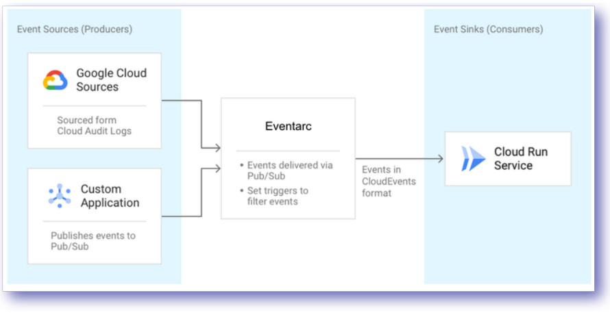
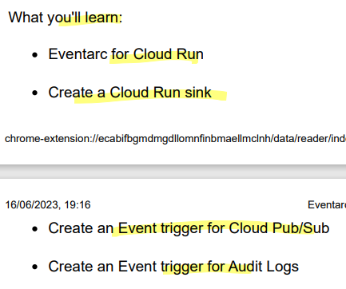
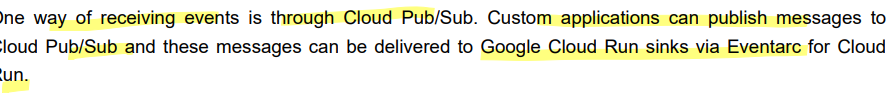
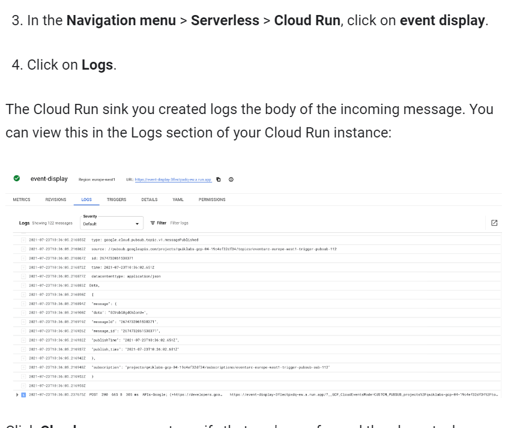
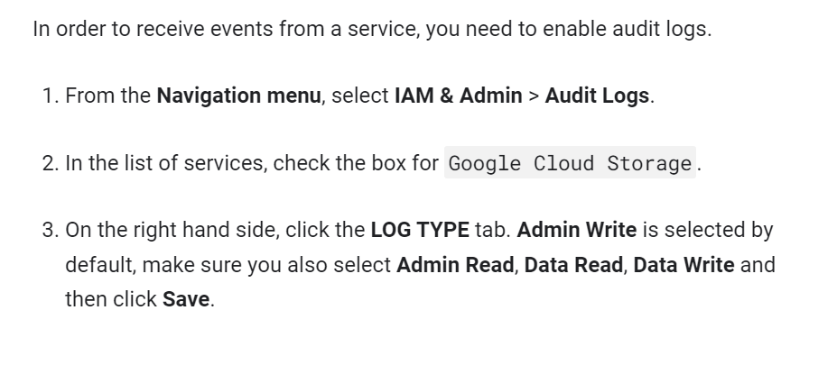
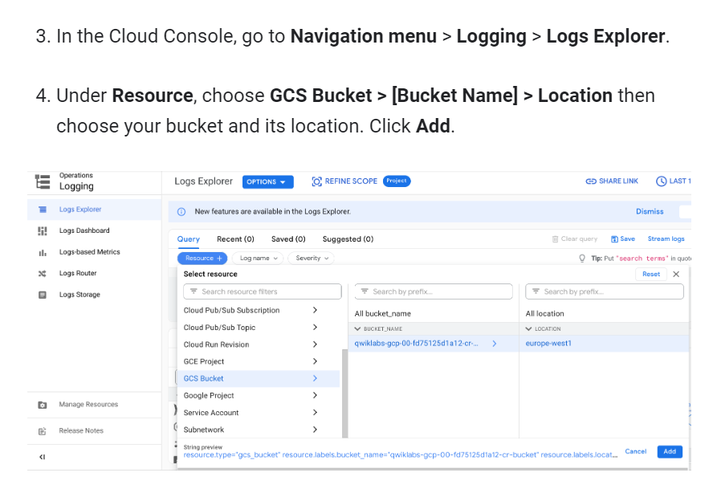
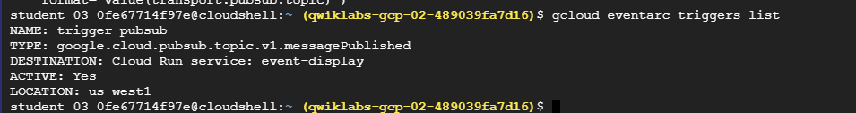
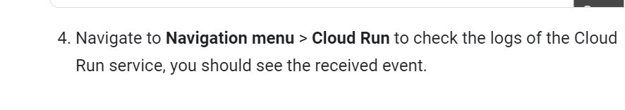

# <https§§§www.cloudskillsboost.google§focuses§15657§parent=catalog>

> [https://www.cloudskillsboost.google/focuses/15657?parent=catalog](https://www.cloudskillsboost.google/focuses/15657?parent=catalog)

# Eventarc for Cloud Run

## Overview

use events for cloud run to manage comm between producer and consumers

Cloud Pub/Sub facilitates event delivery for their project events generated

the unifying delivery mechanism between producers and consumers is Eventarc for Cloud Run.



## Task 1. Set up your environment

```bash
gcloud config set project {{{project_0.project_id | "filled in at lab start"}}}
gcloud config set run/region {{{project_0.default_region | "REGION"}}}

# Cloud Run platform default to managed
gcloud config set run/platform managed

gcloud config set eventarc/location {{{project_0.default_region | "REGION"}}}

```

## Task 2. Enable service account

```bash
# save project
export PROJECT_NUMBER="$(gcloud projects list  --filter=$(gcloud config get-value project)  --format='value(PROJECT_NUMBER)')"

# the eventarc.admin role to the default Compute Engine service account:
gcloud projects add-iam-policy-binding $(gcloud config get-value project) \
  --member=serviceAccount:${PROJECT_NUMBER}-compute@developer.gserviceaccount.com \
  --role='roles/eventarc.admin'

```

## Task 3. Event discovery

```bash
# regirstered sources and types of events
gcloud beta eventarc attributes types list

# more info for each event 
gcloud beta eventarc attributes types describe google.cloud.pubsub.topic.v1.messagePublished

```

## Task 4. Create a Cloud Run sink

```bash
#1. Set up an environment variable for the service:
export SERVICE_NAME=event-display

#2. Set up an environment variable for the image:
export IMAGE_NAME="gcr.io/cloudrun/hello"

#3. Deploy your containerized application to Cloud Run:
gcloud run deploy ${SERVICE_NAME} \ 
--image ${IMAGE_NAME} \ 
--allow-unauthenticated \ 
--max-instances=3
```

the command line displays the service URL. At this point the service is up and
running.

## Task 5. Create a Cloud Pub/Sub event trigger



Create a trigger

```bash
# construct a trigger for events from Cloud Pub/Sub
gcloud beta eventarc attributes types describe \ google.cloud.pubsub.topic.v1.messagePublished

#  Create a trigger to filter events published to the Cloud Pub/Sub topic to your deployed Cloud Run service
gcloud beta eventarc triggers create trigger-pubsub \
  --destination-run-service=${SERVICE_NAME} \
  --matching-criteria="type=google.cloud.pubsub.topic.v1.messagePublished"
```

Find the topic

> The Pub/Sub trigger creates a Pub/Sub topic behind the scenes.

```bash
export TOPIC_ID=$(gcloud eventarc triggers describe trigger-pubsub --format='value(transport.pubsub.topic)')

```

Test the trigger

```bash
# You can check that the trigger is created by listing all triggers:
gcloud eventarc triggers list

#  to simulate a custom application sending message, you can use a gcloud command to to fire an event
gcloud pubsub topics publish ${TOPIC_ID} --message="Hello there"
```



Delete the trigger

```bash
gcloud eventarc triggers delete trigger-pubsub

```

## Task 6. Create a Audit Logs event trigger

```bash
# Create an environment variable for your bucket
export BUCKET_NAME=$(gcloud config get-value project)-cr-bucket

# Create a Cloud Storage bucket in the same region
gsutil mb -p $(gcloud config get-value project) \
  -l $(gcloud config get-value run/region) \
  gs://${BUCKET_NAME}/
```

Enable Audit Logs



Test audit logs

```bash
echo "Hello World" > random.txt
gsutil cp random.txt gs://${BUCKET_NAME}/random.txt
```



Create a trigger

> You are now ready to create an event trigger for Audit Logs.

```bash
# Get more details on the parameters you'll need to construct the trigger:
gcloud beta eventarc attributes types describe google.cloud.audit.log.v1.written

# Create the trigger with the right filters:
gcloud beta eventarc triggers create trigger-auditlog \
--destination-run-service=${SERVICE_NAME} \
--matching-criteria="type=google.cloud.audit.log.v1.written" \
--matching-criteria="serviceName=storage.googleapis.com" \
--matching-criteria="methodName=storage.objects.create" \
--service-account=${PROJECT_NUMBER}-compute@developer.gserviceaccount.com

```

Test the trigger

```bash
gcloud eventarc triggers list

#>_ Wait for up to 10 minutes
```



```bash
gsutil cp random.txt gs://${BUCKET_NAME}/random.txt

```



Delete the trigger

```bash
gcloud eventarc triggers delete trigger-auditlog
```
