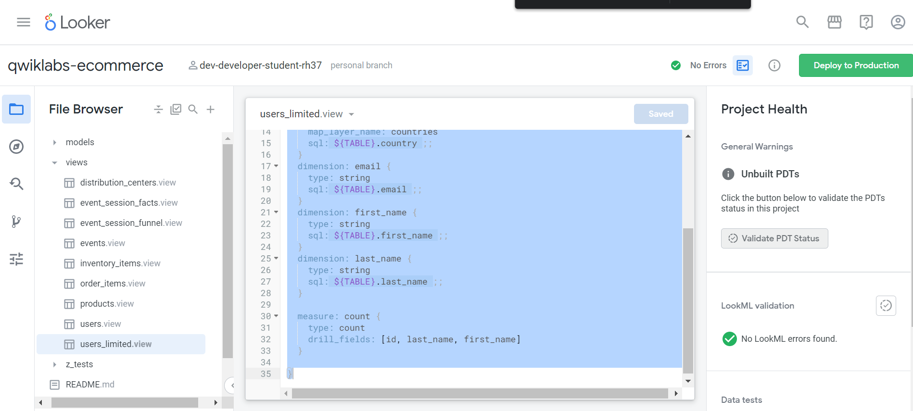
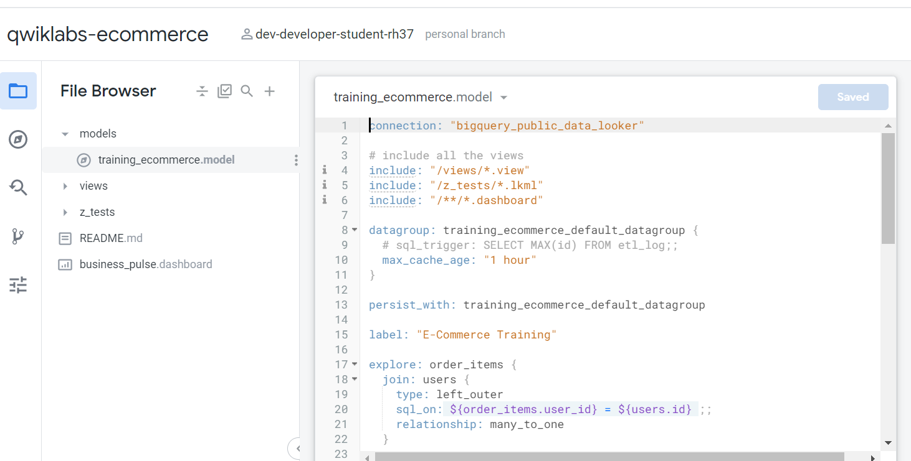
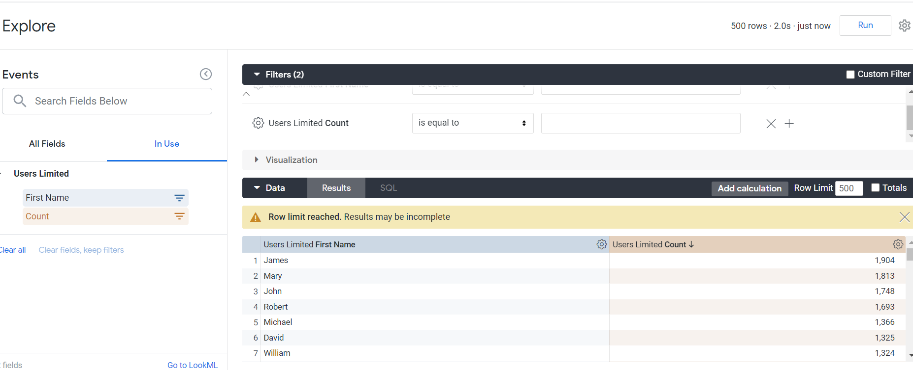

   <https§§§www.cloudskillsboost.google§focuses§18478§parent=catalog>
> <https://www.cloudskillsboost.google/focuses/18478?parent=catalog>
        
## Task 1. Create a view

> dev mode

```lookml
view: users_limited {
  #    You can specify the table name if it's different from the view name:
  sql_table_name: `cloud-training-demos.looker_ecomm.users` ;;
  
  #   Define your dimensions and measures here, like this:
  dimension: id {
    
    primary_key: yes
    type: number
    sql: ${TABLE}.id ;;
  }
  dimension: country {
    type: string
    map_layer_name: countries
    sql: ${TABLE}.country ;;
  }
  dimension: email {
    type: string
    sql: ${TABLE}.email ;;
  }
  dimension: first_name {
    type: string
    sql: ${TABLE}.first_name ;;
  }
  dimension: last_name {
    type: string
    sql: ${TABLE}.last_name ;;
  }
  
  measure: count {
    type: count
    drill_fields: [id, last_name, first_name]
  }
  
}
```



Lastly, click Deploy to Production.


## Task 2. Join a view to an existing explore

model


```lookml
join: users_limited {
  type: left_outer
  sql_on: ${events.user_id} = ${users_limited.id};;
  relationship: many_to_one
}
```
Click the caret next to the file title at the top of the IDE and then select Explore Events.


Under Users Limited, select the First Name dimension and the Count measure.




Finish your quest


[https://www.cloudskillsboost.google/quests/170](https§§§www.cloudskillsboost.google§quests§170/readme.md)
[https://www.cloudskillsboost.google/quests/187](https§§§www.cloudskillsboost.google§quests§187/readme.md)

Next steps / Learn more
[https://community.looker.com/](https§§§community.looker.com§/readme.md)
