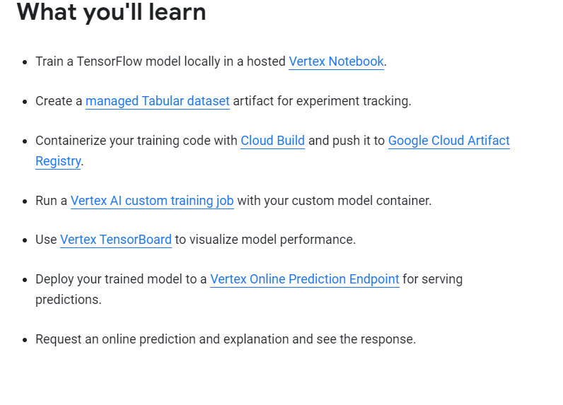
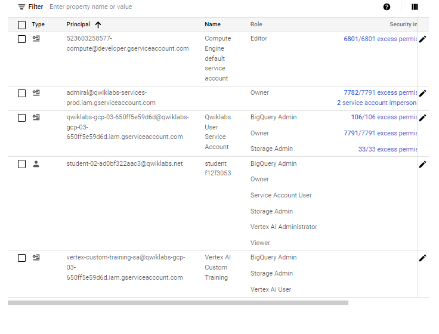
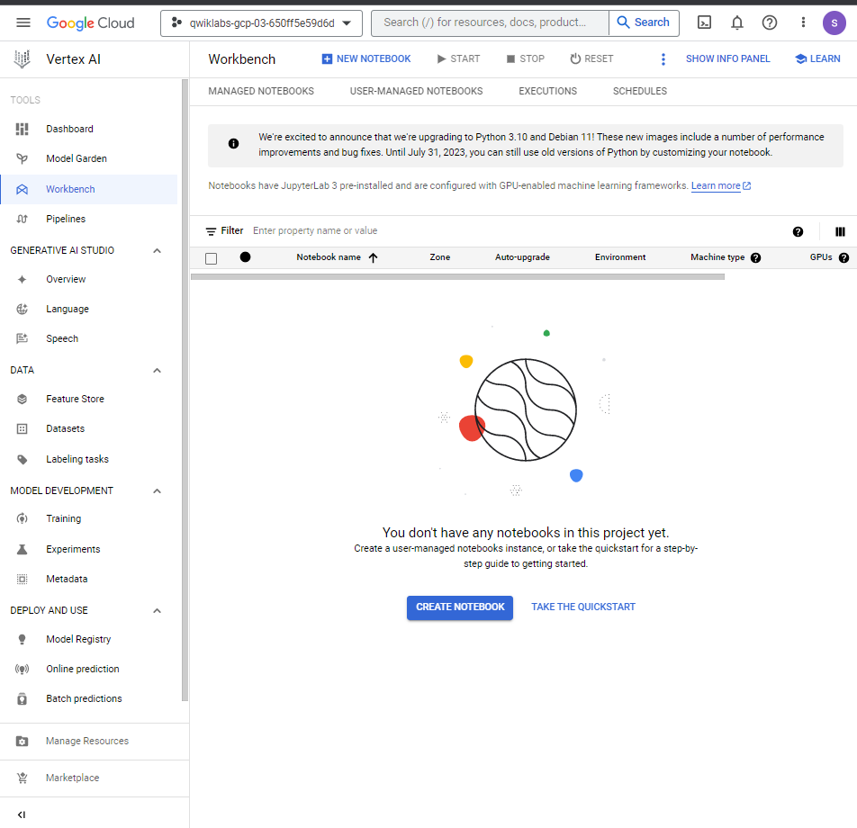
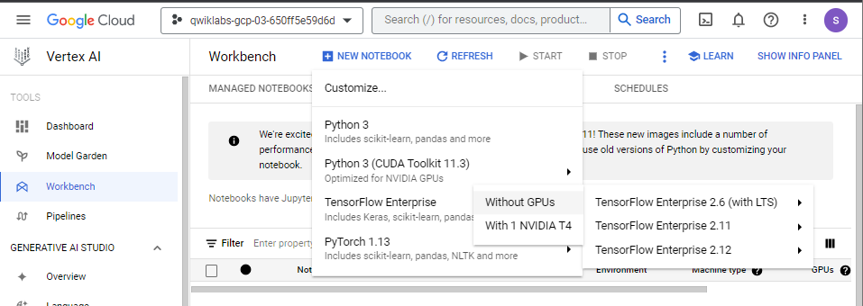
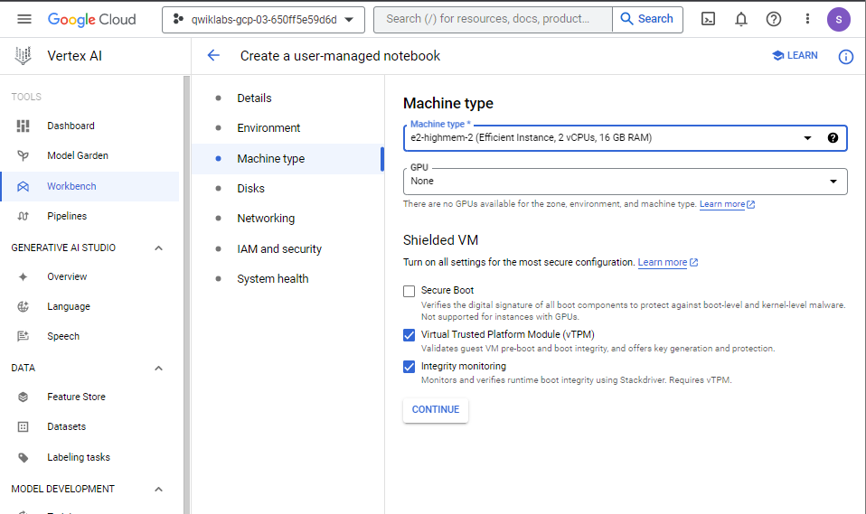
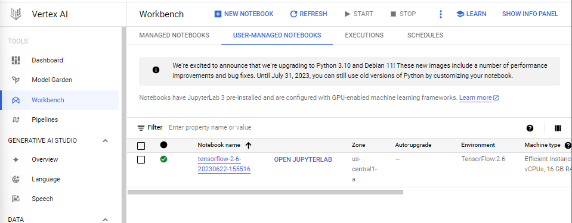
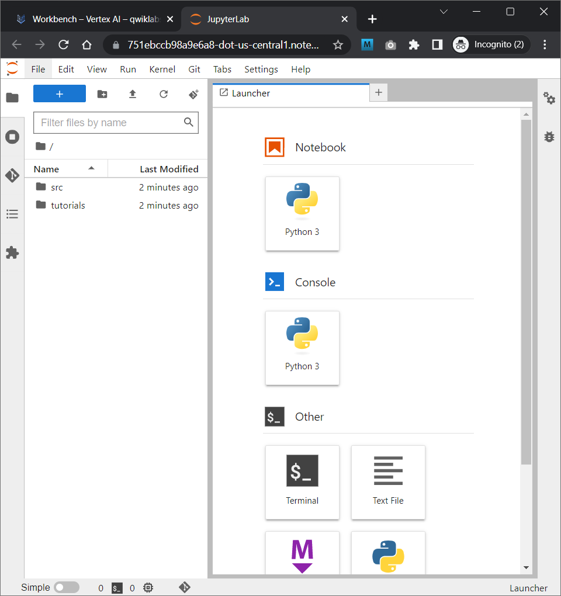

# <https§§§www.cloudskillsboost.google§focuses§18940§parent=catalog>

> [https://www.cloudskillsboost.google/focuses/18940?parent=catalog](https://www.cloudskillsboost.google/focuses/18940?parent=catalog)

https://cloud.google.com/vertex-ai



https://cloud.google.com/vertex-ai/docs/workbench/introduction

https://cloud.google.com/vertex-ai/docs/training/using-managed-datasets

https://cloud.google.com/vertex-ai/docs/experiments/tensorboard-overview

## Task 1. Enable Google Cloud services

```bas
gcloud services enable \
  compute.googleapis.com \
  iam.googleapis.com \
  iamcredentials.googleapis.com \
  monitoring.googleapis.com \
  logging.googleapis.com \
  notebooks.googleapis.com \
  aiplatform.googleapis.com \
  bigquery.googleapis.com \
  artifactregistry.googleapis.com \
  cloudbuild.googleapis.com \
  container.googleapis.com
```

## Task 2. Create Vertex AI custom service account for Vertex Tensorboard integration

```ba
# custome services
SERVICE_ACCOUNT_ID=vertex-custom-training-sa
gcloud iam service-accounts create $SERVICE_ACCOUNT_ID  \
    --description="A custom service account for Vertex custom training with Tensorboard" \
    --display-name="Vertex AI Custom Training"

# Grant it access to Cloud Storage for writing and retrieving Tensorboard logs:
PROJECT_ID=$(gcloud config get-value core/project)
gcloud projects add-iam-policy-binding $PROJECT_ID \
    --member=serviceAccount:$SERVICE_ACCOUNT_ID@$PROJECT_ID.iam.gserviceaccount.com \
    --role="roles/storage.admin"

# Grant it access to your BigQuery data source to read data into your TensorFlow model:
gcloud projects add-iam-policy-binding $PROJECT_ID \
    --member=serviceAccount:$SERVICE_ACCOUNT_ID@$PROJECT_ID.iam.gserviceaccount.com \
    --role="roles/bigquery.admin"

# Grant it access to Vertex AI for running model training, deployment, and explanation jobs:
gcloud projects add-iam-policy-binding $PROJECT_ID \
    --member=serviceAccount:$SERVICE_ACCOUNT_ID@$PROJECT_ID.iam.gserviceaccount.com \
    --role="roles/aiplatform.user"
```



## Task 3. Launch Vertex AI Workbench notebook



new nortebook



machine type







## Task 4. Clone the lab repository

git clone https://github.com/GoogleCloudPlatform/training-data-analyst

## Task 5. Install lab dependencies

cd training-data-analyst/self-paced-labs/vertex-ai/vertex-ai-qwikstart
pip3 install --user -r requirements.txt
