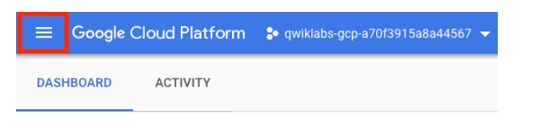

# <https§§§www.cloudskillsboost.google§focuses§2794§§parent§=catalog>
> <https://www.cloudskillsboost.google/focuses/2794?parent=catalog>

## A Tour of Google Cloud Hands-on Labs

[https://cloud.google.com/](/https§§§cloud.google.com§/readme.md)
google cloud services
- compuiting
- storage
- data analytics
- machine learning
- networking

variety of apis

[https://www.cloudskillsboost.google/journeys](/https§§§www.cloudskillsboost.google§journeys/readme.md)
used to learn
used to be Qwiklabs

[https://cloud.google.com/cloud-console/](/https§§§cloud.google.com§cloud-console§/readme.md)
brower UI to manage gcloud services

## Lab fundamentals

lab looks like

* start lab button
- tmp gcloud env created for you
* credit
- pay for the lab
* time
* score
- to pass the lab

## Task 1. Accessing the Cloud Console

for each lab we have diff values to be used

[https://cloud.google.com/docs/overview/#projects](/https§§§cloud.google.com§docs§overview§#projects/readme.md)
project id is uniq identifier

## Task 2. Projects in the Cloud console

project contains resources and services

console looks like

use navigation menu

## Task 3. Roles and permissions

[https://cloud.google.com/iam/](/https§§§cloud.google.com§iam§/readme.md)
iam & admin list of users and pemissions

type, principal, name, role, security insights

roles are can be primitve and more refined
[https://cloud.google.com/iam/docs/understanding-roles/#primitive%5C_roles](/https§§§cloud.google.com§iam§docs§understanding-roles§#primitive%5C_roles/readme.md)
* viewer
- read only, no state changes
* editor
- viewer plus modify state
* owner
- editor plus manage roles and permissions for the project
- setup billing

## Task 4. APIs and services

api to call services via client library
cloud api
[https://cloud.google.com/apis/design/](/https§§§cloud.google.com§apis§design§/readme.md)
most apli need to be enabled first

[https://developers.google.com/apis-explorer/#p/](/https§§§developers.google.com§apis-explorer§#p§/readme.md)
[https://google.qwiklabs.com/catalog_lab/1241](/https§§§google.qwiklabs.com§catalog_lab§1241/readme.md)

## Task 5. Ending your lab

End Lab and then click Submit to

### Finish your quest

lab part of
[https://google.qwiklabs.com/quests/23](/https§§§google.qwiklabs.com§quests§23/readme.md)
[https://www.cloudskillsboost.google/quests/90](/https§§§www.cloudskillsboost.google§quests§90/readme.md)

