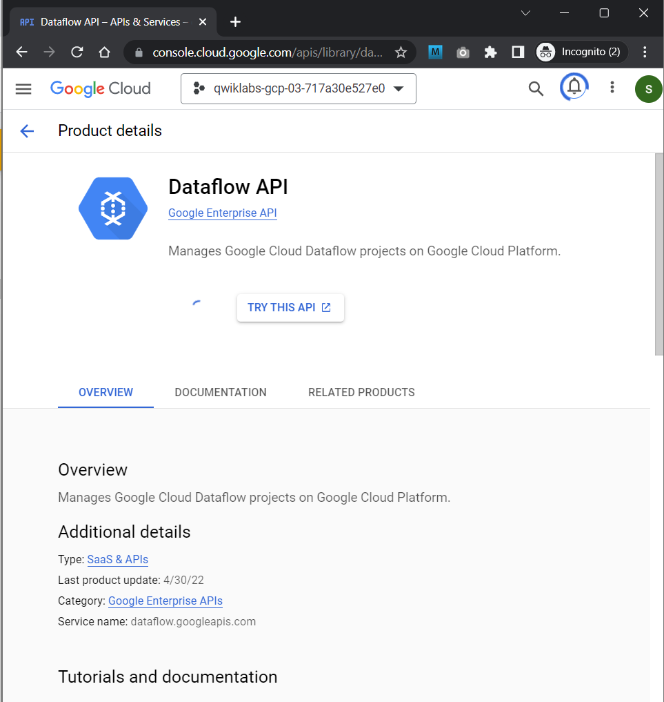
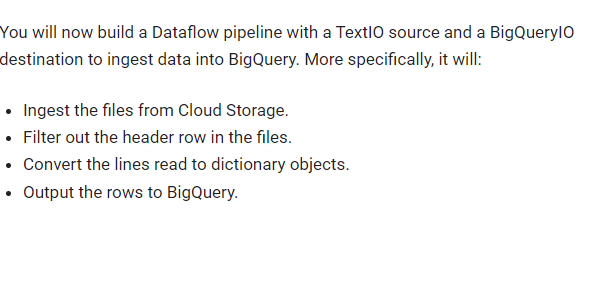
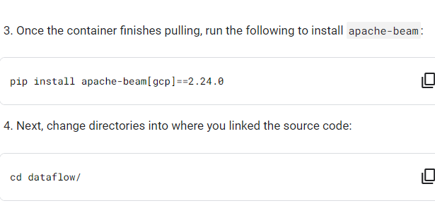
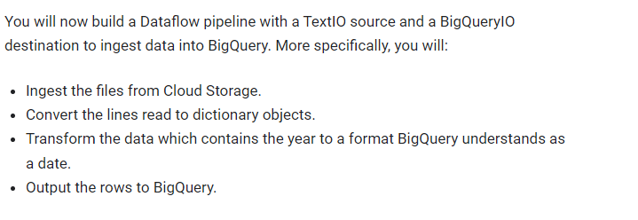
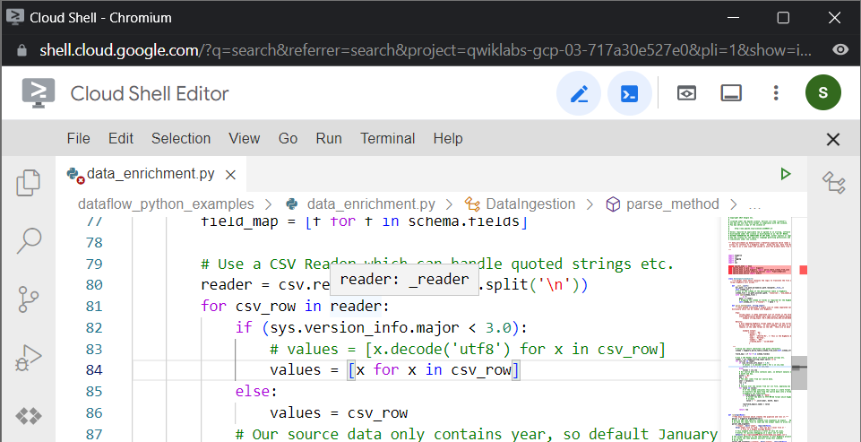

# <https§§§www.cloudskillsboost.google§focuses§3460§parent=catalog>

> [https://www.cloudskillsboost.google/focuses/3460?parent=catalog](https://www.cloudskillsboost.google/focuses/3460?parent=catalog)

# ETL Processing on Google Cloud Using Dataflow and BigQuery

# Overview

# Setup

# Task 1. Ensure that the Dataflow API is successfully enabled



# Task 2. Download the starter code

https://github.com/GoogleCloudPlatform/professional-services/blob/main/examples/dataflow-python-examples/README.md

```bash
gsutil -m cp -R gs://spls/gsp290/dataflow-python-examples .

export PROJECT=qwiklabs-gcp-03-717a30e527e0

gcloud config set project $PROJECT
```

# Task 3. Create Cloud Storage Bucket

```bash
gsutil mb -c regional -l us-east5  gs://$PROJECT
```

# Task 4. Copy files to your bucket

```bash
gsutil cp gs://spls/gsp290/data_files/usa_names.csv gs://$PROJECT/data_files/
gsutil cp gs://spls/gsp290/data_files/head_usa_names.csv gs://$PROJECT/data_files/
```

# Task 5. Create the BigQuery dataset

```
bq mk lake
```

# Task 6. Build a Dataflow pipeline


# Task 7. Data ingestion



# Task 8. Review pipeline python code

in `dataflow-python-examples` > `dataflow_python_examples` and open the `data_ingestion.py`

```python
# Copyright 2017 Google Inc.
#
# Licensed under the Apache License, Version 2.0 (the "License");
# you may not use this file except in compliance with the License.
# You may obtain a copy of the License at
#
#      http://www.apache.org/licenses/LICENSE-2.0
#
# Unless required by applicable law or agreed to in writing, software
# distributed under the License is distributed on an "AS IS" BASIS,
# WITHOUT WARRANTIES OR CONDITIONS OF ANY KIND, either express or implied.
# See the License for the specific language governing permissions and
# limitations under the License.
"""`data_ingestion.py` is a Dataflow pipeline which reads a file and writes its
contents to a BigQuery table.
This example does not do any transformation on the data.
"""


import argparse
import logging
import re
import apache_beam as beam
from apache_beam.options.pipeline_options import PipelineOptions


class DataIngestion:
    """A helper class which contains the logic to translate the file into
    a format BigQuery will accept."""
    def parse_method(self, string_input):
        """This method translates a single line of comma separated values to a
        dictionary which can be loaded into BigQuery.

        Args:
            string_input: A comma separated list of values in the form of
                state_abbreviation,gender,year,name,count_of_babies,dataset_created_date
                Example string_input: KS,F,1923,Dorothy,654,11/28/2016

        Returns:
            A dict mapping BigQuery column names as keys to the corresponding value
            parsed from string_input. In this example, the data is not transformed, and
            remains in the same format as the CSV.
            example output:
            {
                'state': 'KS',
                'gender': 'F',
                'year': '1923',
                'name': 'Dorothy',
                'number': '654',
                'created_date': '11/28/2016'
            }
         """
        # Strip out carriage return, newline and quote characters.
        values = re.split(",",
                          re.sub('\r\n', '', re.sub('"', '', string_input)))
        row = dict(
            zip(('state', 'gender', 'year', 'name', 'number', 'created_date'),
                values))
        return row


def run(argv=None):
    """The main function which creates the pipeline and runs it."""

    parser = argparse.ArgumentParser()

    # Here we add some specific command line arguments we expect.
    # Specifically we have the input file to read and the output table to write.
    # This is the final stage of the pipeline, where we define the destination
    # of the data. In this case we are writing to BigQuery.
    parser.add_argument(
        '--input',
        dest='input',
        required=False,
        help='Input file to read. This can be a local file or '
        'a file in a Google Storage Bucket.',
        # This example file contains a total of only 10 lines.
        # Useful for developing on a small set of data.
        default='gs://spls/gsp290/data_files/head_usa_names.csv')

    # This defaults to the lake dataset in your BigQuery project. You'll have
    # to create the lake dataset yourself using this command:
    # bq mk lake
    parser.add_argument('--output',
                        dest='output',
                        required=False,
                        help='Output BQ table to write results to.',
                        default='lake.usa_names')

    # Parse arguments from the command line.
    known_args, pipeline_args = parser.parse_known_args(argv)

    # DataIngestion is a class we built in this script to hold the logic for
    # transforming the file into a BigQuery table.
    data_ingestion = DataIngestion()

    # Initiate the pipeline using the pipeline arguments passed in from the
    # command line. This includes information such as the project ID and
    # where Dataflow should store temp files.
    p = beam.Pipeline(options=PipelineOptions(pipeline_args))

    (p
     # Read the file. This is the source of the pipeline. All further
     # processing starts with lines read from the file. We use the input
     # argument from the command line. We also skip the first line which is a
     # header row.
     | 'Read from a File' >> beam.io.ReadFromText(known_args.input,
                                                  skip_header_lines=1)
     # This stage of the pipeline translates from a CSV file single row
     # input as a string, to a dictionary object consumable by BigQuery.
     # It refers to a function we have written. This function will
     # be run in parallel on different workers using input from the
     # previous stage of the pipeline.
     | 'String To BigQuery Row' >>
     beam.Map(lambda s: data_ingestion.parse_method(s))
     | 'Write to BigQuery' >> beam.io.Write(
         beam.io.BigQuerySink(
             # The table name is a required argument for the BigQuery sink.
             # In this case we use the value passed in from the command line.
             known_args.output,
             # Here we use the simplest way of defining a schema:
             # fieldName:fieldType
             schema='state:STRING,gender:STRING,year:STRING,name:STRING,'
             'number:STRING,created_date:STRING',
             # Creates the table in BigQuery if it does not yet exist.
             create_disposition=beam.io.BigQueryDisposition.CREATE_IF_NEEDED,
             # Deletes all data in the BigQuery table before writing.
             write_disposition=beam.io.BigQueryDisposition.WRITE_TRUNCATE)))
    p.run().wait_until_finish()


if __name__ == '__main__':
    logging.getLogger().setLevel(logging.INFO)
    run()
```



# Task 9. Run the Apache Beam pipeline

```bash
docker run -it -e PROJECT=$PROJECT -v $(pwd)/dataflow-python-examples:/dataflow python:3.7 /bin/bash
pip install apache-beam[gcp]==2.24.0
cd dataflow/

python dataflow_python_examples/data_ingestion.py \
  --project=$PROJECT --region=us-east5 \
  --runner=DataflowRunner \
  --staging_location=gs://$PROJECT/test \
  --temp_location gs://$PROJECT/test \
  --input gs://$PROJECT/data_files/head_usa_names.csv \
  --save_main_session
```


# Task 10. Data transformation




# Task 11. Run the Apache Beam pipeline

```bash
python dataflow_python_examples/data_transformation.py \
  --project=$PROJECT \
  --region=us-east5 \
  --runner=DataflowRunner \
  --staging_location=gs://$PROJECT/test \
  --temp_location gs://$PROJECT/test \
  --input gs://$PROJECT/data_files/head_usa_names.csv \
  --save_main_session
```

# Task 12. Data enrichment


# Task 13. Review pipeline python code



# Task 14. Run the Apache Beam pipeline

```bash
python dataflow_python_examples/data_enrichment.py \
  --project=$PROJECT \
  --region=us-east5 \
  --runner=DataflowRunner \
  --staging_location=gs://$PROJECT/test \
  --temp_location gs://$PROJECT/test \
  --input gs://$PROJECT/data_files/head_usa_names.csv \
  --save_main_session
```

# Task 15. Data lake to Mart


# Task 16. Review pipeline python code

open `data_lake_to_mart.py`

```py
# Copyright 2017 Google Inc.
#
# Licensed under the Apache License, Version 2.0 (the "License");
# you may not use this file except in compliance with the License.
# You may obtain a copy of the License at
#
#      http://www.apache.org/licenses/LICENSE-2.0
#
# Unless required by applicable law or agreed to in writing, software
# distributed under the License is distributed on an "AS IS" BASIS,
# WITHOUT WARRANTIES OR CONDITIONS OF ANY KIND, either express or implied.
# See the License for the specific language governing permissions and
# limitations under the License.

""" data_lake_to_mart.py demonstrates a Dataflow pipeline which reads a
large BigQuery Table, joins in another dataset, and writes its contents to a
BigQuery table.
"""


import argparse
import logging
import os
import traceback

import apache_beam as beam
from apache_beam.io.gcp.bigquery import parse_table_schema_from_json
from apache_beam.options.pipeline_options import PipelineOptions
from apache_beam.pvalue import AsDict


class DataLakeToDataMart:
    """A helper class which contains the logic to translate the file into
    a format BigQuery will accept.

    This example uses side inputs to join two datasets together.
    """

    def __init__(self):
        dir_path = os.path.dirname(os.path.realpath(__file__))
        self.schema_str = ''
        # This is the schema of the destination table in BigQuery.
        schema_file = os.path.join(dir_path, 'resources', 'orders_denormalized.json')
        with open(schema_file) as f:
            data = f.read()
            # Wrapping the schema in fields is required for the BigQuery API.
            self.schema_str = '{"fields": ' + data + '}'

    def get_orders_query(self):
        """This returns a query against a very large fact table.  We are
        using a fake orders dataset to simulate a fact table in a typical
        data warehouse."""
        orders_query = """SELECT
            acct_number,
            col_number,
            col_number_1,
            col_number_10,
            col_number_100,
            col_number_101,
            col_number_102,
            col_number_103,
            col_number_104,
            col_number_105,
            col_number_106,
            col_number_107,
            col_number_108,
            col_number_109,
            col_number_11,
            col_number_110,
            col_number_111,
            col_number_112,
            col_number_113,
            col_number_114,
            col_number_115,
            col_number_116,
            col_number_117,
            col_number_118,
            col_number_119,
            col_number_12,
            col_number_120,
            col_number_121,
            col_number_122,
            col_number_123,
            col_number_124,
            col_number_125,
            col_number_126,
            col_number_127,
            col_number_128,
            col_number_129,
            col_number_13,
            col_number_130,
            col_number_131,
            col_number_132,
            col_number_133,
            col_number_134,
            col_number_135,
            col_number_136,
            col_number_14,
            col_number_15,
            col_number_16,
            col_number_17,
            col_number_18,
            col_number_19,
            col_number_2,
            col_number_20,
            col_number_21,
            col_number_22,
            col_number_23,
            col_number_24,
            col_number_25,
            col_number_26,
            col_number_27,
            col_number_28,
            col_number_29,
            col_number_3,
            col_number_30,
            col_number_31,
            col_number_32,
            col_number_33,
            col_number_34,
            col_number_35,
            col_number_36,
            col_number_37,
            col_number_38,
            col_number_39,
            col_number_4,
            col_number_40,
            col_number_41,
            col_number_42,
            col_number_43,
            col_number_44,
            col_number_45,
            col_number_46,
            col_number_47,
            col_number_48,
            col_number_49,
            col_number_5,
            col_number_50,
            col_number_51,
            col_number_52,
            col_number_53,
            col_number_54,
            col_number_55,
            col_number_56,
            col_number_57,
            col_number_58,
            col_number_59,
            col_number_6,
            col_number_60,
            col_number_61,
            col_number_62,
            col_number_63,
            col_number_64,
            col_number_65,
            col_number_66,
            col_number_67,
            col_number_68,
            col_number_69,
            col_number_7,
            col_number_70,
            col_number_71,
            col_number_72,
            col_number_73,
            col_number_74,
            col_number_75,
            col_number_76,
            col_number_77,
            col_number_78,
            col_number_79,
            col_number_8,
            col_number_80,
            col_number_81,
            col_number_82,
            col_number_83,
            col_number_84,
            col_number_85,
            col_number_86,
            col_number_87,
            col_number_88,
            col_number_89,
            col_number_9,
            col_number_90,
            col_number_91,
            col_number_92,
            col_number_93,
            col_number_94,
            col_number_95,
            col_number_96,
            col_number_97,
            col_number_98,
            col_number_99,
            col_number_num1,
            date,
            foo,
            num1,
            num2,
            num3,
            num5,
            num6,
            product_number,
            quantity
        FROM
            `qwiklabs-resources.python_dataflow_example.orders` orders
        LIMIT
            10
        """
        return orders_query

    def add_account_details(self, row, account_details):
        """add_account_details joins two datasets together.  Dataflow passes in the
        a row from the orders dataset along with the entire account details dataset.

        This works because the entire account details dataset can be passed in memory.

        The function then looks up the account details, and adds all columns to a result
        dictionary, which will be written to BigQuery."""
        result = row.copy()
        try:
            result.update(account_details[row['acct_number']])
        except KeyError as err:
            traceback.print_exc()
            logging.error("Account Not Found error: %s", err)
        return result


def run(argv=None):
    """The main function which creates the pipeline and runs it."""
    parser = argparse.ArgumentParser()
    # Here we add some specific command line arguments we expect.   S
    # This defaults the output table in your BigQuery you'll have
    # to create the example_data dataset yourself using bq mk temp
    parser.add_argument('--output', dest='output', required=False,
                        help='Output BQ table to write results to.',
                        default='lake.orders_denormalized_sideinput')

    # Parse arguments from the command line.
    known_args, pipeline_args = parser.parse_known_args(argv)

    # DataLakeToDataMart is a class we built in this script to hold the logic for
    # transforming the file into a BigQuery table.
    data_lake_to_data_mart = DataLakeToDataMart()

    p = beam.Pipeline(options=PipelineOptions(pipeline_args))
    schema = parse_table_schema_from_json(data_lake_to_data_mart.schema_str)
    pipeline = beam.Pipeline(options=PipelineOptions(pipeline_args))

    # This query returns details about the account, normalized into a
    # different table.  We will be joining the data in to the main orders dataset in order
    # to create a denormalized table.
    account_details_source = (
        pipeline
        | 'Read Account Details from BigQuery ' >> beam.io.Read(
            beam.io.BigQuerySource(query="""
                SELECT
                  acct_number,
                  acct_company_name,
                  acct_group_name,
                  acct_name,
                  acct_org_name,
                  address,
                  city,
                  state,
                  zip_code,
                  country
                FROM
                  `qwiklabs-resources.python_dataflow_example.account`""",
                                   # This next stage of the pipeline maps the acct_number to a single row of
                                   # results from BigQuery.  Mapping this way helps Dataflow move your data around
                                   # to different workers.  When later stages of the pipeline run, all results from
                                   # a given account number will run on one worker.
                                   use_standard_sql=True))
        | 'Account Details' >> beam.Map(
            lambda row: (
                row['acct_number'], row
            )))

    orders_query = data_lake_to_data_mart.get_orders_query()
    (p
     # Read the orders from BigQuery.  This is the source of the pipeline.  All further
     # processing starts with rows read from the query results here.
     | 'Read Orders from BigQuery ' >> beam.io.Read(
        beam.io.BigQuerySource(query=orders_query, use_standard_sql=True))
     # Here we pass in a side input, which is data that comes from outside our
     # main source.  The side input contains a map of states to their full name
     | 'Join Data with sideInput' >> beam.Map(data_lake_to_data_mart.add_account_details, AsDict(
        account_details_source))
     # This is the final stage of the pipeline, where we define the destination
     # of the data.  In this case we are writing to BigQuery.
     | 'Write Data to BigQuery' >> beam.io.Write(
        beam.io.BigQuerySink(
            # The table name is a required argument for the BigQuery sink.
            # In this case we use the value passed in from the command line.
            known_args.output,
            # Here we use the JSON schema read in from a JSON file.
            # Specifying the schema allows the API to create the table correctly if it does not yet exist.
            schema=schema,
            # Creates the table in BigQuery if it does not yet exist.
            create_disposition=beam.io.BigQueryDisposition.CREATE_IF_NEEDED,
            # Deletes all data in the BigQuery table before writing.
            write_disposition=beam.io.BigQueryDisposition.WRITE_TRUNCATE)))
    p.run().wait_until_finish()


if __name__ == '__main__':
    logging.getLogger().setLevel(logging.INFO)
    run()
```

# Task 17. Run the Apache Beam Pipeline

```bash
python dataflow_python_examples/data_lake_to_mart.py \
  --worker_disk_type="compute.googleapis.com/projects//zones//diskTypes/pd-ssd" \
  --max_num_workers=4 \
  --project=$PROJECT \
  --runner=DataflowRunner \
  --staging_location=gs://$PROJECT/test \
  --temp_location gs://$PROJECT/test \
  --save_main_session \
  --region=us-east5
```


 

