# <https§§§www.cloudskillsboost.google§focuses§3483§parent=catalog>
> <https://www.cloudskillsboost.google/focuses/3483?parent=catalog>

# Google Cloud Storage - Bucket Lock

[https://cloud.google.com/storage/docs/org-policy-constraints#audit-logging](https§§§cloud.google.com§storage§docs§org-policy-constraints#audit-logging/readme.md)
[https://cloud.google.com/storage/docs/lifecycle](https§§§cloud.google.com§storage§docs§lifecycle/readme.md)

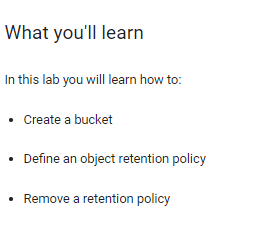

## Task 1. Create a new bucket

```bash
export BUCKET=$(gcloud config get-value project)
```

## Task 2. Define a Retention Policy

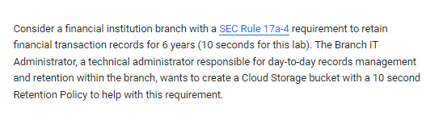

```bash
gsutil retention set 10s "gs://$BUCKET"

gsutil retention get "gs://$BUCKET"

```
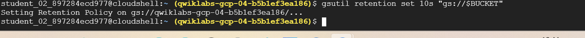

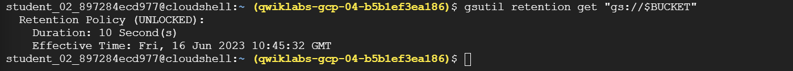

```bash
# add trnsaction record object to test it
gsutil cp gs://spls/gsp297/dummy_transactions "gs://$BUCKET/"
```


```bash
# review policy
gsutil ls -L "gs://$BUCKET/dummy_transactions"
```

 Retention Expiration

```json
          
student_02_897284ecd977@cloudshell:~ (qwiklabs-gcp-04-b5b1ef3ea186)$ gsutil ls -L "gs://$BUCKET/dummy_transactions"
gs://qwiklabs-gcp-04-b5b1ef3ea186/dummy_transactions:
    Creation time:          Fri, 16 Jun 2023 10:46:31 GMT
    Update time:            Fri, 16 Jun 2023 10:46:31 GMT
    Storage class:          STANDARD
    Retention Expiration:   Fri, 16 Jun 2023 10:46:41 GMT
    Content-Language:       en
    Content-Length:         45
    Content-Type:           text/plain
    Hash (crc32c):          4PdEyA==
    Hash (md5):             loAwRzgwWU+JCSjGGildQQ==
    ETag:                   CLed4K7Ox/8CEAE=
    Generation:             1686912391188151
    Metageneration:         1
    ACL:                    [
  {
    "entity": "project-owners-191476308840",
    "projectTeam": {
      "projectNumber": "191476308840",
      "team": "owners"
    },
    "role": "OWNER"
  },
  {
    "entity": "project-editors-191476308840",
    "projectTeam": {
      "projectNumber": "191476308840",
      "team": "editors"
    },
    "role": "OWNER"
  },
  {
    "entity": "project-viewers-191476308840",
    "projectTeam": {
      "projectNumber": "191476308840",
      "team": "viewers"
    },
    "role": "READER"
  },
  {
    "email": "student-02-897284ecd977@qwiklabs.net",
    "entity": "user-student-02-897284ecd977@qwiklabs.net",
    "role": "OWNER"
  }
]
TOTAL: 1 objects, 45 bytes (45 B)
student_02_897284ecd977@cloudshell:~ (qwiklabs-gcp-04-b5b1ef3ea186)$ 
```

When the Retention Policy expires for the given object, it can then be deleted.


## Task 3. Lock the Retention Policy

While unlocked, you can remove the Retention Policy from the bucket or reduce the retention time. After you lock the Retention Policy, it cannot be removed from the bucket or the retention time reduced.

```bash
gsutil retention lock  "gs://$BUCKET"
```

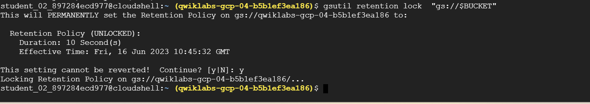


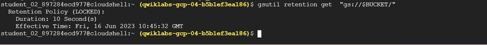

Once locked the Retention Policy can't be unlocked and can only be extended. The Effective Time is updated if the amount of time since it was set or last updated has exceeded the Retention Policy.

## Task 4. Temporary hold

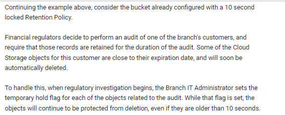

```bash
gsutil retention temp set "gs://$BUCKET/dummy_transactions"
```

lifecycle
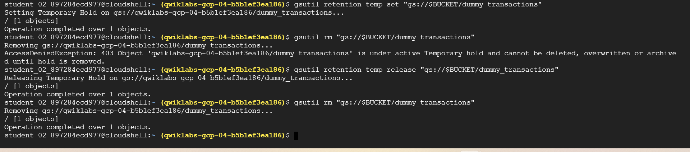

## Task 5. Event-based holds

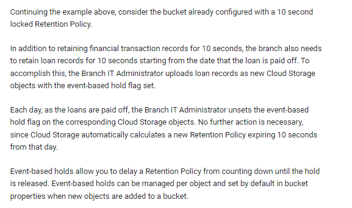

```bash
# event based hold 
gsutil retention event-default set "gs://$BUCKET/"
# add sample
gsutil cp gs://spls/gsp297/dummy_loan "gs://$BUCKET/"

# verify 
gsutil ls -L "gs://$BUCKET/dummy_loan"
#_ Notice that Retention Expiration isn't defined

# release
gsutil retention event release "gs://$BUCKET/dummy_loan"

# verify
gsutil ls -L "gs://$BUCKET/dummy_loan"
```

## Task 6. How to remove a Retention Policy

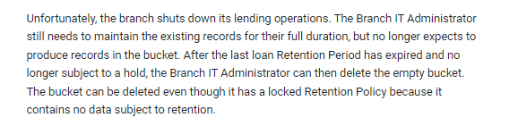

```bash
gsutil rb "gs://$BUCKET/"
```
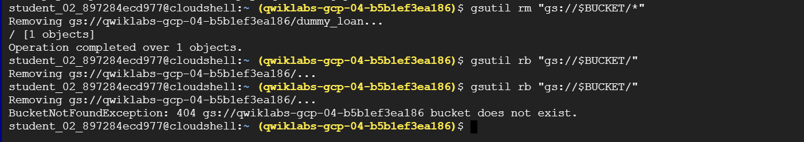