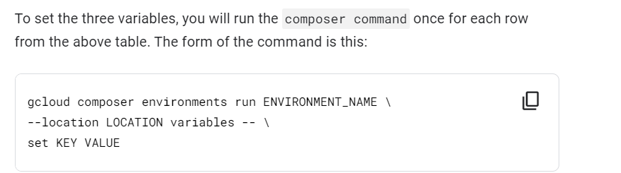
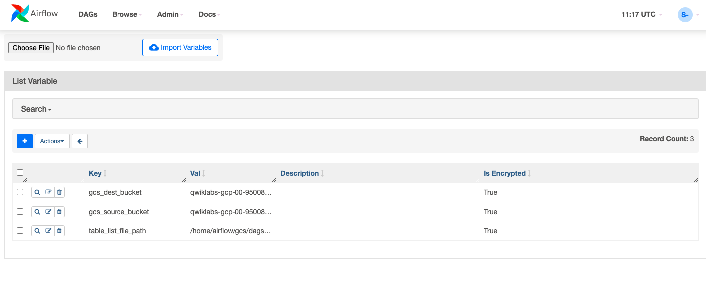

# <https§§§www.cloudskillsboost.google§focuses§3528§parent=catalog>
> <https://www.cloudskillsboost.google/focuses/3528?parent=catalog>
        
# Cloud Composer: Copying BigQuery Tables Across Different Locations


# Overview

http://airflow.apache.org/
https://cloud.google.com/bigquery/docs/


# Setup

gcloud auth list

# Task 1. Create Cloud Composer environment


create


# Task 2. Create Cloud Storage buckets

one located in the US as source (e.g. 6552634-us)
the other located in EU as destination (e.g. 6552634-eu)


# Task 3. BigQuery destination da# Taset

nyc_tlc_EU in eu


# Task 4. Airflow and core concepts, a brief introduction

https://airflow.apache.org/
https://airflow.apache.org/docs/apache-airflow/1.10.15/concepts.html


# Task 5. Defining the workflow


The code shown in bq_copy_across_locations.py is the workflow code, also referred to as the DAG.

[here](./bq_copy_across_locations.py)


# Task 6. Viewing environment information


```py
# Python virtual environments are used to isolate package installation from the system.
 
sudo apt-get install -y virtualenv
 
python3 -m venv venv
  
source venv/bin/activate
 
```


# Task 7. Setting DAGs Cloud Storage bucket

DAGS_BUCKET=us-east1-composer-advanced--76d055f9-bucket


# Task 8. Setting Airflow variables

https://cloud.google.com/composer/docs/how-to/managing/environment-variables

table_list_file_path, gcs_source_bucket, and gcs_dest_bucket.



```bash
UNIQUE_ID=qwiklabs-gcp-00-bb89e393f674

gcloud composer environments run composer-advanced-lab \
--location us-east1 variables -- \
set table_list_file_path /home/airflow/gcs/dags/bq_copy_eu_to_us_sample.csv
gcloud composer environments run composer-advanced-lab \
--location us-east1 variables -- \
set gcs_source_bucket "$UNIQUE_ID"-us
gcloud composer environments run composer-advanced-lab \
--location us-east1 variables -- \
set gcs_dest_bucket "$UNIQUE_ID"-eu
```


# Task 9. Uploading the DAG and dependencies to Cloud Storage

```bash
# Copy the Google Cloud Python docs samples files into your Cloud shell:
cd ~
gsutil -m cp -r gs://spls/gsp283/python-docs-samples .

# Upload a copy of the third party hook and operator to the plugins folder of your Composer DAGs Cloud Storage bucket:
gsutil cp -r python-docs-samples/third_party/apache-airflow/plugins/* gs://$DAGS_BUCKET/plugins

# Next, upload the DAG and config file to the DAGs Cloud Storage bucket of your environment:
gsutil cp python-docs-samples/composer/workflows/bq_copy_across_locations.py gs://$DAGS_BUCKET/dags
gsutil cp python-docs-samples/composer/workflows/bq_copy_eu_to_us_sample.csv gs://$DAGS_BUCKET/dags

```

# Task 10. Using the Airflow UI





# Task 11. Validate the results
 


https://cloud.google.com/blog/products/data-analytics/how-to-transfer-bigquery-tables-between-locations-with-cloud-composer


dag execution


end


bq

