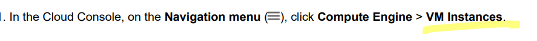

# <https§§§www.cloudskillsboost.google§focuses§3563§§parent§=catalog>
> <https://www.cloudskillsboost.google/focuses/3563?parent=catalog>


# Creating a Virtual Machine

create  vms on the gcloud

we have regions and zones
* western us // us-west1-a and b
* central us // us-central1-a..f
* eastrn us // us-east1-a..d
* western europe // europe-west1-a..d
* eastern asia //asia-east1-a..d

## Task 1. Create a new instance from the Cloud Console


create instance
name
region
zone
https://cloud.google.com/compute/docs/regions-zones
series
machine type
https://cloud.google.com/compute/docs/machine-resource
boot disk
firewall
create
use ssh to connect to the box

## Task 2. Install an NGINX web server

```bash
# update
sudo apt-get update
# install ngix and check
sudo apt-get install -y nginx
ps auwx | grep nginx

```
## Task 3. Create a new instance with gcloud

> use cmd line to do the same


```bash
gcloud compute instances create gcelab2 --machine-type e2-medium --zone ${ZONE}

# def default
gcloud config set compute/zone ${ZONE}
gcloud config set compute/region ${REGION}

## ssh
gcloud compute ssh gcelab2 --zone ${ZONE}
```