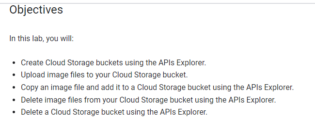
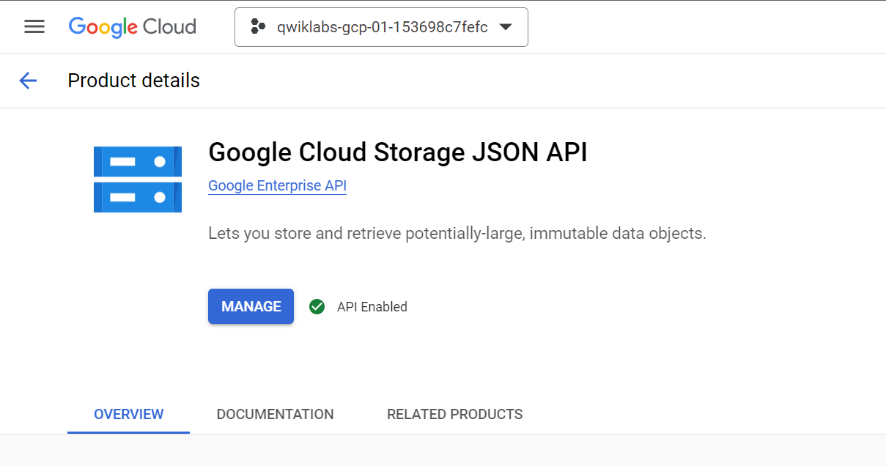
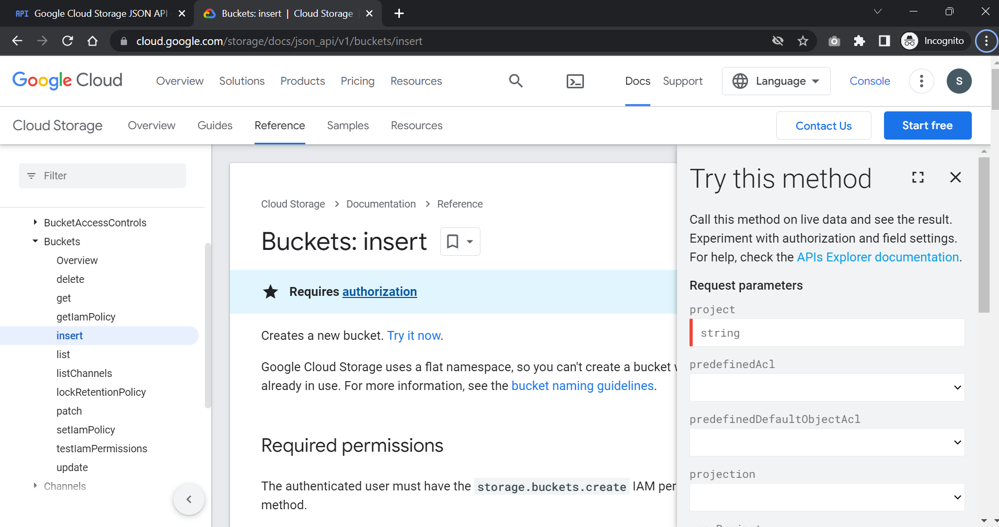
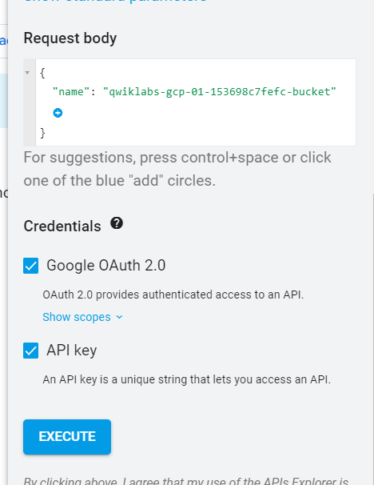
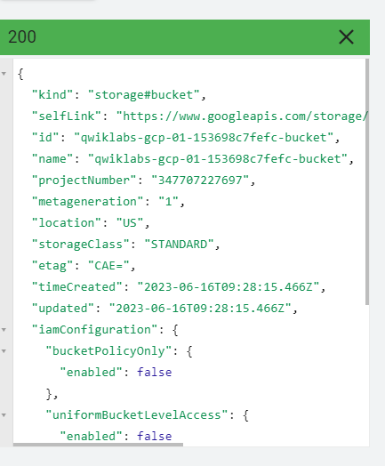
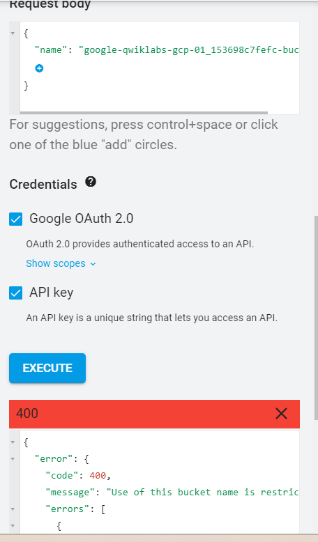
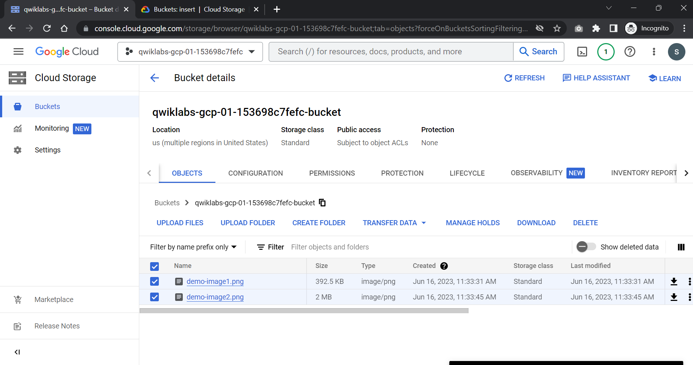
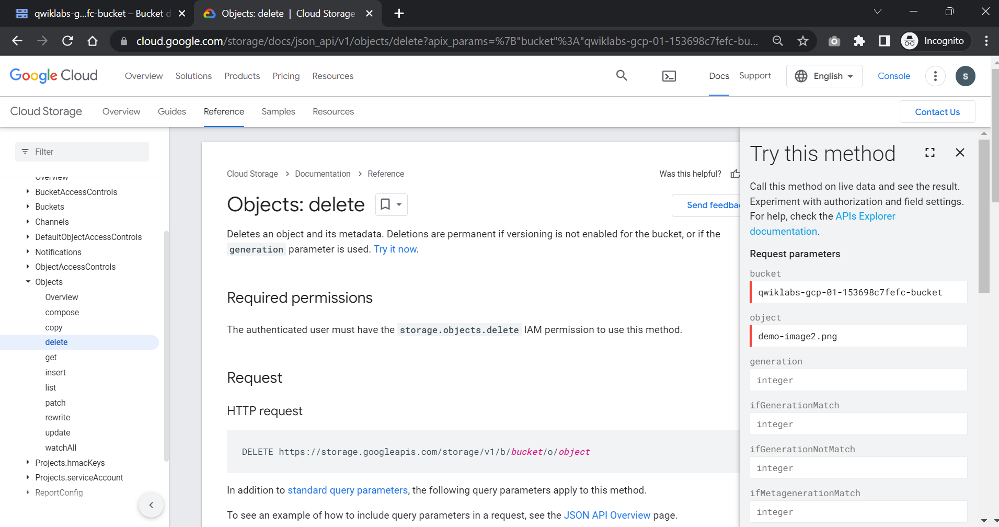
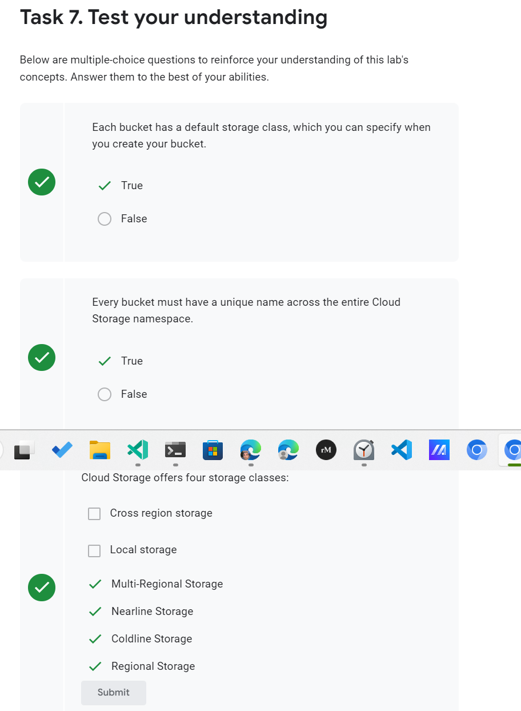

# <https§§§www.cloudskillsboost.google§focuses§3632§parent=catalog>
> <https://www.cloudskillsboost.google/focuses/3632?parent=catalog>

# APIs Explorer: Cloud Storage

## Overview

https://developers.google.com/apis-explorer/
https://cloud.google.com/storage/



## Task 1. Create Cloud Storage Buckets



https://cloud.google.com/storage/docs/json_api/v1/buckets/insert

api ref
https://cloud.google.com/storage/docs/json_api/v1/


api explorer





```json
{
  "kind": "storage#bucket",
  "selfLink": "https://www.googleapis.com/storage/v1/b/qwiklabs-gcp-01-153698c7fefc-bucket",
  "id": "qwiklabs-gcp-01-153698c7fefc-bucket",
  "name": "qwiklabs-gcp-01-153698c7fefc-bucket",
  "projectNumber": "347707227697",
  "metageneration": "1",
  "location": "US",
  "storageClass": "STANDARD",
  "etag": "CAE=",
  "timeCreated": "2023-06-16T09:28:15.466Z",
  "updated": "2023-06-16T09:28:15.466Z",
  "iamConfiguration": {
    "bucketPolicyOnly": {
      "enabled": false
    },
    "uniformBucketLevelAccess": {
      "enabled": false
    },
    "publicAccessPrevention": "inherited"
  },
  "locationType": "multi-region",
  "rpo": "DEFAULT"
}
```

## Task 2. Make a second Cloud Storage bucket



naming
https://cloud.google.com/storage/docs/buckets#naming


## Task 3. Upload files to your Cloud Storage bucket



## Task 4. Copy files between Cloud Storage buckets

https://cloud.google.com/storage/docs/json_api/v1/objects/copy

## Task 5. Delete files from a Cloud Storage bucket



## Task 6. Delete your Cloud Storage bucket

https://cloud.google.com/storage/docs/json_api/v1/buckets/delete

```json
{
  "error": {
    "code": 409,
    "message": "The bucket you tried to delete is not empty.",
    "errors": [
      {
        "message": "The bucket you tried to delete is not empty.",
        "domain": "global",
        "reason": "conflict"
      }
    ]
  }
}
```



