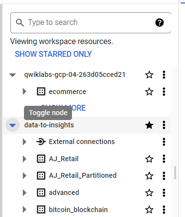

# <https§§§www.cloudskillsboost.google§focuses§3638§parent=catalog>
> <https://www.cloudskillsboost.google/focuses/3638?parent=catalog>

# Troubleshooting and Solving Data Join Pitfalls

What you'll do
In this lab, you perform these tasks:

Use BigQuery to explore a dataset

Troubleshoot duplicate rows in a dataset

Create joins between data tables

Understand each join type





## Task 3. Examine the fields

navigate to data-to-insights > ecommerce > all_sessions_raw.

## Task 4. Identify a key field in your ecommerce dataset

```
#standardSQL
# how many products are on the website?
SELECT DISTINCT
productSKU,
v2ProductName
FROM `data-to-insights.ecommerce.all_sessions_raw`
```

```
SELECT
  productSKU,
  COUNT(DISTINCT v2ProductName) AS product_count,
  STRING_AGG(DISTINCT v2ProductName LIMIT 5) AS product_name
FROM `data-to-insights.ecommerce.all_sessions_raw`
  WHERE v2ProductName IS NOT NULL
  GROUP BY productSKU
  HAVING product_count > 1
  ORDER BY product_count DESC
```

## Task 5. Pitfall: non-unique key

```
SELECT DISTINCT
  v2ProductName,
  productSKU
FROM `data-to-insights.ecommerce.all_sessions_raw`
WHERE productSKU = 'GGOEGPJC019099'
```

```
WITH inventory_per_sku AS (
  SELECT DISTINCT
    website.v2ProductName,
    website.productSKU,
    inventory.stockLevel
  FROM `data-to-insights.ecommerce.all_sessions_raw` AS website
  JOIN `data-to-insights.ecommerce.products` AS inventory
    ON website.productSKU = inventory.SKU
    WHERE productSKU = 'GGOEGPJC019099'
)
SELECT
  productSKU,
  SUM(stockLevel) AS total_inventory
FROM inventory_per_sku
GROUP BY productSKU
```

## Task 6. Join pitfall solution: use distinct SKUs before joining

```
SELECT
  productSKU,
  ARRAY_AGG(DISTINCT v2ProductName) AS push_all_names_into_array
FROM `data-to-insights.ecommerce.all_sessions_raw`
WHERE productSKU = 'GGOEGAAX0098'
GROUP BY productSKU
```

```
SELECT
  productSKU,
  ARRAY_AGG(DISTINCT v2ProductName LIMIT 1) AS push_all_names_into_array
FROM `data-to-insights.ecommerce.all_sessions_raw`
WHERE productSKU = 'GGOEGAAX0098'
GROUP BY productSKU
```

```
#standardSQL
SELECT DISTINCT
website.productSKU
FROM `data-to-insights.ecommerce.all_sessions_raw` AS website
JOIN `data-to-insights.ecommerce.products` AS inventory
ON website.productSKU = inventory.SKU
```

```
#standardSQL
# pull ID fields from both tables
SELECT DISTINCT
website.productSKU AS website_SKU,
inventory.SKU AS inventory_SKU
FROM `data-to-insights.ecommerce.all_sessions_raw` AS website
JOIN `data-to-insights.ecommerce.products` AS inventory
ON website.productSKU = inventory.SKU
# IDs are present in both tables, how can you dig deeper?
```

```
#standardSQL
# the secret is in the JOIN type
# pull ID fields from both tables
SELECT DISTINCT
website.productSKU AS website_SKU,
inventory.SKU AS inventory_SKU
FROM `data-to-insights.ecommerce.all_sessions_raw` AS website
LEFT JOIN `data-to-insights.ecommerce.products` AS inventory
ON website.productSKU = inventory.SKU
```

```
#standardSQL
# find product SKUs in website table but not in product inventory table
SELECT DISTINCT
website.productSKU AS website_SKU,
inventory.SKU AS inventory_SKU
FROM `data-to-insights.ecommerce.all_sessions_raw` AS website
LEFT JOIN `data-to-insights.ecommerce.products` AS inventory
ON website.productSKU = inventory.SKU
WHERE inventory.SKU IS NULL
```

```
#standardSQL
# you can even pick one and confirm
SELECT * FROM `data-to-insights.ecommerce.products`
WHERE SKU = 'GGOEGATJ060517'
# query returns zero results
```

```
#standardSQL
# reverse the join
# find records in website but not in inventory
SELECT DISTINCT
website.productSKU AS website_SKU,
inventory.SKU AS inventory_SKU
FROM `data-to-insights.ecommerce.all_sessions_raw` AS website
RIGHT JOIN `data-to-insights.ecommerce.products` AS inventory
ON website.productSKU = inventory.SKU
WHERE website.productSKU IS NULL
```


```
#standardSQL
# what are these products?
# add more fields in the SELECT STATEMENT
SELECT DISTINCT
website.productSKU AS website_SKU,
inventory.*
FROM `data-to-insights.ecommerce.all_sessions_raw` AS website
RIGHT JOIN `data-to-insights.ecommerce.products` AS inventory
ON website.productSKU = inventory.SKU
WHERE website.productSKU IS NULL
```