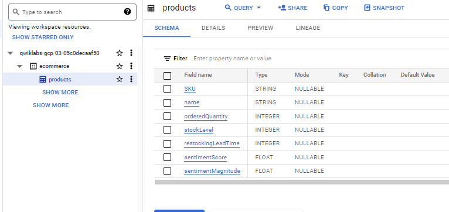

# <https§§§www.cloudskillsboost.google§focuses§3640§parent=catalog>
> <https://www.cloudskillsboost.google/focuses/3640?parent=catalog>

# Creating a Data Warehouse Through Joins and Unions

In this lab, you learn how to perform these tasks:

Explore new ecommerce data on sentiment analysis

Join together datasets and create new tables

Append historical data with unions and table wildcards


## Task 1. The BigQuery console

In the Google Cloud Console, select Navigation menu > BigQuery.

## Task 5. Examine the data





Title it sales_by_sku_20170801
Source the data from data-to-insights.ecommerce.all_sessions_raw
Include only distinct results
Return productSKU
Return the total quantity ordered (productQuantity). Hint: Use a SUM() with a IFNULL condition
Filter for only sales on 20170801
ORDER BY the SKUs with the most orders first

```sql
SELECT
  SKU,
  name,
  sentimentScore,
  sentimentMagnitude
FROM
  `data-to-insights.ecommerce.products`
WHERE sentimentScore IS NOT NULL
ORDER BY
  sentimentScore
LIMIT 5
```

## Task 6. Join datasets to find insights

```sql
# pull what sold on 08/01/2017
CREATE OR REPLACE TABLE ecommerce.sales_by_sku_20170801 AS
SELECT
  productSKU,
  SUM(IFNULL(productQuantity,0)) AS total_ordered
FROM
  `data-to-insights.ecommerce.all_sessions_raw`
WHERE date = '20170801'
GROUP BY productSKU
ORDER BY total_ordered DESC #462 skus sold
```

Using a JOIN, enrich the website ecommerce data with the following fields from the product inventory dataset:

name

stockLevel

restockingLeadTime

sentimentScore

sentimentMagnitude

 ```sql
 # join against product inventory to get name
SELECT DISTINCT
  website.productSKU,
  website.total_ordered,
  inventory.name,
  inventory.stockLevel,
  inventory.restockingLeadTime,
  inventory.sentimentScore,
  inventory.sentimentMagnitude
FROM
  ecommerce.sales_by_sku_20170801 AS website
  LEFT JOIN `data-to-insights.ecommerce.products` AS inventory
  ON website.productSKU = inventory.SKU
ORDER BY total_ordered DESC
```

A calculated field of (total_ordered / stockLevel) and alias it "ratio". Hint: Use SAFE_DIVIDE(field1,field2) to avoid dividing by 0 errors when the stock level is 0.
Filter the results to only include products that have gone through 50% or more of their inventory already at the beginning of the month

```sql
# calculate ratio and filter
SELECT DISTINCT
  website.productSKU,
  website.total_ordered,
  inventory.name,
  inventory.stockLevel,
  inventory.restockingLeadTime,
  inventory.sentimentScore,
  inventory.sentimentMagnitude,
  SAFE_DIVIDE(website.total_ordered, inventory.stockLevel) AS ratio
FROM
  ecommerce.sales_by_sku_20170801 AS website
  LEFT JOIN `data-to-insights.ecommerce.products` AS inventory
  ON website.productSKU = inventory.SKU
# gone through more than 50% of inventory for the month
WHERE SAFE_DIVIDE(website.total_ordered,inventory.stockLevel) >= .50
ORDER BY total_ordered DESC
```

## Task 7. Append additional records


```sql
CREATE OR REPLACE TABLE ecommerce.sales_by_sku_20170802
(
productSKU STRING,
total_ordered INT64
);

INSERT INTO ecommerce.sales_by_sku_20170802
(productSKU, total_ordered)
VALUES('GGOEGHPA002910', 101)

```
What is a pitfall of having many daily sales tables? You will have to write many UNION statements chained together.

A better solution is to use the table wildcard filter and _TABLE_SUFFIX filter.

Write a query that uses the (*) table wildcard to select all records from ecommerce.sales_by_sku_ for the year 2017.

```sql
SELECT * FROM `ecommerce.sales_by_sku_2017*`
```

Modify the previous query to add a filter to limit the results to just 08/02/2017.

```sql
SELECT * FROM `ecommerce.sales_by_sku_2017*`
WHERE _TABLE_SUFFIX = '0802'
```

and usage as 

```sql

INSERT INTO ecommerce.sales_by_sku_20170802
(productSKU, total_ordered)
SELECT productSKU, total_ordered FROM `ecommerce.sales_by_sku_2017*`
WHERE _TABLE_SUFFIX = '0802'
```