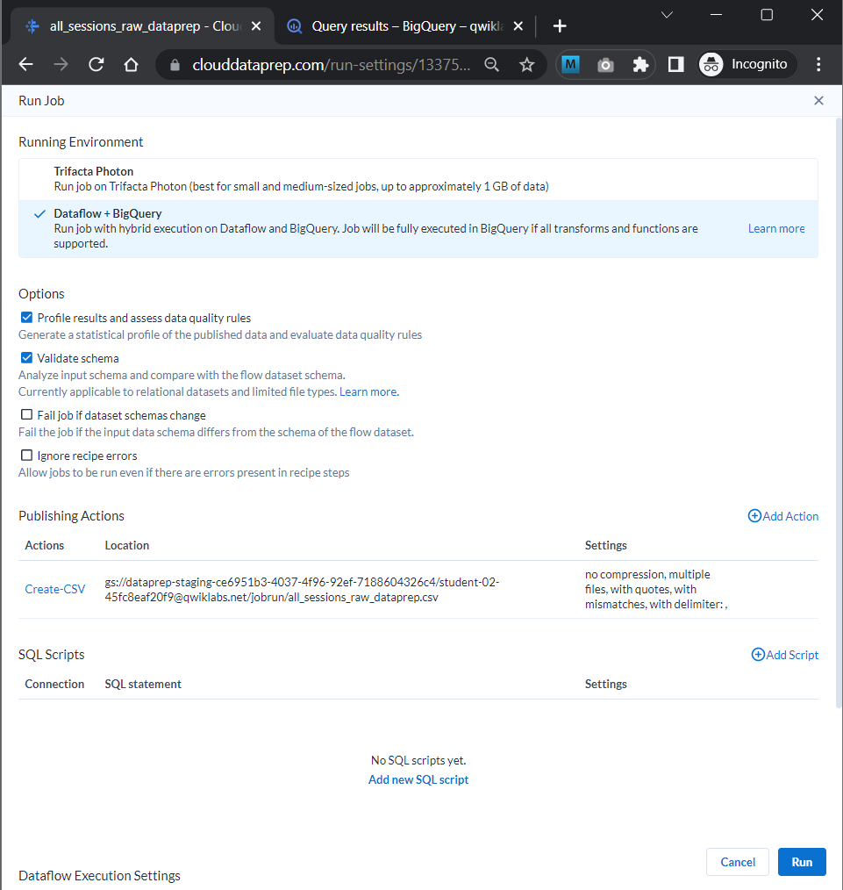

# <https§§§www.cloudskillsboost.google§focuses§4415§parent=catalog>

> [https://www.cloudskillsboost.google/focuses/4415?parent=catalog](https://www.cloudskillsboost.google/focuses/4415?parent=catalog)

# Creating a Data Transformation Pipeline with Cloud Dataprep

## Overview

[https://cloud.google.com/dataprep/](https§§§cloud.google.com§dataprep§/readme.md)

## Task 1. Open Google Cloud Dataprep


## Task 2. Creating a BigQuery dataset


```sql
#standardSQL
 CREATE OR REPLACE TABLE ecommerce.all_sessions_raw_dataprep
 OPTIONS(
   description="Raw data from analyst team to ingest into Cloud Dataprep"
 ) AS
 SELECT * FROM `data-to-insights.ecommerce.all_sessions_raw`
 WHERE date = '20170801'; # limiting to one day of data 56k rows for this lab
```


 


## Task 3. Connecting BigQuery data to Cloud Dataprep

 


edit recipe

 

column details

 


## Task 5. Cleaning the data

change type

 


uniq col

 

 


all transf


 


## Task 7. Running Cloud Dataprep jobs to BigQuery

job def

 

 


job execution

 


view bq job

 


xxx
