# <https§§§www.cloudskillsboost.google§focuses§49746§catalog_rank=%7B%22rank%22%3A1%2C%22num_filters%22%3A0%2C%22has_search%22%3Atrue%7D&parent=catalog&search_id=26588762>

> [https://www.cloudskillsboost.google/focuses/49746?catalog_rank=%7B%22rank%22%3A1%2C%22num_filters%22%3A0%2C%22has_search%22%3Atrue%7D&amp;parent=catalog&amp;search_id=26588762](https://www.cloudskillsboost.google/focuses/49746?catalog_rank=%7B%22rank%22%3A1%2C%22num_filters%22%3A0%2C%22has_search%22%3Atrue%7D&parent=catalog&search_id=26588762)

# Using BigQuery Omni with AWS


## Overview

https://cloud.google.com/bigquery/docs/omni-introductionhttps://cloud.google.com/bigquery/docs/omni-aws-introduction

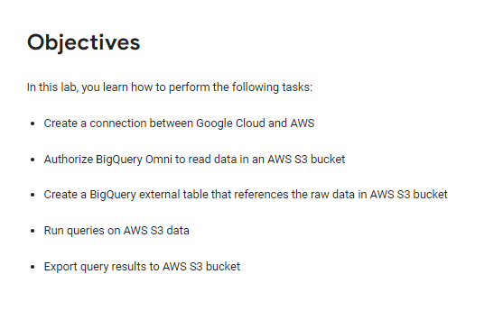

## Task 1. Create a BigQuery AWS connection

BigQuery Omni accesses Amazon S3 data through authorized connections from Google Cloud. Each connection has its own unique Amazon Web Services (AWS) Identity and Access Management (IAM) user. You grant permissions to users through AWS IAM roles. The policies within the AWS IAM roles determine what data BigQuery can access for each connection.

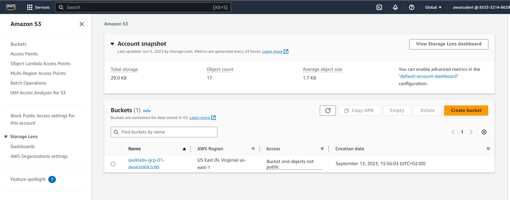

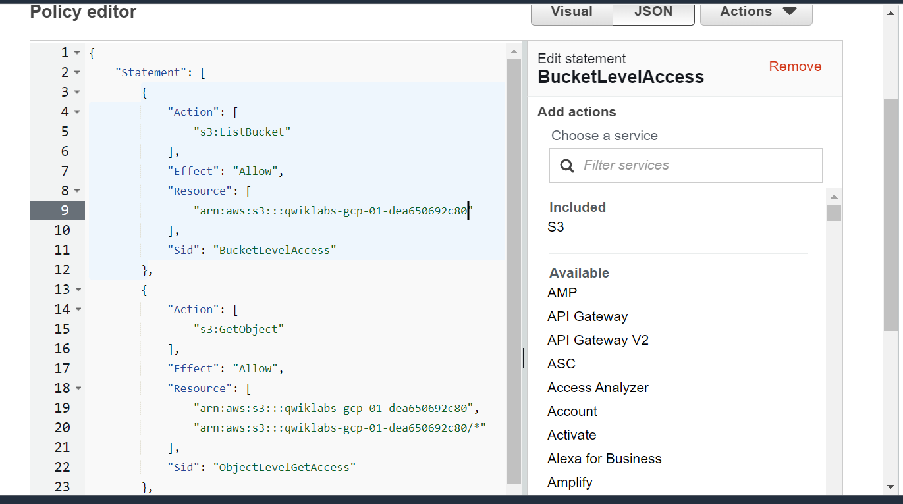

### Validate the AWS IAM for BigQuery

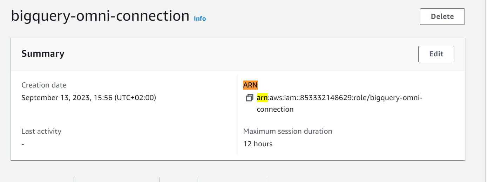

arn:aws:iam::853332148629:role/bigquery-omni-connection

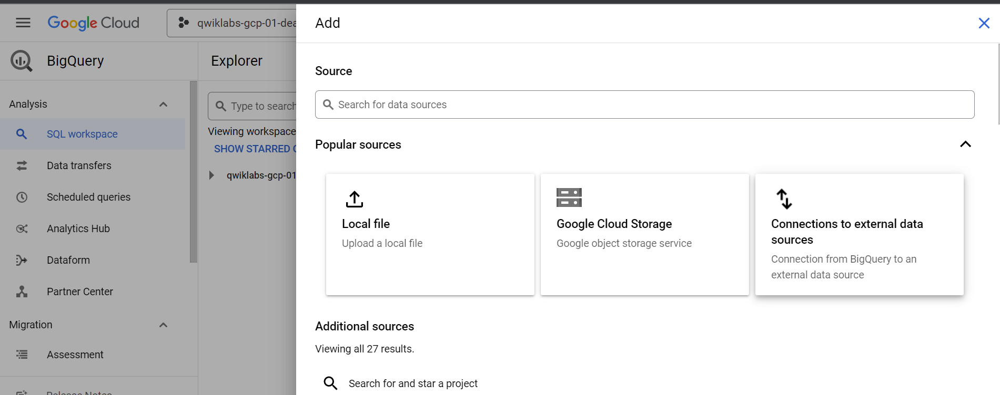

creae extenral data source

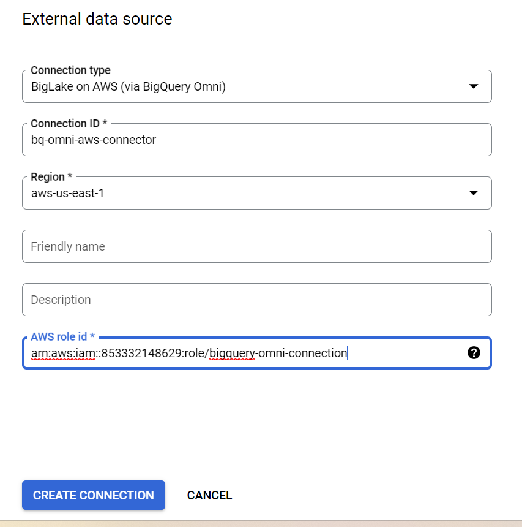

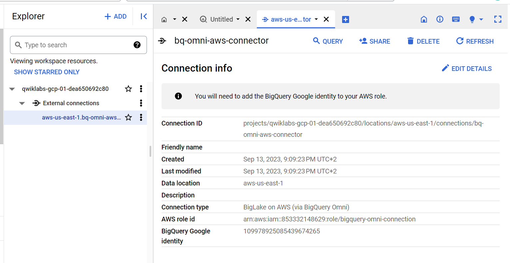

109978925085439674265

### Add a Trust Relationship to the AWS role

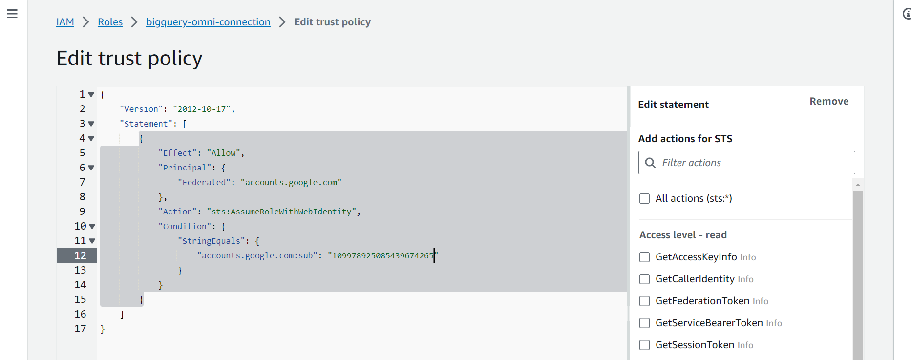

## Task 2. Run queries on the AWS S3 external table

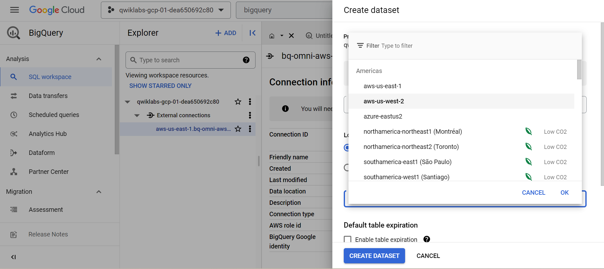

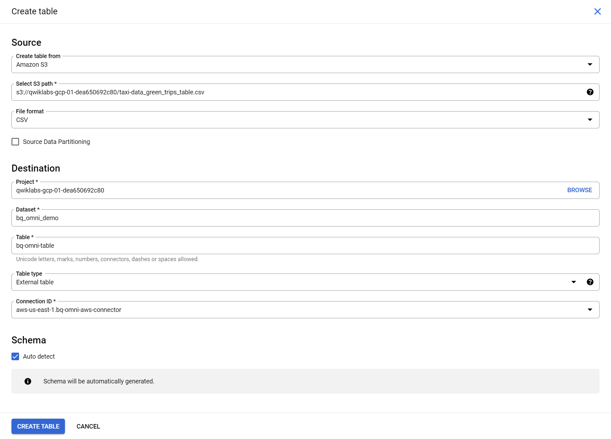


## Task 3. Create an external table and query AWS S3 data

BigQuery Omni lets you query the external table like any BigQuery table. The maximum result size for [interactive queries](https://cloud.google.com/bigquery/docs/running-queries#queries) is 10 GB ([preview](https://cloud.google.com/products#product-launch-stages)). For more information, see [Limitations](https://cloud.google.com/bigquery/docs/omni-introduction#limitations). If your query result is larger than 10 GB, then we recommend that you export it to Amazon S3. The query result is stored in a BigQuery temporary table.


## Task 4. Export query results to AWS S3

```
EXPORT DATA WITH CONNECTION `aws-us-east-1.bq-omni-aws-connector`
OPTIONS(uri="s3://qwiklabs-gcp-01-dea650692c80/exports/*", format="CSV")
AS SELECT * FROM `qwiklabs-gcp-01-dea650692c80.bq_omni_demo.bq-omni-table`
```

 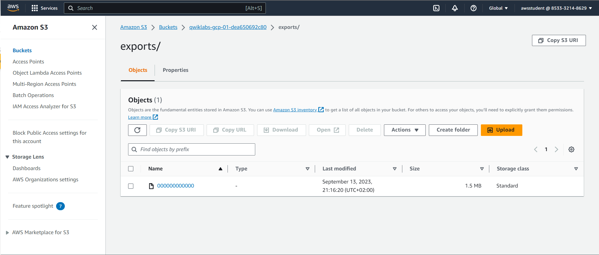
