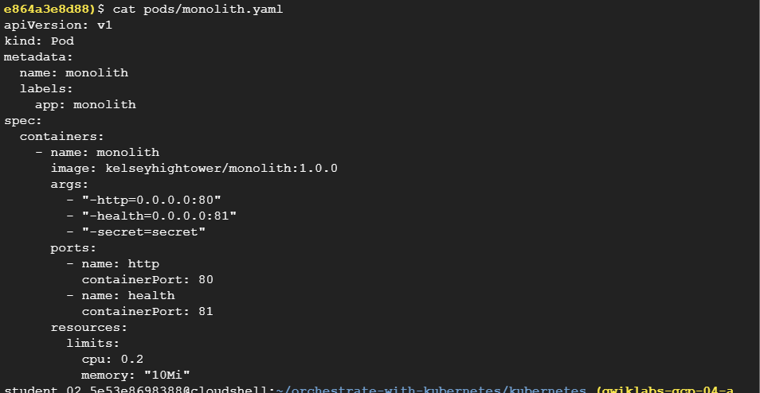

# <https§§§www.cloudskillsboost.google§focuses§557§parent=catalog>

> [https://www.cloudskillsboost.google/focuses/557?parent=catalog](https://www.cloudskillsboost.google/focuses/557?parent=catalog)


# Orchestrating the Cloud with Kubernetes

 


## Setup and requirements


```
gcloud config set compute/zone us-central1-b


gcloud container clusters create io
```


 


## Task 1. Get the sample code

```
gsutil cp -r gs://spls/gsp021/* .

cd orchestrate-with-kubernetes/kubernetes
```


 


## Task 2. Quick Kubernetes Demo

```
kubectl create deployment nginx --image=nginx:1.10.0
```

 

```
kubectl get pods
```

 

```
kubectl expose deployment nginx --port 80 --type LoadBalancer
```

 

after a bit

 

 

 


## Task 3. Pods

[https://kubernetes.io/docs/concepts/workloads/pods/](https§§§kubernetes.io§docs§concepts§workloads§pods§/readme.md)

[https://kubernetes.io/docs/concepts/storage/volumes/](https§§§kubernetes.io§docs§concepts§storage§volumes§/readme.md)


## Task 4. Creating pods


 

```
kubectl create -f pods/monolith.yaml
```

 

```
kubectl get pods
```

 


## Task 5. Interacting with pods


kubectl port-forward monolith 10080:80


curl http://127.0.0.1:10080

 


curl http://127.0.0.1:10080/secure


curl -u user http://127.0.0.1:10080/login


```
# create an environment variable for the token.
TOKEN=$(curl http://127.0.0.1:10080/login -u user|jq -r '.token')
```


```
curl -H "Authorization: Bearer $TOKEN" http://127.0.0.1:10080/secure
```

 


```
kubectl logs monolith
```

 

curl http://127.0.0.1:10080 2 times

 

```
kubectl exec monolith --stdin --tty -c monolith -- /bin/sh
```

 


## Task 6. Services


[https://kubernetes.io/docs/concepts/services-networking/service/](https§§§kubernetes.io§docs§concepts§services-networking§service§/readme.md)

 


## Task 7. Creating a service


```
cd ~/orchestrate-with-kubernetes/kubernetes
cat pods/secure-monolith.yaml
```

```
student_02_5e53e8698388@cloudshell:~/orchestrate-with-kubernetes/kubernetes (qwiklabs-gcp-04-ae864a3e8d88)$ cat pods/secure-monolith.yaml
apiVersion: v1
kind: Pod
metadata:
  name: "secure-monolith"
  labels:
    app: monolith
spec:
  containers:
    - name: nginx
      image: "nginx:1.9.14"
      lifecycle:
        preStop:
          exec:
            command: ["/usr/sbin/nginx","-s","quit"]
      volumeMounts:
        - name: "nginx-proxy-conf"
          mountPath: "/etc/nginx/conf.d"
        - name: "tls-certs"
          mountPath: "/etc/tls"
...
```


```
# Create the secure-monolith pods and their configuration data:

kubectl create secret generic tls-certs --from-file tls/
kubectl create configmap nginx-proxy-conf --from-file nginx/proxy.conf
kubectl create -f pods/secure-monolith.yaml
```

```
cat services/monolith.yaml
```

```

student_02_5e53e8698388@cloudshell:~/orchestrate-with-kubernetes/kubernetes (qwiklabs-gcp-04-ae864a3e8d88)$ cat services/monolith.yaml
kind: Service
apiVersion: v1
metadata:
  name: "monolith"
spec:
  selector:
    app: "monolith"
    secure: "enabled"
  ports:
    - protocol: "TCP"
      port: 443
      targetPort: 443
      nodePort: 31000
  type: NodePort
student_02_5e53e8698388@cloudshell:~/orchestrate-with-kubernetes/kubernetes (qwiklabs-gcp-04-ae864a3e8d88)$ 
```


```
kubectl create -f services/monolith.yaml
```

 


```
gcloud compute firewall-rules create allow-monolith-nodeport \
  --allow=tcp:31000
```

 

```
gcloud compute instances list
```


## Task 8. Adding labels to pods


```
kubectl get pods -l "app=monolith"

kubectl get pods -l "app=monolith,secure=enabled"

kubectl label pods secure-monolith 'secure=enabled'
kubectl get pods secure-monolith --show-labels

kubectl describe services monolith | grep Endpoints

gcloud compute instances list
curl -k https://<EXTERNAL_IP>:31000

```


## Task 9. Deploying applications with Kubernetes

[https://kubernetes.io/docs/concepts/workloads/controllers/deployment/#what-is-a-deployment](https§§§kubernetes.io§docs§concepts§workloads§controllers§deployment§#what-is-a-deployment/readme.md)

[https://kubernetes.io/docs/concepts/workloads/controllers/replicaset/](https§§§kubernetes.io§docs§concepts§workloads§controllers§replicaset§/readme.md)


## Task 10. Creating deployments


cat deployments/auth.yaml

```
lease visit the web page mentioned above.
student_02_5e53e8698388@cloudshell:~/orchestrate-with-kubernetes/kubernetes (qwiklabs-gcp-04-ae864a3e8d88)$ cat deployments/auth.yaml
apiVersion: apps/v1
kind: Deployment
metadata:
  name: auth
spec:
  selector:
    matchLabels:
      app: auth
  replicas: 1
  template:
    metadata:
      labels:
        app: auth
        track: stable
    spec:
      containers:
        - name: auth
          image: "kelseyhightower/auth:2.0.0"
          ports:
            - name: http
              containerPort: 80
            - name: health
              containerPort: 81
          resources:
            limits:
              cpu: 0.2
              memory: "10Mi"
          livenessProbe:
            httpGet:
              path: /healthz
              port: 81
              scheme: HTTP
            initialDelaySeconds: 5
            periodSeconds: 15
            timeoutSeconds: 5
          readinessProbe:
            httpGet:
              path: /readiness
              port: 81
              scheme: HTTP
            initialDelaySeconds: 5
            timeoutSeconds: 1
student_02_5e53e8698388@cloudshell:~/orchestrate-with-kubernetes/kubernet
```


```

kubectl create -f deployments/auth.yaml

kubectl create -f services/auth.yaml

kubectl create -f deployments/hello.yaml
kubectl create -f services/hello.yaml

kubectl create configmap nginx-frontend-conf --from-file=nginx/frontend.conf
kubectl create -f deployments/frontend.yaml
kubectl create -f services/frontend.yaml

kubectl get services frontend
```

 

 


 
