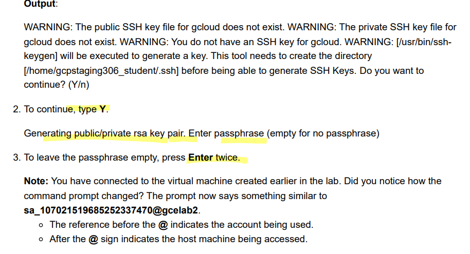

# <https§§§www.cloudskillsboost.google§focuses§563§§parent§=catalog>
> <https://www.cloudskillsboost.google/focuses/563\?parent\=catalog>
        
# Getting Started with Cloud Shell and gcloud

cloud shell is 5gb vm to manage gcloud

## Activate Cloud Shell

you have a project_id

```bash
gcloud auth list
# > authorize
```


[https://cloud.google.com/sdk/gcloud](https§§§cloud.google.com§sdk§gcloud/readme.md)

## Task 1. Configuring your environment

```bash
# set region
gcloud config set compute/region ${REGION}
gcloud config get-value compute/region

gcloud config set compute/zone ${ZONE}
gcloud config set compute/zone
```

find the project info

```bash
# view project id
gcloud config get-value project
# view project details
gcloud compute project-info describe --project $(gcloud config get-value project)
```

setting env var
```bash
# project id 
export PROJECT_ID=$(gcloud cpnfig get-value project)
# zone
export ZONE=$(gcloud config get-value compute/zone)

```

Creating a virtual machine with the gcloud tool

```bash
gcloud compute instances create gcelab2 --machine-type e2-medium --zone ${ZONE}
```

Exploring gcloud commands

```bash
# gcloud help
gcloud -h
gcloud config --help
gcloud help config

```
[https://cloud.google.com/sdk/gcloud/reference/](https§§§cloud.google.com§sdk§gcloud§reference§/readme.md)


```bash
# conf list
gcloud config list
gcloud config list --all
```

## Task 2. Filtering command-line output

```bash
# List the compute instance available in the project:
gcloud compute instances list 
# filter by name
gcloud compute instances list --filter="name=('gcelab2')"
# firewal list
gcloud compute firewall-rules list
# filter by name
gcloud compute firewall-rules list --filter="network='default'"
gcloud compute firewall-rules list --filter="NETWORK:'default' AND ALLOW:'icmp'"

```

## Task 3. Connecting to your VM instance

ssh to vms
```bash
gcloud compute ssh gcelab2 --zone $ZONE

```


## Task 4. Updating the firewall
```bash
# List the firewall rules for the project
gcloud compute firewall-rules list

```
> Note: Communication with the virtual machine will fail as it does not have an appropriate firewall rule.

get communication working we
need to:
Add a tag to the gcelab2 virtual machine
Add a firewall rule for http traffic

```bash
gcloud compute instances add-tags gcelab2 --tags http-server,https-server
gcloud compute firewall-rules create default-allow-http --direction=INGRESS --priority=1000 --network=default --action=ALLOW --rules=tcp:80 --source-ranges=0.0.0.0/0 --target-tags=http-server
gcloud compute firewall-rules list --filter=ALLOW:'80'

# verify
curl http://$(gcloud compute instances list --filter=name:gcelab2 --format='value(EXTERNAL_IP)')

```

## Task 5. Viewing the system logs

check log to understand more
```bash
gcloud logging logs list
# filter
gcloud logging logs list --filter="compute"
# filter
gcloud logging read "resource.type=gce_instance" --limit 5
# filter
gcloud logging read "resource.type=gce_instance AND labels.instance_name='gcelab2'" --limit 5

```

[https://www.cloudskillsboost.google/focuses/7140?parent=catalog](https§§§www.cloudskillsboost.google§focuses§7140§parent=catalog/readme.md)
