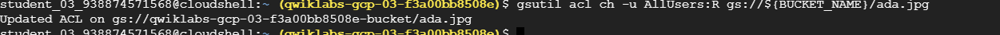

# <https§§§www.cloudskillsboost.google§focuses§569§parent=catalog>
> <https://www.cloudskillsboost.google/focuses/569?parent=catalog>

# Cloud Storage: Qwik Start - CLI/SDK

## Setup and requirements

```bash
gcloud auth list
gcloud config list project
gcloud config set compute/region us-east1
```

## Task 1. Create a bucket

https://cloud.google.com/storage/docs/gsutil


```bash
BUCKET_NAME=qwiklabs-gcp-03-f3a00bb8508e-bucket
gsutil mb gs://${BUCKET_NAME}
```


## Task 2. Upload an object into your bucket

```bash
curl https://upload.wikimedia.org/wikipedia/commons/thumb/a/a4/Ada_Lovelace_portrait.jpg/800px-Ada_Lovelace_portrait.jpg --output ada.jpg
gsutil cp ada.jpg gs://${BUCKET_NAME}
```

## Task 3. Download an object from your bucket

```bash
gsutil cp -r gs://${BUCKET_NAME}/ada.jpg .
```

## Task 4. Copy an object to a folder in the bucket

```bash
gsutil cp gs://${BUCKET_NAME}/ada.jpg gs://${BUCKET_NAME}/image-folder/
```

## Task 5. List contents of a bucket or folder

```bash
gsutil ls 
gsutil ls gs://${BUCKET_NAME}
```


## Task 6. Make your object publicly accessible

grant access to all users

```bash

gsutil acl ch -u AllUsers:R gs://${BUCKET_NAME}/ada.jpg
```



```bash
gsutil acl ch -d AllUsers gs://${BUCKET_NAME}/ada.jpg
```