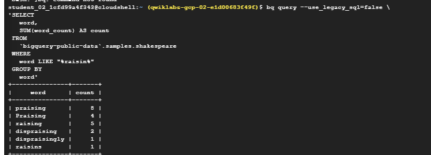
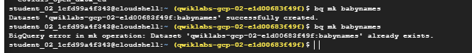
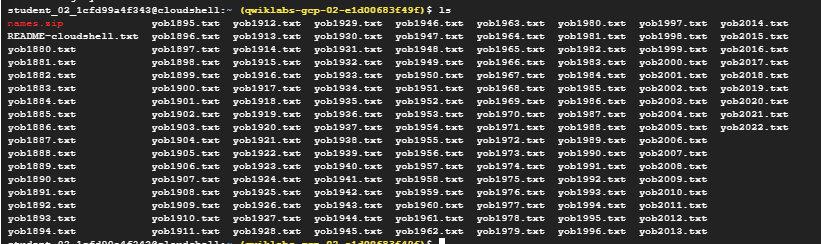
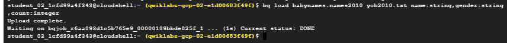
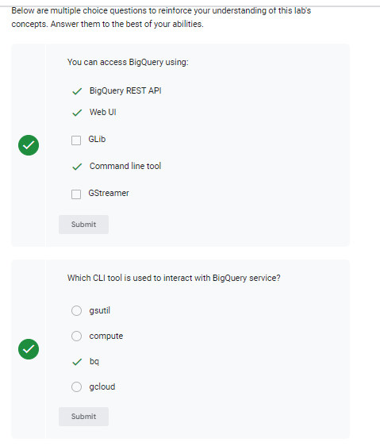

# <https§§§www.cloudskillsboost.google§focuses§577§parent=catalog>
> <https://www.cloudskillsboost.google/focuses/577?parent=catalog>

# BigQuery: Qwik Start - Command Line

## Overview

https://cloud.google.com/bigquery/docs/introduction

## Task 1. Examine a table

https://cloud.google.com/bigquery/public-data#sample_tables

```
bq show bigquery-public-data:samples.shakespeare
```

## Task 3. Run a query

 bq query "[SQL_STATEMENT]":

 ex

 ```bash
 bq query --use_legacy_sql=false \
'SELECT
   word,
   SUM(word_count) AS count
 FROM
   `bigquery-public-data`.samples.shakespeare
 WHERE
   word LIKE "%raisin%"
 GROUP BY
   word'
```




```bash
bq query --use_legacy_sql=false \
'SELECT
   word
 FROM
   `bigquery-public-data`.samples.shakespeare
 WHERE
   word = "huzzah"'
```

## Task 4. Create a new table

```bash
bq ls bigquery-public-data:
```

make dataset

```bash
bq mk babynames
```
> Now create a dataset. A dataset name can be up to 1,024 characters long, and consist of A-Z, a-z, 0-9, and the underscore, but it cannot start with a number or underscore, or have spaces.



### Upload the dataset

```bash

curl -LO http://www.ssa.gov/OACT/babynames/names.zip
unzip names.zip

bq load babynames.names2010 yob2010.txt name:string,gender:string,count:integer

```






## Task 5. Run queries

```bash
bq query "SELECT name,count FROM babynames.names2010 WHERE gender = 'F' ORDER BY count DESC LIMIT 5"
```


## Task 7. Clean up

```
bq rm -r babynames
```