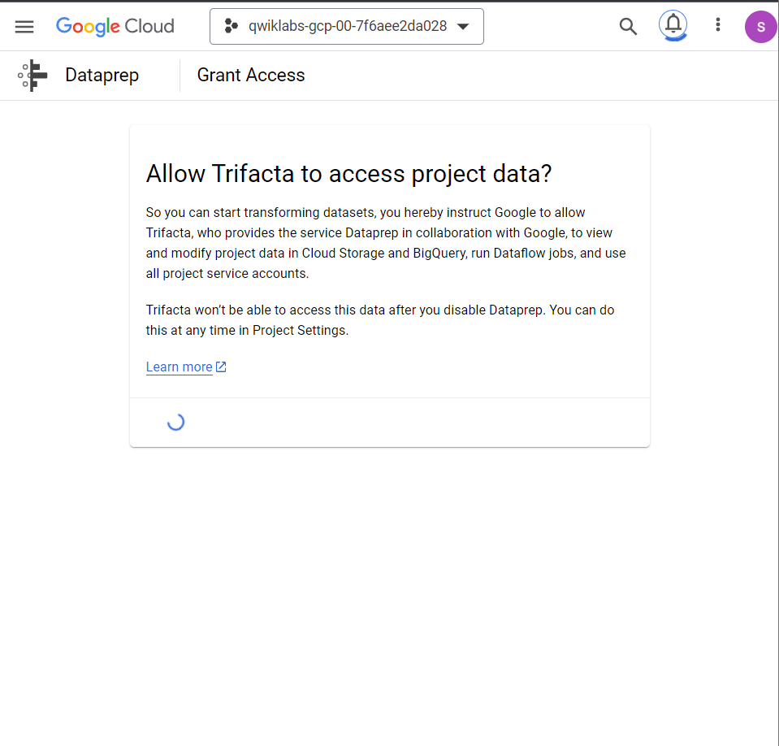
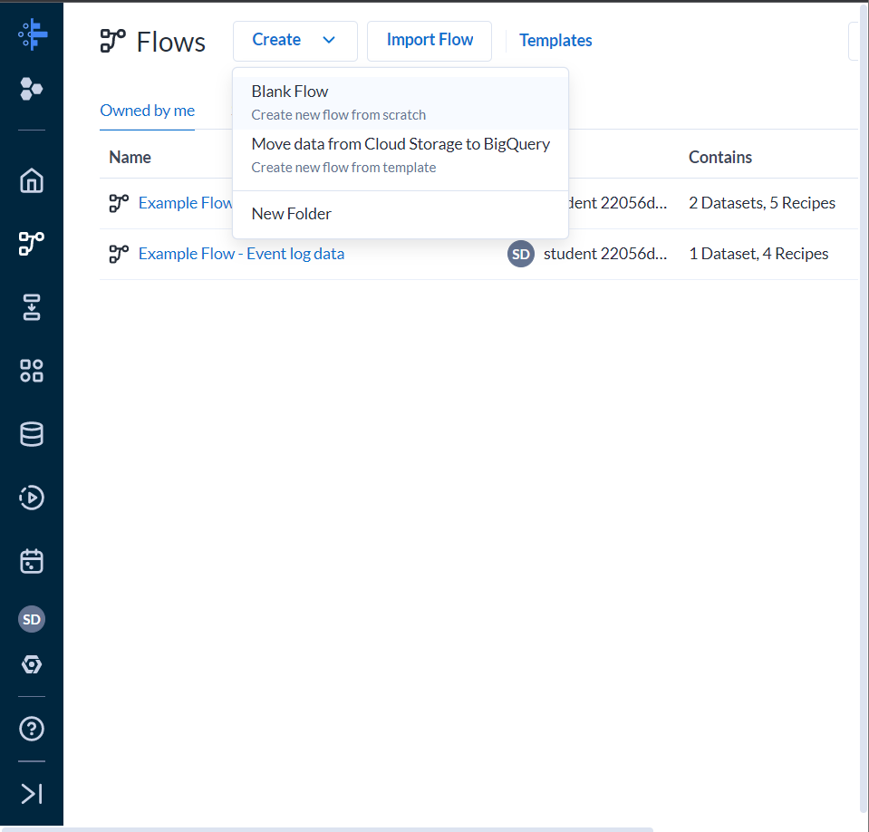
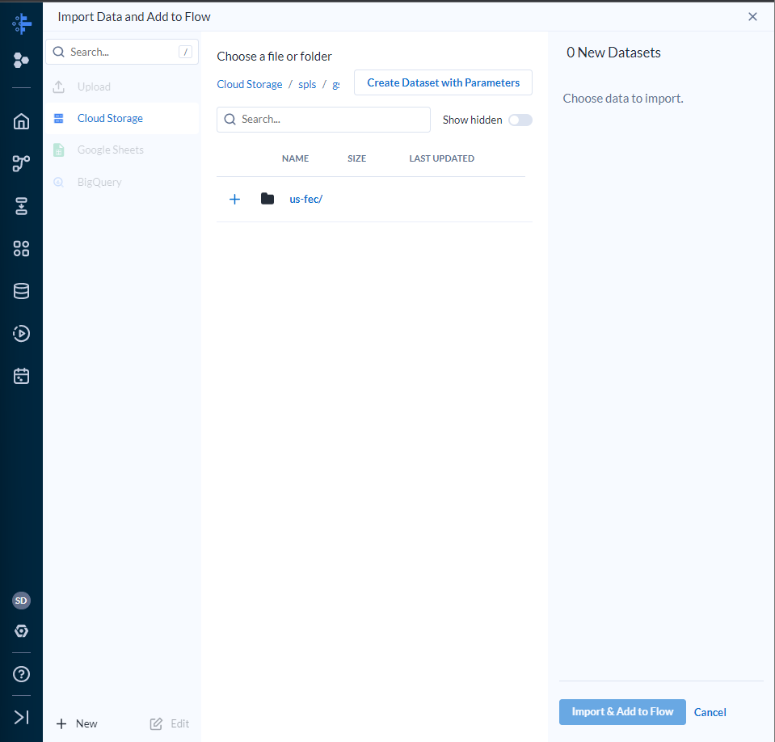
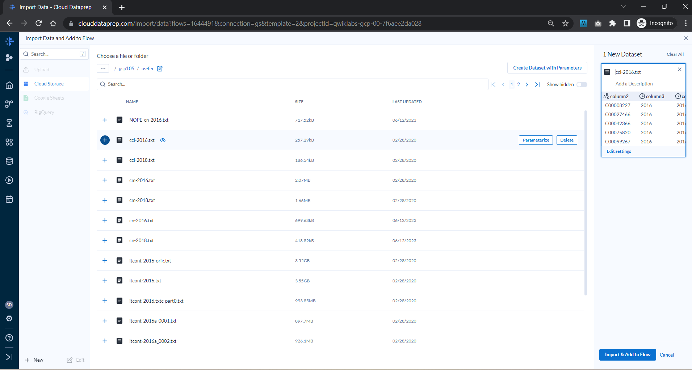
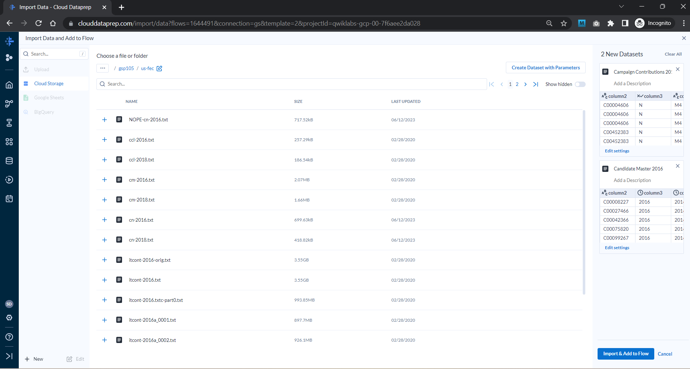
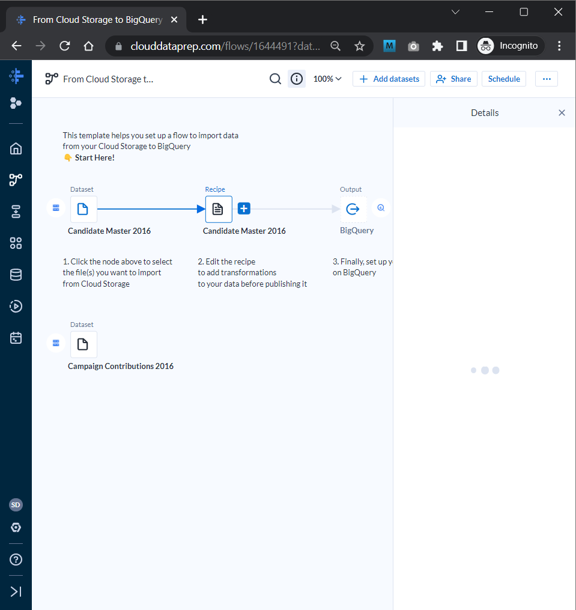
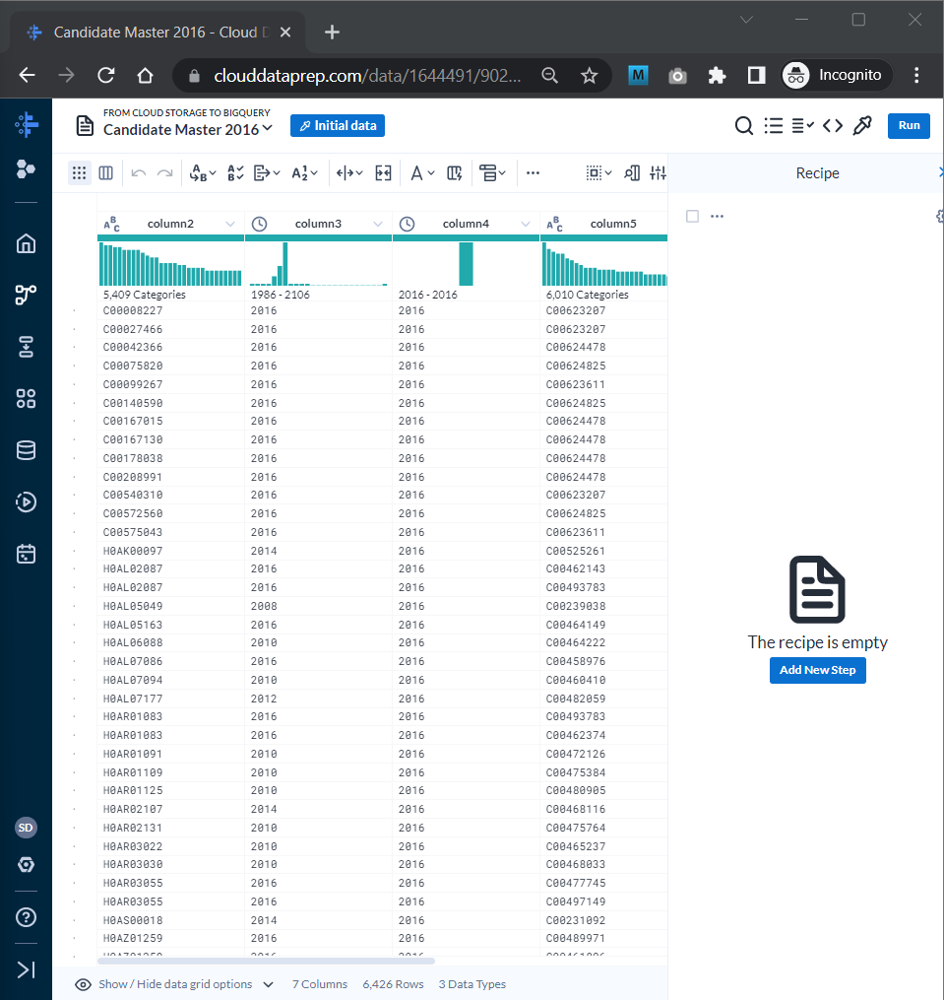

# <https§§§www.cloudskillsboost.google§focuses§584§parent=catalog>

> [https://www.cloudskillsboost.google/focuses/584?parent=catalog](https://www.cloudskillsboost.google/focuses/584?parent=catalog)

# Dataprep: Qwik Start

## Task 1. Create a Cloud Storage bucket in your project

qwiklabs-gcp-00-7f6aee2da028

## Task 2. Initialize Cloud Dataprep

 

## Task 3. Create a flow

 

[https://www.fec.gov/data/browse-data/?tab=bulk-data](https§§§www.fec.gov§data§browse-data§§tab=bulk-data/readme.md)

## Task 4. Import datasets

Type `gs://spls/gsp105` in the **Choose a file or folder** text box, then click  **Go** .

 

cn 2016

 

2 data sets

 

## Task 5. Prep the candidate file

 

The Transformer page is where you build your transformation recipe

 
