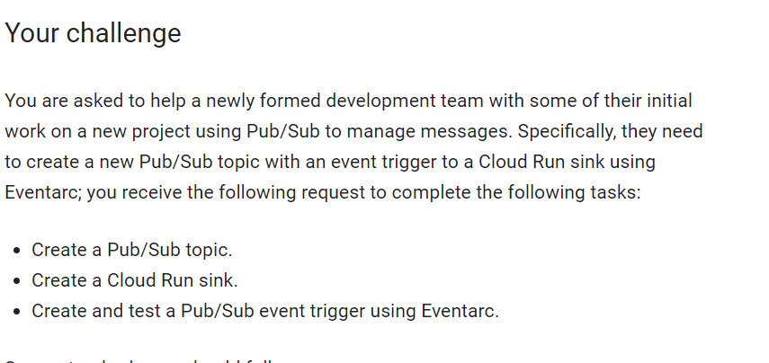
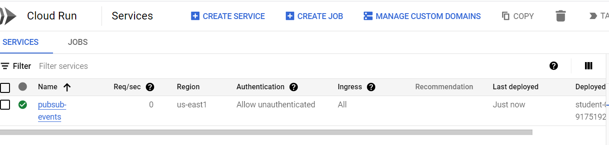
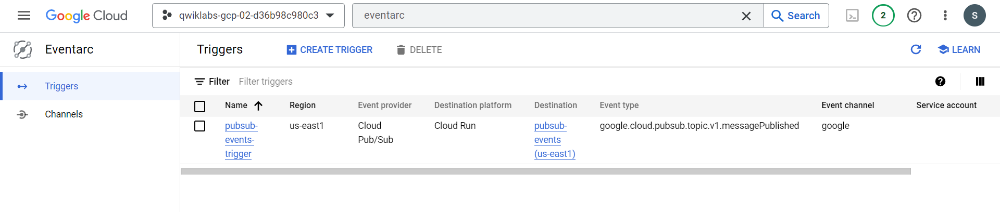

# <https§§§www.cloudskillsboost.google§focuses§63244§parent=catalog>
> <https://www.cloudskillsboost.google/focuses/63244?parent=catalog>

# Get Started with Eventarc: Challenge Lab

## Challenge scenario

You are just starting your junior cloud DevOps role. So far you have been helping teams create and manage Cloud Functions, Cloud Run services, and Pub/Sub topics.



## Setup

```bash
gcloud auth list
export PROJECT_ID=qwiklabs-gcp-00-b51df23247f5
export REGION=us-east4

gcloud config set run/region $REGION

# Cloud Run platform default to managed
gcloud config set run/platform managed

gcloud config set eventarc/location $REGION

```

## Task 1. Create a Pub/Sub topic

Create a Pub/Sub topic named project_id-topic with a subscription named project_id-topic-sub.

```bash
gcloud pubsub topics create $PROJECT_ID-topic
gcloud pubsub subscriptions create --topic  $PROJECT_ID-topic $PROJECT_ID-topic-sub
```

## Task 2. Create a Cloud Run sink

Create a Cloud Run sink with the following requirements:
Service name: pubsub-events
Image name: gcr.io/cloudrun/hello

```bash
export SERVICE_NAME="pubsub-events"
export IMAGE_NAME="gcr.io/cloudrun/hello"

# deploy your containerized application to Cloud Run:
gcloud run deploy ${SERVICE_NAME} --image ${IMAGE_NAME} --allow-unauthenticated --max-instances=3
``` 


## Task 3. Create and test a Pub/Sub event trigger using Eventarc

Create a Pub/Sub event trigger named pubsub-events-trigger with the following requirements:
Use the Cloud Run sink and Pub/Sub topic created in the previous tasks.

To create the trigger on an existing Pub/Sub topic, add the following argument to the command used to create the trigger: --transport-topic=project_id-topic


```bash
gcloud beta eventarc triggers create pubsub-events-trigger \
  --location=$REGION \
  --destination-run-service=${SERVICE_NAME} \
  --destination-run-region=$REGION \
  --transport-topic=$PROJECT_ID-topic \
  --matching-criteria="type=google.cloud.pubsub.topic.v1.messagePublished"

```



Test the Pub/Sub event trigger by publishing a message to the Pub/Sub topic.


```bash
gcloud pubsub topics publish $PROJECT_ID-topic --message="Hello there"
```