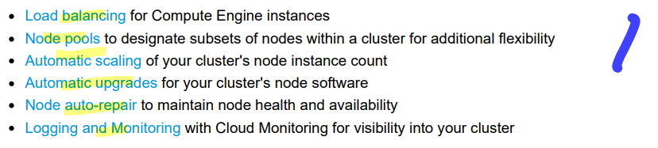

# <https§§§www.cloudskillsboost.google§focuses§878§§parent§=catalog>
> <https://www.cloudskillsboost.google/focuses/878\?parent\=catalog>

# Kubernetes Engine: Qwik Start

https://cloud.google.com/kubernetes-engine/
- managed env
- containered apps

Cluster orchestration with Google Kubernetes Engine

gke is powered by kubernetes
you use kub commands and resources
- deploy and manage apps
- admin tasks
- set policies
- monitor health

Kubernetes on Google Cloud

kub on gcloud bemnefits


## Task 2. Create a GKE cluster

cluster consists
- cluster master
- worker nodes
all are compute eng vms
```bash
gcloud container clusters create --machine-type=e2-medium --zone=$ZONE lab-cluster
```

## Task 3. Get authentication credentials for the cluster

you need auth credentials to interact with the cluster

```bash
gcloud container clusters get-credentials lab-cluster
```

## Task 4. Deploy an application to the cluster

deploy a containerized app to the cluster
gke uses kub ojects to create and manage cluster's resources
- deployment obj
- service obj

```bash
# new deployment from a container image using kutectl
kubectl create deployment hello-server --image=gcr.io/google-samples/hello-app:1.0
# >_ deployment.apps/hello-server created

# create a kub service to expose the app to external traffic
kubectl expose deployment hello-server --type=LoadBalancer --port 8080
# >_ service/hello-server exposed

# inspect the service
kubectl get service

```

## Task 5. Deleting the cluster

```bash
# delete cluter
gcloud container clusters delete lab-cluster

```