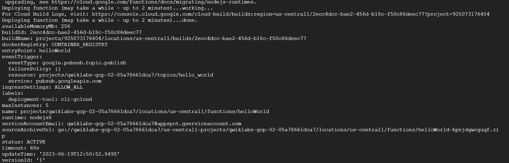

# <https§§§www.cloudskillsboost.google§focuses§916§parent=catalog>
> <https://www.cloudskillsboost.google/focuses/916?parent=catalog>

# Cloud Functions: Qwik Start - Command Line

## Task 1. Create a function

gcloud config set compute/region us-central1

mkdir gcf_hello_world

cd gcf_hello_world

nano index.js

```
/**
* Background Cloud Function to be triggered by Pub/Sub.
* This function is exported by index.js, and executed when
* the trigger topic receives a message.
*
* @param {object} data The event payload.
* @param {object} context The event metadata.
*/
exports.helloWorld = (data, context) => {
const pubSubMessage = data;
const name = pubSubMessage.data
    ? Buffer.from(pubSubMessage.data, 'base64').toString() : "Hello World";
console.log(`My Cloud Function: ${name}`);
};
```

## Task 2. Create a cloud storage bucket
PROJECT_ID=qwiklabs-gcp-02-05a78661dca7
BUCKET_NAME=qwiklabs-gcp-02-05a78661dca7
gsutil mb -p $PROJECT_ID gs://$BUCKET_NAME


## Task 3. Deploy your function

When deploying a new function, you must specify --trigger-topic, --trigger-bucket, or --trigger-http. When deploying an update to an existing function, the function keeps the existing trigger unless otherwise specified.

gcloud functions deploy helloWorld \
  --stage-bucket $BUCKET_NAME \
  --trigger-topic hello_world \
  --runtime nodejs8


gcloud functions describe helloWorld



## Task 4. Test the function

```bash
DATA=$(printf 'Hello World!'|base64) && gcloud functions call helloWorld --data '{"data":"'$DATA'"}'
```


## Task 5. View logs

```bash 
gcloud functions logs read helloWorld
```