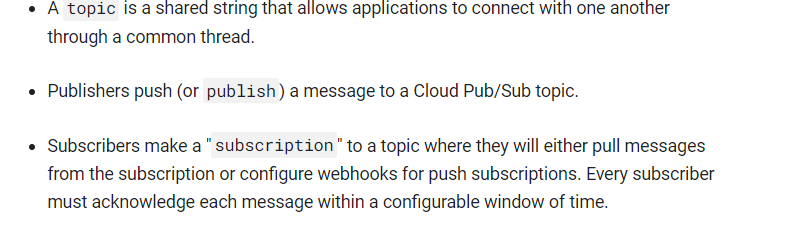
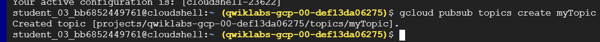
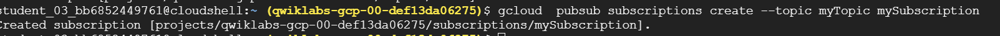
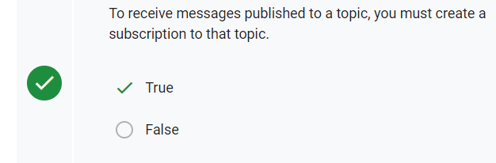
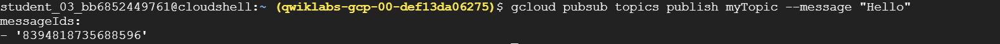
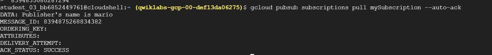
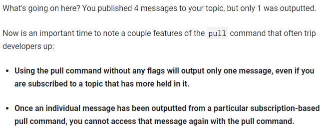
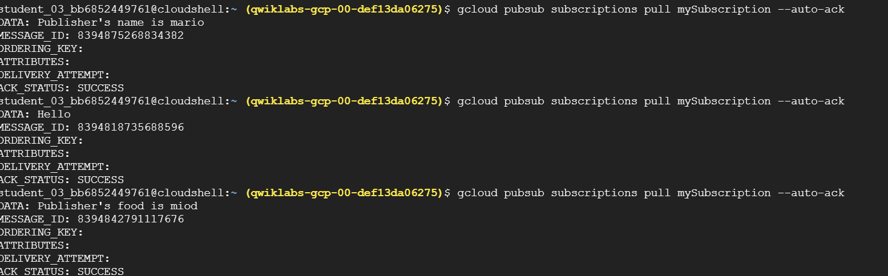
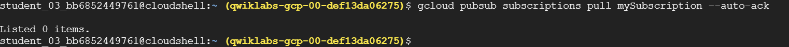
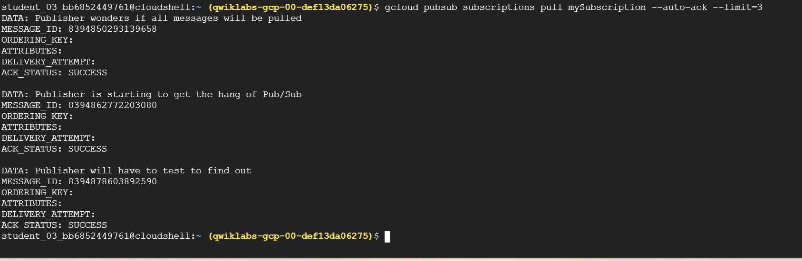

# <https§§§www.cloudskillsboost.google§focuses§925§parent=catalog>
> <https://www.cloudskillsboost.google/focuses/925?parent=catalog>

# Google Cloud Pub/Sub: Qwik Start - Command Line

In this lab, you will do the following:

Learn the basics of Pub/Sub.

Create, delete, and list Pub/Sub topics.

Create, delete, and list Pub/Sub subscriptions.

Publish messages to a topic.

Use a pull subscriber to output individual topic messages.

Use a pull subscriber with a flag to output multiple messages.

## Prerequisites

Before taking this lab, consider your proficiency with Pub/Sub. Below is a list of more challenging labs that will let you apply your knowledge of Pub/Sub to different cloud services and use cases:

[https://google.qwiklabs.com/catalog_lab/934](https§§§google.qwiklabs.com§catalog_lab§934/readme.md)
[https://www.cloudskillsboost.google/focuses/1831?parent=catalog](https§§§www.cloudskillsboost.google§focuses§1831§parent=catalog/readme.md)

## Pub/Sub basics



## Task 1. Pub/Sub topics


```bash
gcloud pubsub topics create myTopic
```


```bash
gcloud pubsub topics list
```
```
---
messageStoragePolicy:
  allowedPersistenceRegions:
  - asia-east1
  - asia-northeast1
  - asia-south1
  - asia-southeast1
  - australia-southeast1
  - europe-central2
  - europe-north1
  - europe-west1
  - europe-west10
  - europe-west12
  - europe-west2
  - europe-west3
  - europe-west4
  - europe-west5
  - me-central1
  - me-central2
  - me-west1
  - southamerica-west1
  - us-central1
  - us-central2
  - us-east1
  - us-east4
  - us-east5
  - us-east7
  - us-south1
  - us-west1
  - us-west2
  - us-west3
  - us-west4
name: projects/qwiklabs-gcp-00-def13da06275/topics/Test1
---
messageStoragePolicy:
  allowedPersistenceRegions:
  - asia-east1
  - asia-northeast1
  - asia-south1
  - asia-southeast1
  - australia-southeast1
  - europe-central2

...

  - us-west2
  - us-west3
  - us-west4
name: projects/qwiklabs-gcp-00-def13da06275/topics/myTopic
  ```

```bash
# delete
gcloud pubsub topics delete Test1
gcloud pubsub topics delete Test2
```
## Task 2. Pub/Sub subscriptions

Run the following command to create a subscription called mySubscription to topic myTopic:

```bash
gcloud  pubsub subscriptions create --topic myTopic mySubscription
```


```bash
# more subs
gcloud  pubsub subscriptions create --topic myTopic Test1
gcloud  pubsub subscriptions create --topic myTopic Test2
```



## Task 3. Pub/Sub publishing and pulling a single message

Next you'll learn how to publish a message to a Pub/Sub topic.

```bash
gcloud pubsub topics publish myTopic --message "Hello"
```


```bash
# more msg
gcloud pubsub topics publish myTopic --message "Publisher's name is mario"
gcloud pubsub topics publish myTopic --message "Publisher's food is miod"
gcloud pubsub topics publish myTopic --message "Publisher thinks Pub/Sub is awesome"
```

Next, use the pull command to get the messages from your topic. The pull command is subscription based, meaning it should work because earlier you set up the subscription mySubscription to the topic myTopic.





run more times


until none are left


## Task 4. Pub/Sub pulling all messages from subscriptions

Since you pulled all of the messages from your topic in the last example, populate myTopic with a few more messages.

```bash
gcloud pubsub topics publish myTopic --message "Publisher is starting to get the hang of Pub/Sub"
gcloud pubsub topics publish myTopic --message "Publisher wonders if all messages will be pulled"
gcloud pubsub topics publish myTopic --message "Publisher will have to test to find out"
```

get them

```bash
# Add a flag to your command so you can output all three messages in one request.
gcloud pubsub subscriptions pull mySubscription --auto-ack --limit=3
```

