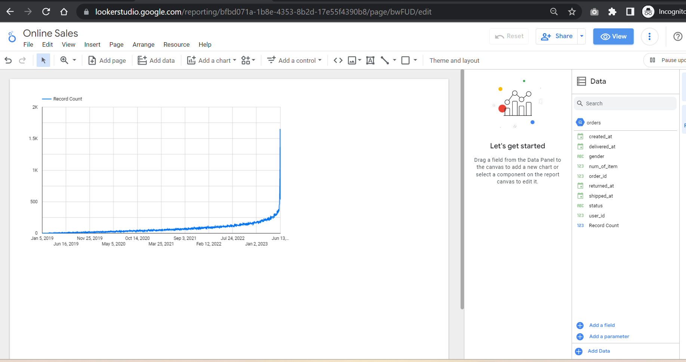
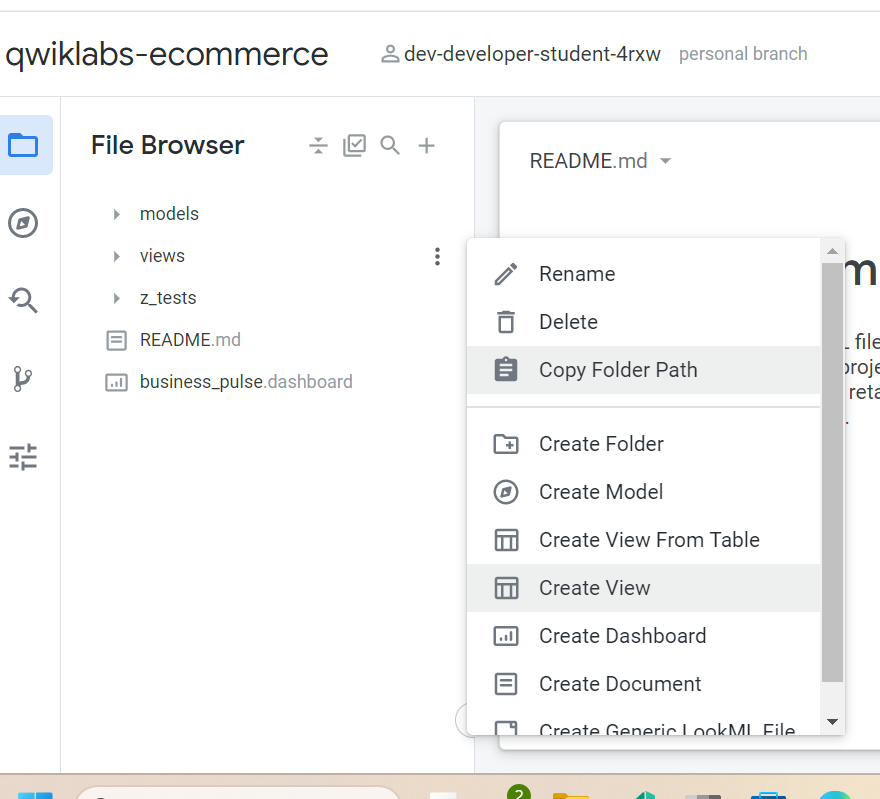
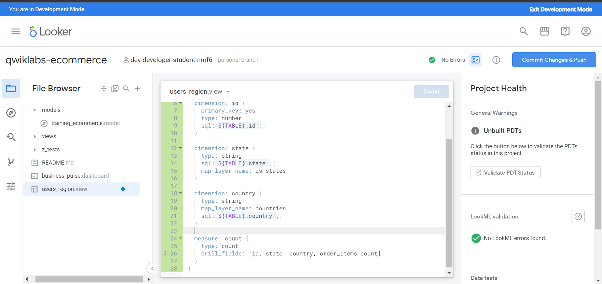
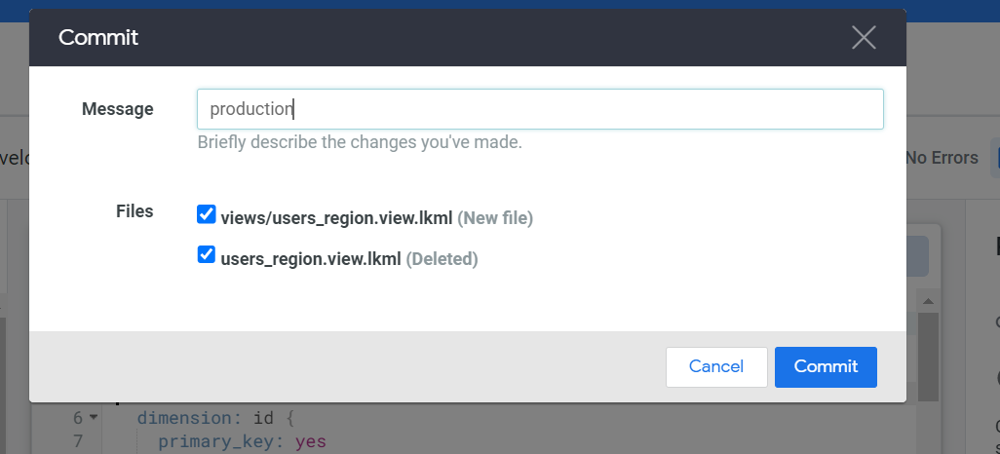
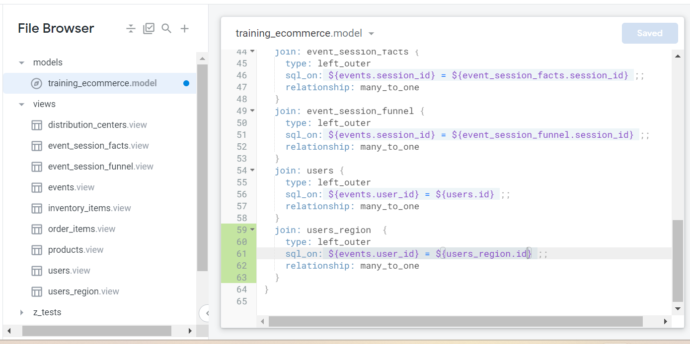
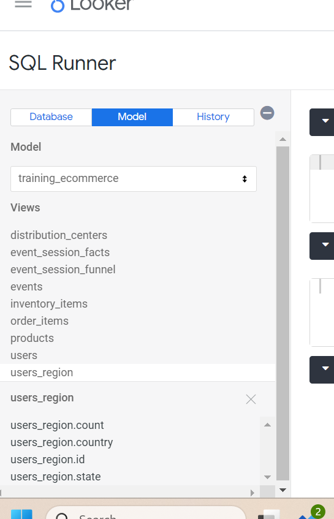
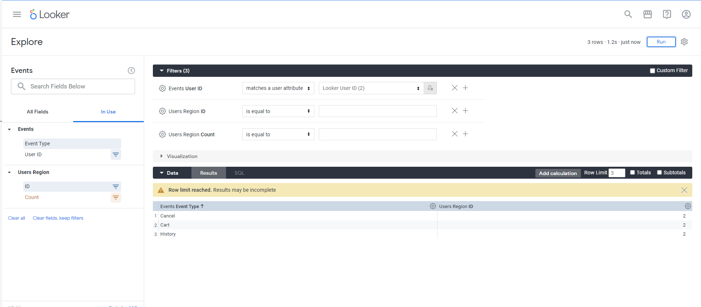

# <https§§§www.cloudskillsboost.google§games§4111§labs§26480>
> <https://www.cloudskillsboost.google/games/4111/labs/26480>

# Get Started with Looker: Challenge Lab
## Task 1. Create a new report in Looker Studio



## Task 2. Create a new view in Looker

> developer mode



sample 
```
view: users {
  sql_table_name: `cloud-training-demos.looker_ecomm.users`
    ;;
  drill_fields: [id]

  dimension: id {
    primary_key: yes
    type: number
    sql: ${TABLE}.id ;;
  }

  dimension: age {
    type: number
    sql: ${TABLE}.age ;;
  }

  dimension: city {
    type: string
    sql: ${TABLE}.city ;;
  }

  dimension: country {
    type: string
    map_layer_name: countries
    sql: ${TABLE}.country ;;
  }

  dimension_group: created {
    type: time
    timeframes: [
      raw,
      time,
      date,
      week,
      month,
      quarter,
      year
    ]
    sql: ${TABLE}.created_at ;;
  }

  dimension: email {
    type: string
    sql: ${TABLE}.email ;;
  }

  dimension: first_name {
    type: string
    sql: ${TABLE}.first_name ;;
  }

  dimension: gender {
    type: string
    sql: ${TABLE}.gender ;;
  }

  dimension: last_name {
    type: string
    sql: ${TABLE}.last_name ;;
  }

  dimension: latitude {
    type: number
    sql: ${TABLE}.latitude ;;
  }

  dimension: longitude {
    type: number
    sql: ${TABLE}.longitude ;;
  }

  dimension: state {
    type: string
    sql: ${TABLE}.state ;;
    map_layer_name: us_states
  }

  dimension: traffic_source {
    type: string
    sql: ${TABLE}.traffic_source ;;
  }

  dimension: zip {
    type: zipcode
    sql: ${TABLE}.zip ;;
  }

  measure: count {
    type: count
    drill_fields: [id, last_name, first_name, events.count, order_items.count]
  }
}
```
users_region
```text
view: users_region {
  sql_table_name: `cloud-training-demos.looker_ecomm.users`
  ;;
  drill_fields: [id]

  dimension: id {
    primary_key: yes
    type: number
    sql: ${TABLE}.id ;;
  }

  dimension: state {
    type: string
    sql: ${TABLE}.state ;;
    map_layer_name: us_states
  }

  dimension: country {
    type: string
    map_layer_name: countries
    sql: ${TABLE}.country ;;
  }

  measure: count {
    type: count
    drill_fields: [id, state, country, order_items.count]
  }
}

... join

  }
  join: users_region  {
    type: left_outer
    sql_on: ${events.user_id} = ${users_region.id} ;;
    relationship: many_to_one
  }
}

```








## Task 3. Create a new dashboard in Looker



join

