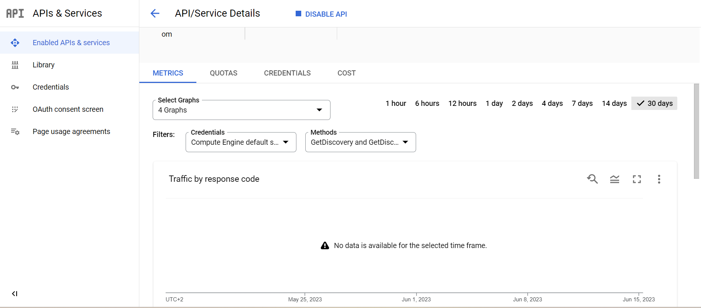
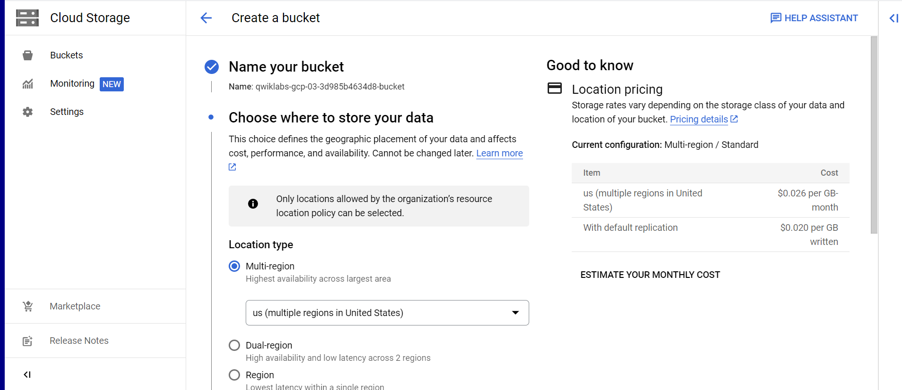
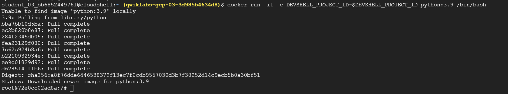
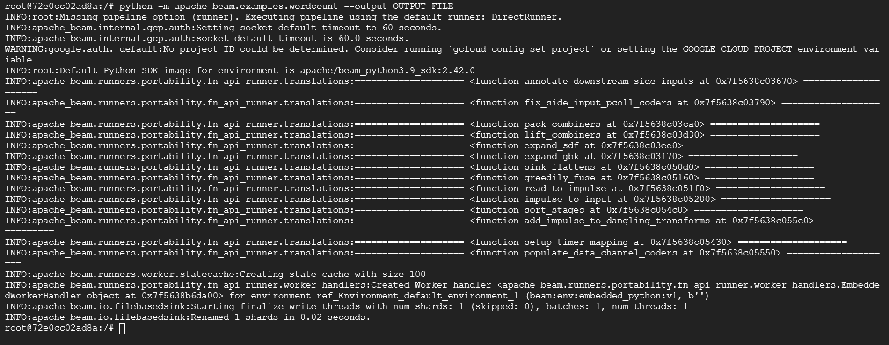
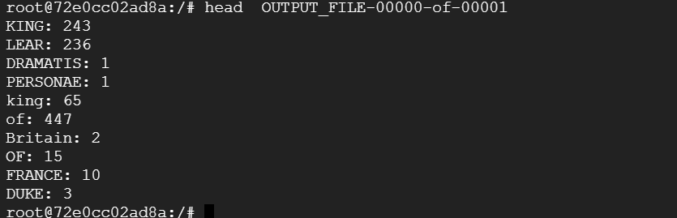
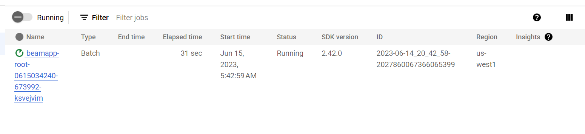
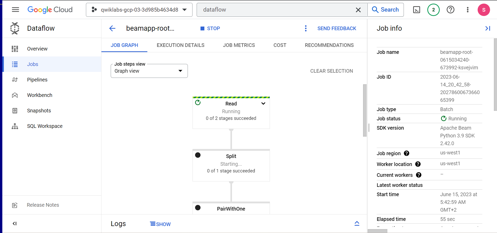
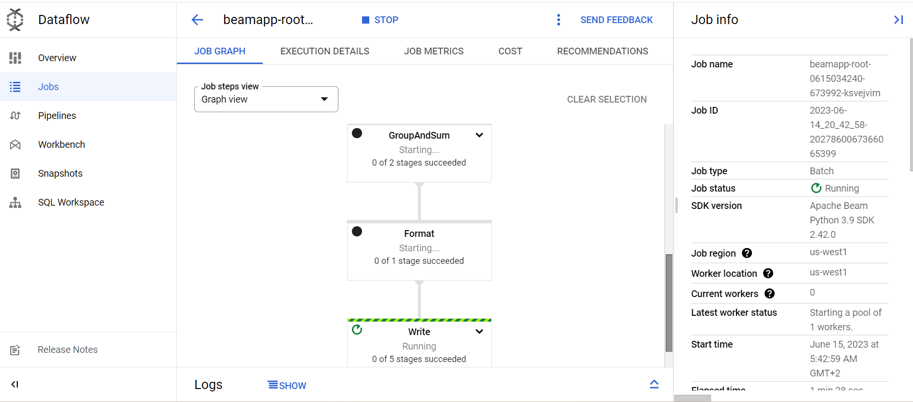
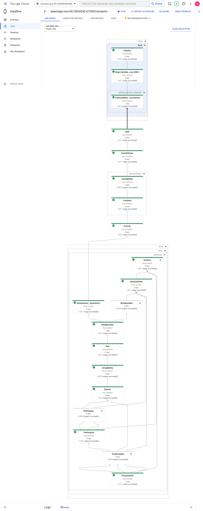
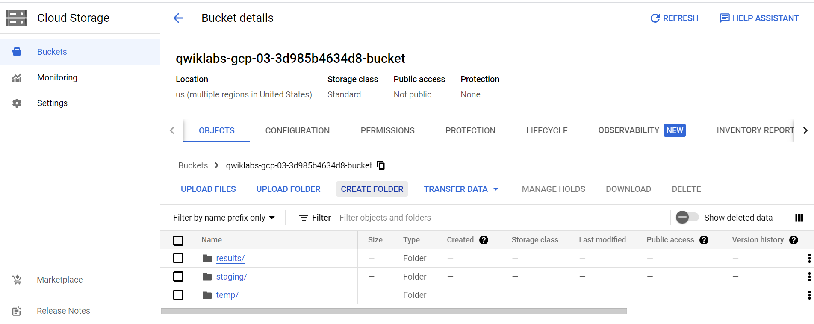

# <https§§§www.cloudskillsboost.google§games§4111§labs§26482>
> <https://www.cloudskillsboost.google/games/4111/labs/26482>

# Dataflow: Qwik Start - Python

## Setup and requirements

```bash
gcloud auth list
gcloud config list project
gcloud config set compute/region us-west1
```

enable dataflow api
https://console.cloud.google.com/apis/library/dataflow.googleapis.com


create bucket


## Task 2. Install pip and the Cloud Dataflow SDK

This command pulls a Docker container with the latest stable version of Python 3.9 and then opens up a command shell for you to run the following commands inside your container.


```bash
docker run -it -e DEVSHELL_PROJECT_ID=$DEVSHELL_PROJECT_ID python:3.9 /bin/bash
```



```bash
pip install 'apache-beam[gcp]'==2.42.0
```

```bash
python -m apache_beam.examples.wordcount --output OUTPUT_FILE
```


```log

promised: 1
Fall: 1
feather: 1
redeem: 1
murderers: 1
Gentle: 1
hanging: 1
biting: 1
falchion: 1
crosses: 1
spoil: 1
brag: 1
Caius: 1
rotten: 1
decay: 2
sad: 2
steps: 1
all's: 1
cheerless: 1
fordone: 1
selves: 1
desperately: 1
bootless: 1
applied: 1
resign: 1
During: 1
absolute: 1
merited: 1
wages: 1
cup: 1
deservings: 1
hang'd: 1
Thou'lt: 1
button: 1
faints: 1
Break: 1
Vex: 1
ghost: 1
rack: 1
Stretch: 1
usurp'd: 1
Friends: 1
Rule: 1
gored: 1
journey: 1
weight: 1
ought: 1
oldest: 1
root@72e0cc02ad8a:/# head  OUTPUT_FILE-00000-of-00001 
KING: 243
LEAR: 236
DRAMATIS: 1
PERSONAE: 1
king: 65
of: 447
Britain: 2
OF: 15
FRANCE: 10
DUKE: 3
root@72e0cc02ad8a:/# BUCKET=gs://qwiklabs-gcp-03-3d985b4634d8-bucket
python -m apache_beam.examples.wordcount --project $DEVSHELL_PROJECT_ID \
  --runner DataflowRunner \
  --staging_location $BUCKET/staging \
  --temp_location $BUCKET/temp \
  --output $BUCKET/results/output \
  --region us-west1
INFO:apache_beam.internal.gcp.auth:Setting socket default timeout to 60 seconds.
INFO:apache_beam.internal.gcp.auth:socket default timeout is 60.0 seconds.
WARNING:google.auth._default:No project ID could be determined. Consider running `gcloud config set project` or setting the GOOGLE_CLOUD_PROJECT environment variable
INFO:apache_beam.runners.portability.stager:Downloading source distribution of the SDK from PyPi
INFO:apache_beam.runners.portability.stager:Executing command: ['/usr/local/bin/python', '-m', 'pip', 'download', '--dest', '/tmp/tmpb0yc0cto', 'apache-beam==2.42.0', '--no-deps', '--no-binary', ':all:']

[notice] A new release of pip is available: 23.0.1 -> 23.1.2
[notice] To update, run: pip install --upgrade pip
INFO:apache_beam.runners.portability.stager:Staging SDK sources from PyPI: dataflow_python_sdk.tar
INFO:apache_beam.runners.portability.stager:Downloading binary distribution of the SDK from PyPi
INFO:apache_beam.runners.portability.stager:Executing command: ['/usr/local/bin/python', '-m', 'pip', 'download', '--dest', '/tmp/tmpb0yc0cto', 'apache-beam==2.42.0', '--no-deps', '--only-binary', ':all:', '--python-version', '39', '--implementation', 'cp', '--abi', 'cp39', '--platform', 'manylinux1_x86_64']

[notice] A new release of pip is available: 23.0.1 -> 23.1.2
[notice] To update, run: pip install --upgrade pip
INFO:apache_beam.runners.portability.stager:Staging binary distribution of the SDK from PyPI: apache_beam-2.42.0-cp39-cp39-manylinux1_x86_64.whl
INFO:root:Default Python SDK image for environment is apache/beam_python3.9_sdk:2.42.0
INFO:root:Using provided Python SDK container image: gcr.io/cloud-dataflow/v1beta3/python39:2.42.0
INFO:root:Python SDK container image set to "gcr.io/cloud-dataflow/v1beta3/python39:2.42.0" for Docker environment
INFO:apache_beam.runners.portability.fn_api_runner.translations:==================== <function pack_combiners at 0x7f0dbd1c9e50> ====================
INFO:apache_beam.runners.portability.fn_api_runner.translations:==================== <function sort_stages at 0x7f0dbd1ca670> ====================
INFO:apache_beam.runners.dataflow.internal.apiclient:Starting GCS upload to gs://qwiklabs-gcp-03-3d985b4634d8-bucket/staging/beamapp-root-0615034240-673992-ksvejvim.1686800560.674363/pickled_main_session...
INFO:apache_beam.runners.dataflow.internal.apiclient:Completed GCS upload to gs://qwiklabs-gcp-03-3d985b4634d8-bucket/staging/beamapp-root-0615034240-673992-ksvejvim.1686800560.674363/pickled_main_session in 0 seconds.
INFO:apache_beam.runners.dataflow.internal.apiclient:Starting GCS upload to gs://qwiklabs-gcp-03-3d985b4634d8-bucket/staging/beamapp-root-0615034240-673992-ksvejvim.1686800560.674363/dataflow_python_sdk.tar...
INFO:apache_beam.runners.dataflow.internal.apiclient:Completed GCS upload to gs://qwiklabs-gcp-03-3d985b4634d8-bucket/staging/beamapp-root-0615034240-673992-ksvejvim.1686800560.674363/dataflow_python_sdk.tar in 1 seconds.
INFO:apache_beam.runners.dataflow.internal.apiclient:Starting GCS upload to gs://qwiklabs-gcp-03-3d985b4634d8-bucket/staging/beamapp-root-0615034240-673992-ksvejvim.1686800560.674363/apache_beam-2.42.0-cp39-cp39-manylinux1_x86_64.whl...
INFO:apache_beam.runners.dataflow.internal.apiclient:Completed GCS upload to gs://qwiklabs-gcp-03-3d985b4634d8-bucket/staging/beamapp-root-0615034240-673992-ksvejvim.1686800560.674363/apache_beam-2.42.0-cp39-cp39-manylinux1_x86_64.whl in 12 seconds.
INFO:apache_beam.runners.dataflow.internal.apiclient:Starting GCS upload to gs://qwiklabs-gcp-03-3d985b4634d8-bucket/staging/beamapp-root-0615034240-673992-ksvejvim.1686800560.674363/pipeline.pb...
INFO:apache_beam.runners.dataflow.internal.apiclient:Completed GCS upload to gs://qwiklabs-gcp-03-3d985b4634d8-bucket/staging/beamapp-root-0615034240-673992-ksvejvim.1686800560.674363/pipeline.pb in 0 seconds.
INFO:apache_beam.runners.dataflow.internal.apiclient:Create job: <Job
 clientRequestId: '20230615034240675997-3343'
 createTime: '2023-06-15T03:42:59.766019Z'
 currentStateTime: '1970-01-01T00:00:00Z'
 id: '2023-06-14_20_42_58-2027860067366065399'
 location: 'us-west1'
 name: 'beamapp-root-0615034240-673992-ksvejvim'
 projectId: 'qwiklabs-gcp-03-3d985b4634d8'
 stageStates: []
 startTime: '2023-06-15T03:42:59.766019Z'
 steps: []
 tempFiles: []
 type: TypeValueValuesEnum(JOB_TYPE_BATCH, 1)>
INFO:apache_beam.runners.dataflow.internal.apiclient:Created job with id: [2023-06-14_20_42_58-2027860067366065399]
INFO:apache_beam.runners.dataflow.internal.apiclient:Submitted job: 2023-06-14_20_42_58-2027860067366065399
INFO:apache_beam.runners.dataflow.internal.apiclient:To access the Dataflow monitoring console, please navigate to https://console.cloud.google.com/dataflow/jobs/us-west1/2023-06-14_20_42_58-2027860067366065399?project=qwiklabs-gcp-03-3d985b4634d8
INFO:apache_beam.runners.dataflow.dataflow_runner:Job 2023-06-14_20_42_58-2027860067366065399 is in state JOB_STATE_PENDING
INFO:apache_beam.runners.dataflow.dataflow_runner:2023-06-15T03:42:58.314Z: JOB_MESSAGE_BASIC: Dataflow Runner V2 auto-enabled. Use --experiments=disable_runner_v2 to opt out.
INFO:apache_beam.runners.dataflow.dataflow_runner:2023-06-15T03:43:00.354Z: JOB_MESSAGE_DETAILED: Autoscaling is enabled for job 2023-06-14_20_42_58-2027860067366065399. The number of workers will be between 1 and 1000.
INFO:apache_beam.runners.dataflow.dataflow_runner:2023-06-15T03:43:00.397Z: JOB_MESSAGE_DETAILED: Autoscaling was automatically enabled for job 2023-06-14_20_42_58-2027860067366065399.
INFO:apache_beam.runners.dataflow.dataflow_runner:2023-06-15T03:43:02.309Z: JOB_MESSAGE_BASIC: Worker configuration: n1-standard-1 in us-west1-a.
INFO:apache_beam.runners.dataflow.dataflow_runner:2023-06-15T03:43:02.826Z: JOB_MESSAGE_DETAILED: Expanding SplittableParDo operations into optimizable parts.
INFO:apache_beam.runners.dataflow.dataflow_runner:2023-06-15T03:43:02.853Z: JOB_MESSAGE_DETAILED: Expanding CollectionToSingleton operations into optimizable parts.
INFO:apache_beam.runners.dataflow.dataflow_runner:2023-06-15T03:43:02.903Z: JOB_MESSAGE_DETAILED: Expanding CoGroupByKey operations into optimizable parts.
INFO:apache_beam.runners.dataflow.dataflow_runner:2023-06-15T03:43:02.930Z: JOB_MESSAGE_DEBUG: Combiner lifting skipped for step Write/Write/WriteImpl/GroupByKey: GroupByKey not followed by a combiner.
INFO:apache_beam.runners.dataflow.dataflow_runner:2023-06-15T03:43:02.982Z: JOB_MESSAGE_DETAILED: Expanding GroupByKey operations into optimizable parts.
INFO:apache_beam.runners.dataflow.dataflow_runner:2023-06-15T03:43:03.006Z: JOB_MESSAGE_DEBUG: Annotating graph with Autotuner information.
INFO:apache_beam.runners.dataflow.dataflow_runner:2023-06-15T03:43:03.038Z: JOB_MESSAGE_DETAILED: Fusing adjacent ParDo, Read, Write, and Flatten operations
INFO:apache_beam.runners.dataflow.dataflow_runner:2023-06-15T03:43:03.063Z: JOB_MESSAGE_DETAILED: Fusing consumer Write/Write/WriteImpl/InitializeWrite into Write/Write/WriteImpl/DoOnce/Map(decode)
INFO:apache_beam.runners.dataflow.dataflow_runner:2023-06-15T03:43:03.088Z: JOB_MESSAGE_DETAILED: Fusing consumer Write/Write/WriteImpl/DoOnce/FlatMap(<lambda at core.py:3481>) into Write/Write/WriteImpl/DoOnce/Impulse
INFO:apache_beam.runners.dataflow.dataflow_runner:2023-06-15T03:43:03.112Z: JOB_MESSAGE_DETAILED: Fusing consumer Write/Write/WriteImpl/DoOnce/Map(decode) into Write/Write/WriteImpl/DoOnce/FlatMap(<lambda at core.py:3481>)
INFO:apache_beam.runners.dataflow.dataflow_runner:2023-06-15T03:43:03.138Z: JOB_MESSAGE_DETAILED: Fusing consumer Read/Read/Map(<lambda at iobase.py:908>) into Read/Read/Impulse
INFO:apache_beam.runners.dataflow.dataflow_runner:2023-06-15T03:43:03.161Z: JOB_MESSAGE_DETAILED: Fusing consumer ref_AppliedPTransform_Read-Read-SDFBoundedSourceReader-ParDo-SDFBoundedSourceDoFn-_7/PairWithRestriction into Read/Read/Map(<lambda at iobase.py:908>)
INFO:apache_beam.runners.dataflow.dataflow_runner:2023-06-15T03:43:03.188Z: JOB_MESSAGE_DETAILED: Fusing consumer ref_AppliedPTransform_Read-Read-SDFBoundedSourceReader-ParDo-SDFBoundedSourceDoFn-_7/SplitWithSizing into ref_AppliedPTransform_Read-Read-SDFBoundedSourceReader-ParDo-SDFBoundedSourceDoFn-_7/PairWithRestriction
INFO:apache_beam.runners.dataflow.dataflow_runner:2023-06-15T03:43:03.215Z: JOB_MESSAGE_DETAILED: Fusing consumer Split into ref_AppliedPTransform_Read-Read-SDFBoundedSourceReader-ParDo-SDFBoundedSourceDoFn-_7/ProcessElementAndRestrictionWithSizing
INFO:apache_beam.runners.dataflow.dataflow_runner:2023-06-15T03:43:03.241Z: JOB_MESSAGE_DETAILED: Fusing consumer PairWithOne into Split
INFO:apache_beam.runners.dataflow.dataflow_runner:2023-06-15T03:43:03.264Z: JOB_MESSAGE_DETAILED: Fusing consumer GroupAndSum/GroupByKey+GroupAndSum/Combine/Partial into PairWithOne
INFO:apache_beam.runners.dataflow.dataflow_runner:2023-06-15T03:43:03.290Z: JOB_MESSAGE_DETAILED: Fusing consumer GroupAndSum/GroupByKey/Write into GroupAndSum/GroupByKey+GroupAndSum/Combine/Partial
INFO:apache_beam.runners.dataflow.dataflow_runner:2023-06-15T03:43:03.313Z: JOB_MESSAGE_DETAILED: Fusing consumer GroupAndSum/Combine into GroupAndSum/GroupByKey/Read
INFO:apache_beam.runners.dataflow.dataflow_runner:2023-06-15T03:43:03.336Z: JOB_MESSAGE_DETAILED: Fusing consumer GroupAndSum/Combine/Extract into GroupAndSum/Combine
INFO:apache_beam.runners.dataflow.dataflow_runner:2023-06-15T03:43:03.362Z: JOB_MESSAGE_DETAILED: Fusing consumer Format into GroupAndSum/Combine/Extract
INFO:apache_beam.runners.dataflow.dataflow_runner:2023-06-15T03:43:03.390Z: JOB_MESSAGE_DETAILED: Fusing consumer Write/Write/WriteImpl/WindowInto(WindowIntoFn) into Format
INFO:apache_beam.runners.dataflow.dataflow_runner:2023-06-15T03:43:03.413Z: JOB_MESSAGE_DETAILED: Fusing consumer Write/Write/WriteImpl/WriteBundles into Write/Write/WriteImpl/WindowInto(WindowIntoFn)
INFO:apache_beam.runners.dataflow.dataflow_runner:2023-06-15T03:43:03.439Z: JOB_MESSAGE_DETAILED: Fusing consumer Write/Write/WriteImpl/Pair into Write/Write/WriteImpl/WriteBundles
INFO:apache_beam.runners.dataflow.dataflow_runner:2023-06-15T03:43:03.462Z: JOB_MESSAGE_DETAILED: Fusing consumer Write/Write/WriteImpl/GroupByKey/Write into Write/Write/WriteImpl/Pair
INFO:apache_beam.runners.dataflow.dataflow_runner:2023-06-15T03:43:03.489Z: JOB_MESSAGE_DETAILED: Fusing consumer Write/Write/WriteImpl/Extract into Write/Write/WriteImpl/GroupByKey/Read
INFO:apache_beam.runners.dataflow.dataflow_runner:2023-06-15T03:43:03.526Z: JOB_MESSAGE_DEBUG: Workflow config is missing a default resource spec.
INFO:apache_beam.runners.dataflow.dataflow_runner:2023-06-15T03:43:03.542Z: JOB_MESSAGE_DEBUG: Adding StepResource setup and teardown to workflow graph.
INFO:apache_beam.runners.dataflow.dataflow_runner:2023-06-15T03:43:03.566Z: JOB_MESSAGE_DEBUG: Adding workflow start and stop steps.
INFO:apache_beam.runners.dataflow.dataflow_runner:2023-06-15T03:43:03.586Z: JOB_MESSAGE_DEBUG: Assigning stage ids.
INFO:apache_beam.runners.dataflow.dataflow_runner:2023-06-15T03:43:03.691Z: JOB_MESSAGE_DEBUG: Executing wait step start34
INFO:apache_beam.runners.dataflow.dataflow_runner:2023-06-15T03:43:03.743Z: JOB_MESSAGE_BASIC: Executing operation Read/Read/Impulse+Read/Read/Map(<lambda at iobase.py:908>)+ref_AppliedPTransform_Read-Read-SDFBoundedSourceReader-ParDo-SDFBoundedSourceDoFn-_7/PairWithRestriction+ref_AppliedPTransform_Read-Read-SDFBoundedSourceReader-ParDo-SDFBoundedSourceDoFn-_7/SplitWithSizing
INFO:apache_beam.runners.dataflow.dataflow_runner:2023-06-15T03:43:03.758Z: JOB_MESSAGE_BASIC: Executing operation Write/Write/WriteImpl/DoOnce/Impulse+Write/Write/WriteImpl/DoOnce/FlatMap(<lambda at core.py:3481>)+Write/Write/WriteImpl/DoOnce/Map(decode)+Write/Write/WriteImpl/InitializeWrite
INFO:apache_beam.runners.dataflow.dataflow_runner:2023-06-15T03:43:03.773Z: JOB_MESSAGE_DEBUG: Starting worker pool setup.
INFO:apache_beam.runners.dataflow.dataflow_runner:2023-06-15T03:43:03.801Z: JOB_MESSAGE_BASIC: Starting 1 workers in us-west1-a...
INFO:apache_beam.runners.dataflow.dataflow_runner:Job 2023-06-14_20_42_58-2027860067366065399 is in state JOB_STATE_RUNNING
INFO:apache_beam.runners.dataflow.dataflow_runner:2023-06-15T03:44:04.869Z: JOB_MESSAGE_DETAILED: Autoscaling: Raised the number of workers to 1 based on the rate of progress in the currently running stage(s).
INFO:apache_beam.runners.dataflow.dataflow_runner:2023-06-15T03:44:40.995Z: JOB_MESSAGE_DETAILED: Workers have started successfully.
INFO:apache_beam.runners.dataflow.dataflow_runner:2023-06-15T03:47:02.886Z: JOB_MESSAGE_DETAILED: All workers have finished the startup processes and began to receive work requests.
INFO:apache_beam.runners.dataflow.dataflow_runner:2023-06-15T03:47:07.756Z: JOB_MESSAGE_BASIC: Finished operation Read/Read/Impulse+Read/Read/Map(<lambda at iobase.py:908>)+ref_AppliedPTransform_Read-Read-SDFBoundedSourceReader-ParDo-SDFBoundedSourceDoFn-_7/PairWithRestriction+ref_AppliedPTransform_Read-Read-SDFBoundedSourceReader-ParDo-SDFBoundedSourceDoFn-_7/SplitWithSizing
INFO:apache_beam.runners.dataflow.dataflow_runner:2023-06-15T03:47:07.819Z: JOB_MESSAGE_DEBUG: Value "ref_AppliedPTransform_Read-Read-SDFBoundedSourceReader-ParDo-SDFBoundedSourceDoFn-_7-split-with-sizing-out3" materialized.
INFO:apache_beam.runners.dataflow.dataflow_runner:2023-06-15T03:47:07.906Z: JOB_MESSAGE_BASIC: Executing operation GroupAndSum/GroupByKey/Create
INFO:apache_beam.runners.dataflow.dataflow_runner:2023-06-15T03:47:08.371Z: JOB_MESSAGE_BASIC: Finished operation GroupAndSum/GroupByKey/Create
INFO:apache_beam.runners.dataflow.dataflow_runner:2023-06-15T03:47:08.419Z: JOB_MESSAGE_DEBUG: Value "GroupAndSum/GroupByKey/Session" materialized.
INFO:apache_beam.runners.dataflow.dataflow_runner:2023-06-15T03:47:08.482Z: JOB_MESSAGE_BASIC: Executing operation ref_AppliedPTransform_Read-Read-SDFBoundedSourceReader-ParDo-SDFBoundedSourceDoFn-_7/ProcessElementAndRestrictionWithSizing+Split+PairWithOne+GroupAndSum/GroupByKey+GroupAndSum/Combine/Partial+GroupAndSum/GroupByKey/Write
INFO:apache_beam.runners.dataflow.dataflow_runner:2023-06-15T03:47:08.735Z: JOB_MESSAGE_BASIC: Finished operation Write/Write/WriteImpl/DoOnce/Impulse+Write/Write/WriteImpl/DoOnce/FlatMap(<lambda at core.py:3481>)+Write/Write/WriteImpl/DoOnce/Map(decode)+Write/Write/WriteImpl/InitializeWrite
INFO:apache_beam.runners.dataflow.dataflow_runner:2023-06-15T03:47:08.779Z: JOB_MESSAGE_DEBUG: Value "Write/Write/WriteImpl/DoOnce/Map(decode).None" materialized.
INFO:apache_beam.runners.dataflow.dataflow_runner:2023-06-15T03:47:08.811Z: JOB_MESSAGE_DEBUG: Value "Write/Write/WriteImpl/InitializeWrite.None" materialized.
INFO:apache_beam.runners.dataflow.dataflow_runner:2023-06-15T03:47:08.878Z: JOB_MESSAGE_BASIC: Executing operation Write/Write/WriteImpl/WriteBundles/View-python_side_input0-Write/Write/WriteImpl/WriteBundles
INFO:apache_beam.runners.dataflow.dataflow_runner:2023-06-15T03:47:08.913Z: JOB_MESSAGE_BASIC: Executing operation Write/Write/WriteImpl/FinalizeWrite/View-python_side_input0-Write/Write/WriteImpl/FinalizeWrite
INFO:apache_beam.runners.dataflow.dataflow_runner:2023-06-15T03:47:08.946Z: JOB_MESSAGE_BASIC: Executing operation Write/Write/WriteImpl/PreFinalize/View-python_side_input0-Write/Write/WriteImpl/PreFinalize
INFO:apache_beam.runners.dataflow.dataflow_runner:2023-06-15T03:47:08.960Z: JOB_MESSAGE_BASIC: Finished operation Write/Write/WriteImpl/FinalizeWrite/View-python_side_input0-Write/Write/WriteImpl/FinalizeWrite
INFO:apache_beam.runners.dataflow.dataflow_runner:2023-06-15T03:47:08.992Z: JOB_MESSAGE_BASIC: Finished operation Write/Write/WriteImpl/WriteBundles/View-python_side_input0-Write/Write/WriteImpl/WriteBundles
INFO:apache_beam.runners.dataflow.dataflow_runner:2023-06-15T03:47:09Z: JOB_MESSAGE_BASIC: Finished operation Write/Write/WriteImpl/PreFinalize/View-python_side_input0-Write/Write/WriteImpl/PreFinalize
INFO:apache_beam.runners.dataflow.dataflow_runner:2023-06-15T03:47:09.022Z: JOB_MESSAGE_DEBUG: Value "Write/Write/WriteImpl/FinalizeWrite/View-python_side_input0-Write/Write/WriteImpl/FinalizeWrite.out" materialized.
INFO:apache_beam.runners.dataflow.dataflow_runner:2023-06-15T03:47:09.056Z: JOB_MESSAGE_DEBUG: Value "Write/Write/WriteImpl/WriteBundles/View-python_side_input0-Write/Write/WriteImpl/WriteBundles.out" materialized.
INFO:apache_beam.runners.dataflow.dataflow_runner:2023-06-15T03:47:09.089Z: JOB_MESSAGE_DEBUG: Value "Write/Write/WriteImpl/PreFinalize/View-python_side_input0-Write/Write/WriteImpl/PreFinalize.out" materialized.
INFO:apache_beam.runners.dataflow.dataflow_runner:2023-06-15T03:47:10.669Z: JOB_MESSAGE_BASIC: Finished operation ref_AppliedPTransform_Read-Read-SDFBoundedSourceReader-ParDo-SDFBoundedSourceDoFn-_7/ProcessElementAndRestrictionWithSizing+Split+PairWithOne+GroupAndSum/GroupByKey+GroupAndSum/Combine/Partial+GroupAndSum/GroupByKey/Write
INFO:apache_beam.runners.dataflow.dataflow_runner:2023-06-15T03:47:10.742Z: JOB_MESSAGE_BASIC: Executing operation GroupAndSum/GroupByKey/Close
INFO:apache_beam.runners.dataflow.dataflow_runner:2023-06-15T03:47:10.797Z: JOB_MESSAGE_BASIC: Finished operation GroupAndSum/GroupByKey/Close
INFO:apache_beam.runners.dataflow.dataflow_runner:2023-06-15T03:47:10.863Z: JOB_MESSAGE_BASIC: Executing operation Write/Write/WriteImpl/GroupByKey/Create
INFO:apache_beam.runners.dataflow.dataflow_runner:2023-06-15T03:47:11.024Z: JOB_MESSAGE_BASIC: Finished operation Write/Write/WriteImpl/GroupByKey/Create
INFO:apache_beam.runners.dataflow.dataflow_runner:2023-06-15T03:47:11.075Z: JOB_MESSAGE_DEBUG: Value "Write/Write/WriteImpl/GroupByKey/Session" materialized.
INFO:apache_beam.runners.dataflow.dataflow_runner:2023-06-15T03:47:11.144Z: JOB_MESSAGE_BASIC: Executing operation GroupAndSum/GroupByKey/Read+GroupAndSum/Combine+GroupAndSum/Combine/Extract+Format+Write/Write/WriteImpl/WindowInto(WindowIntoFn)+Write/Write/WriteImpl/WriteBundles+Write/Write/WriteImpl/Pair+Write/Write/WriteImpl/GroupByKey/Write
INFO:apache_beam.runners.dataflow.dataflow_runner:2023-06-15T03:47:12.676Z: JOB_MESSAGE_BASIC: Finished operation GroupAndSum/GroupByKey/Read+GroupAndSum/Combine+GroupAndSum/Combine/Extract+Format+Write/Write/WriteImpl/WindowInto(WindowIntoFn)+Write/Write/WriteImpl/WriteBundles+Write/Write/WriteImpl/Pair+Write/Write/WriteImpl/GroupByKey/Write
INFO:apache_beam.runners.dataflow.dataflow_runner:2023-06-15T03:47:12.746Z: JOB_MESSAGE_BASIC: Executing operation Write/Write/WriteImpl/GroupByKey/Close
INFO:apache_beam.runners.dataflow.dataflow_runner:2023-06-15T03:47:12.806Z: JOB_MESSAGE_BASIC: Finished operation Write/Write/WriteImpl/GroupByKey/Close
INFO:apache_beam.runners.dataflow.dataflow_runner:2023-06-15T03:47:12.858Z: JOB_MESSAGE_BASIC: Executing operation Write/Write/WriteImpl/GroupByKey/Read+Write/Write/WriteImpl/Extract
INFO:apache_beam.runners.dataflow.dataflow_runner:2023-06-15T03:47:14.771Z: JOB_MESSAGE_BASIC: Finished operation Write/Write/WriteImpl/GroupByKey/Read+Write/Write/WriteImpl/Extract
INFO:apache_beam.runners.dataflow.dataflow_runner:2023-06-15T03:47:14.839Z: JOB_MESSAGE_DEBUG: Value "Write/Write/WriteImpl/Extract.None" materialized.
INFO:apache_beam.runners.dataflow.dataflow_runner:2023-06-15T03:47:14.896Z: JOB_MESSAGE_BASIC: Executing operation Write/Write/WriteImpl/FinalizeWrite/View-python_side_input1-Write/Write/WriteImpl/FinalizeWrite
INFO:apache_beam.runners.dataflow.dataflow_runner:2023-06-15T03:47:14.917Z: JOB_MESSAGE_BASIC: Executing operation Write/Write/WriteImpl/PreFinalize/View-python_side_input1-Write/Write/WriteImpl/PreFinalize
INFO:apache_beam.runners.dataflow.dataflow_runner:2023-06-15T03:47:14.952Z: JOB_MESSAGE_BASIC: Finished operation Write/Write/WriteImpl/FinalizeWrite/View-python_side_input1-Write/Write/WriteImpl/FinalizeWrite
INFO:apache_beam.runners.dataflow.dataflow_runner:2023-06-15T03:47:14.972Z: JOB_MESSAGE_BASIC: Finished operation Write/Write/WriteImpl/PreFinalize/View-python_side_input1-Write/Write/WriteImpl/PreFinalize
INFO:apache_beam.runners.dataflow.dataflow_runner:2023-06-15T03:47:15.016Z: JOB_MESSAGE_DEBUG: Value "Write/Write/WriteImpl/FinalizeWrite/View-python_side_input1-Write/Write/WriteImpl/FinalizeWrite.out" materialized.
INFO:apache_beam.runners.dataflow.dataflow_runner:2023-06-15T03:47:15.050Z: JOB_MESSAGE_DEBUG: Value "Write/Write/WriteImpl/PreFinalize/View-python_side_input1-Write/Write/WriteImpl/PreFinalize.out" materialized.
INFO:apache_beam.runners.dataflow.dataflow_runner:2023-06-15T03:47:15.108Z: JOB_MESSAGE_BASIC: Executing operation Write/Write/WriteImpl/PreFinalize
INFO:apache_beam.runners.dataflow.dataflow_runner:2023-06-15T03:47:17.392Z: JOB_MESSAGE_BASIC: Finished operation Write/Write/WriteImpl/PreFinalize
INFO:apache_beam.runners.dataflow.dataflow_runner:2023-06-15T03:47:17.441Z: JOB_MESSAGE_DEBUG: Value "Write/Write/WriteImpl/PreFinalize.None" materialized.
INFO:apache_beam.runners.dataflow.dataflow_runner:2023-06-15T03:47:17.500Z: JOB_MESSAGE_BASIC: Executing operation Write/Write/WriteImpl/FinalizeWrite/View-python_side_input2-Write/Write/WriteImpl/FinalizeWrite
INFO:apache_beam.runners.dataflow.dataflow_runner:2023-06-15T03:47:17.551Z: JOB_MESSAGE_BASIC: Finished operation Write/Write/WriteImpl/FinalizeWrite/View-python_side_input2-Write/Write/WriteImpl/FinalizeWrite
INFO:apache_beam.runners.dataflow.dataflow_runner:2023-06-15T03:47:17.608Z: JOB_MESSAGE_DEBUG: Value "Write/Write/WriteImpl/FinalizeWrite/View-python_side_input2-Write/Write/WriteImpl/FinalizeWrite.out" materialized.
INFO:apache_beam.runners.dataflow.dataflow_runner:2023-06-15T03:47:17.673Z: JOB_MESSAGE_BASIC: Executing operation Write/Write/WriteImpl/FinalizeWrite
INFO:apache_beam.runners.dataflow.dataflow_runner:2023-06-15T03:47:19.605Z: JOB_MESSAGE_BASIC: Finished operation Write/Write/WriteImpl/FinalizeWrite
INFO:apache_beam.runners.dataflow.dataflow_runner:2023-06-15T03:47:19.671Z: JOB_MESSAGE_DEBUG: Executing success step success32
INFO:apache_beam.runners.dataflow.dataflow_runner:2023-06-15T03:47:19.788Z: JOB_MESSAGE_DETAILED: Cleaning up.
INFO:apache_beam.runners.dataflow.dataflow_runner:2023-06-15T03:47:20.038Z: JOB_MESSAGE_DEBUG: Starting worker pool teardown.
INFO:apache_beam.runners.dataflow.dataflow_runner:2023-06-15T03:47:20.060Z: JOB_MESSAGE_BASIC: Stopping worker pool...
INFO:apache_beam.runners.dataflow.dataflow_runner:2023-06-15T03:48:03.649Z: JOB_MESSAGE_DETAILED: Autoscaling: Resized worker pool from 1 to 0.
INFO:apache_beam.runners.dataflow.dataflow_runner:2023-06-15T03:48:03.681Z: JOB_MESSAGE_BASIC: Worker pool stopped.
INFO:apache_beam.runners.dataflow.dataflow_runner:2023-06-15T03:48:03.700Z: JOB_MESSAGE_DEBUG: Tearing down pending resources...
INFO:apache_beam.runners.dataflow.dataflow_runner:Job 2023-06-14_20_42_58-2027860067366065399 is in state JOB_STATE_DONE
root@72e0cc02ad8a:/# 
```



## Task 3. Run an example pipeline remotely

```bash
BUCKET=gs://qwiklabs-gcp-03-3d985b4634d8-bucket
python -m apache_beam.examples.wordcount --project $DEVSHELL_PROJECT_ID \
  --runner DataflowRunner \
  --staging_location $BUCKET/staging \
  --temp_location $BUCKET/temp \
  --output $BUCKET/results/output \
  --region us-west1
```



job in dataflow ux




more details



```log


root@72e0cc02ad8a:/# BUCKET=gs://qwiklabs-gcp-03-3d985b4634d8-bucket
python -m apache_beam.examples.wordcount --project $DEVSHELL_PROJECT_ID \
  --runner DataflowRunner \
  --staging_location $BUCKET/staging \
  --temp_location $BUCKET/temp \
  --output $BUCKET/results/output \
  --region us-west1
INFO:apache_beam.internal.gcp.auth:Setting socket default timeout to 60 seconds.
INFO:apache_beam.internal.gcp.auth:socket default timeout is 60.0 seconds.
WARNING:google.auth._default:No project ID could be determined. Consider running `gcloud config set project` or setting the GOOGLE_CLOUD_PROJECT environment variable
INFO:apache_beam.runners.portability.stager:Downloading source distribution of the SDK from PyPi
INFO:apache_beam.runners.portability.stager:Executing command: ['/usr/local/bin/python', '-m', 'pip', 'download', '--dest', '/tmp/tmpb0yc0cto', 'apache-beam==2.42.0', '--no-deps', '--no-binary', ':all:']

[notice] A new release of pip is available: 23.0.1 -> 23.1.2
[notice] To update, run: pip install --upgrade pip
INFO:apache_beam.runners.portability.stager:Staging SDK sources from PyPI: dataflow_python_sdk.tar
INFO:apache_beam.runners.portability.stager:Downloading binary distribution of the SDK from PyPi
INFO:apache_beam.runners.portability.stager:Executing command: ['/usr/local/bin/python', '-m', 'pip', 'download', '--dest', '/tmp/tmpb0yc0cto', 'apache-beam==2.42.0', '--no-deps', '--only-binary', ':all:', '--python-version', '39', '--implementation', 'cp', '--abi', 'cp39', '--platform', 'manylinux1_x86_64']

[notice] A new release of pip is available: 23.0.1 -> 23.1.2
[notice] To update, run: pip install --upgrade pip
INFO:apache_beam.runners.portability.stager:Staging binary distribution of the SDK from PyPI: apache_beam-2.42.0-cp39-cp39-manylinux1_x86_64.whl
INFO:root:Default Python SDK image for environment is apache/beam_python3.9_sdk:2.42.0
INFO:root:Using provided Python SDK container image: gcr.io/cloud-dataflow/v1beta3/python39:2.42.0
INFO:root:Python SDK container image set to "gcr.io/cloud-dataflow/v1beta3/python39:2.42.0" for Docker environment
INFO:apache_beam.runners.portability.fn_api_runner.translations:==================== <function pack_combiners at 0x7f0dbd1c9e50> ====================
INFO:apache_beam.runners.portability.fn_api_runner.translations:==================== <function sort_stages at 0x7f0dbd1ca670> ====================
INFO:apache_beam.runners.dataflow.internal.apiclient:Starting GCS upload to gs://qwiklabs-gcp-03-3d985b4634d8-bucket/staging/beamapp-root-0615034240-673992-ksvejvim.1686800560.674363/pickled_main_session...
INFO:apache_beam.runners.dataflow.internal.apiclient:Completed GCS upload to gs://qwiklabs-gcp-03-3d985b4634d8-bucket/staging/beamapp-root-0615034240-673992-ksvejvim.1686800560.674363/pickled_main_session in 0 seconds.
INFO:apache_beam.runners.dataflow.internal.apiclient:Starting GCS upload to gs://qwiklabs-gcp-03-3d985b4634d8-bucket/staging/beamapp-root-0615034240-673992-ksvejvim.1686800560.674363/dataflow_python_sdk.tar...
INFO:apache_beam.runners.dataflow.internal.apiclient:Completed GCS upload to gs://qwiklabs-gcp-03-3d985b4634d8-bucket/staging/beamapp-root-0615034240-673992-ksvejvim.1686800560.674363/dataflow_python_sdk.tar in 1 seconds.
INFO:apache_beam.runners.dataflow.internal.apiclient:Starting GCS upload to gs://qwiklabs-gcp-03-3d985b4634d8-bucket/staging/beamapp-root-0615034240-673992-ksvejvim.1686800560.674363/apache_beam-2.42.0-cp39-cp39-manylinux1_x86_64.whl...
INFO:apache_beam.runners.dataflow.internal.apiclient:Completed GCS upload to gs://qwiklabs-gcp-03-3d985b4634d8-bucket/staging/beamapp-root-0615034240-673992-ksvejvim.1686800560.674363/apache_beam-2.42.0-cp39-cp39-manylinux1_x86_64.whl in 12 seconds.
INFO:apache_beam.runners.dataflow.internal.apiclient:Starting GCS upload to gs://qwiklabs-gcp-03-3d985b4634d8-bucket/staging/beamapp-root-0615034240-673992-ksvejvim.1686800560.674363/pipeline.pb...
INFO:apache_beam.runners.dataflow.internal.apiclient:Completed GCS upload to gs://qwiklabs-gcp-03-3d985b4634d8-bucket/staging/beamapp-root-0615034240-673992-ksvejvim.1686800560.674363/pipeline.pb in 0 seconds.
INFO:apache_beam.runners.dataflow.internal.apiclient:Create job: <Job
 clientRequestId: '20230615034240675997-3343'
 createTime: '2023-06-15T03:42:59.766019Z'
 currentStateTime: '1970-01-01T00:00:00Z'
 id: '2023-06-14_20_42_58-2027860067366065399'
 location: 'us-west1'
 name: 'beamapp-root-0615034240-673992-ksvejvim'
 projectId: 'qwiklabs-gcp-03-3d985b4634d8'
 stageStates: []
 startTime: '2023-06-15T03:42:59.766019Z'
 steps: []
 tempFiles: []
 type: TypeValueValuesEnum(JOB_TYPE_BATCH, 1)>
INFO:apache_beam.runners.dataflow.internal.apiclient:Created job with id: [2023-06-14_20_42_58-2027860067366065399]
INFO:apache_beam.runners.dataflow.internal.apiclient:Submitted job: 2023-06-14_20_42_58-2027860067366065399
INFO:apache_beam.runners.dataflow.internal.apiclient:To access the Dataflow monitoring console, please navigate to https://console.cloud.google.com/dataflow/jobs/us-west1/2023-06-14_20_42_58-2027860067366065399?project=qwiklabs-gcp-03-3d985b4634d8
INFO:apache_beam.runners.dataflow.dataflow_runner:Job 2023-06-14_20_42_58-2027860067366065399 is in state JOB_STATE_PENDING
INFO:apache_beam.runners.dataflow.dataflow_runner:2023-06-15T03:42:58.314Z: JOB_MESSAGE_BASIC: Dataflow Runner V2 auto-enabled. Use --experiments=disable_runner_v2 to opt out.
INFO:apache_beam.runners.dataflow.dataflow_runner:2023-06-15T03:43:00.354Z: JOB_MESSAGE_DETAILED: Autoscaling is enabled for job 2023-06-14_20_42_58-2027860067366065399. The number of workers will be between 1 and 1000.
INFO:apache_beam.runners.dataflow.dataflow_runner:2023-06-15T03:43:00.397Z: JOB_MESSAGE_DETAILED: Autoscaling was automatically enabled for job 2023-06-14_20_42_58-2027860067366065399.
INFO:apache_beam.runners.dataflow.dataflow_runner:2023-06-15T03:43:02.309Z: JOB_MESSAGE_BASIC: Worker configuration: n1-standard-1 in us-west1-a.
INFO:apache_beam.runners.dataflow.dataflow_runner:2023-06-15T03:43:02.826Z: JOB_MESSAGE_DETAILED: Expanding SplittableParDo operations into optimizable parts.
INFO:apache_beam.runners.dataflow.dataflow_runner:2023-06-15T03:43:02.853Z: JOB_MESSAGE_DETAILED: Expanding CollectionToSingleton operations into optimizable parts.
INFO:apache_beam.runners.dataflow.dataflow_runner:2023-06-15T03:43:02.903Z: JOB_MESSAGE_DETAILED: Expanding CoGroupByKey operations into optimizable parts.
INFO:apache_beam.runners.dataflow.dataflow_runner:2023-06-15T03:43:02.930Z: JOB_MESSAGE_DEBUG: Combiner lifting skipped for step Write/Write/WriteImpl/GroupByKey: GroupByKey not followed by a combiner.
INFO:apache_beam.runners.dataflow.dataflow_runner:2023-06-15T03:43:02.982Z: JOB_MESSAGE_DETAILED: Expanding GroupByKey operations into optimizable parts.
INFO:apache_beam.runners.dataflow.dataflow_runner:2023-06-15T03:43:03.006Z: JOB_MESSAGE_DEBUG: Annotating graph with Autotuner information.
INFO:apache_beam.runners.dataflow.dataflow_runner:2023-06-15T03:43:03.038Z: JOB_MESSAGE_DETAILED: Fusing adjacent ParDo, Read, Write, and Flatten operations
INFO:apache_beam.runners.dataflow.dataflow_runner:2023-06-15T03:43:03.063Z: JOB_MESSAGE_DETAILED: Fusing consumer Write/Write/WriteImpl/InitializeWrite into Write/Write/WriteImpl/DoOnce/Map(decode)
INFO:apache_beam.runners.dataflow.dataflow_runner:2023-06-15T03:43:03.088Z: JOB_MESSAGE_DETAILED: Fusing consumer Write/Write/WriteImpl/DoOnce/FlatMap(<lambda at core.py:3481>) into Write/Write/WriteImpl/DoOnce/Impulse
INFO:apache_beam.runners.dataflow.dataflow_runner:2023-06-15T03:43:03.112Z: JOB_MESSAGE_DETAILED: Fusing consumer Write/Write/WriteImpl/DoOnce/Map(decode) into Write/Write/WriteImpl/DoOnce/FlatMap(<lambda at core.py:3481>)
INFO:apache_beam.runners.dataflow.dataflow_runner:2023-06-15T03:43:03.138Z: JOB_MESSAGE_DETAILED: Fusing consumer Read/Read/Map(<lambda at iobase.py:908>) into Read/Read/Impulse
INFO:apache_beam.runners.dataflow.dataflow_runner:2023-06-15T03:43:03.161Z: JOB_MESSAGE_DETAILED: Fusing consumer ref_AppliedPTransform_Read-Read-SDFBoundedSourceReader-ParDo-SDFBoundedSourceDoFn-_7/PairWithRestriction into Read/Read/Map(<lambda at iobase.py:908>)
INFO:apache_beam.runners.dataflow.dataflow_runner:2023-06-15T03:43:03.188Z: JOB_MESSAGE_DETAILED: Fusing consumer ref_AppliedPTransform_Read-Read-SDFBoundedSourceReader-ParDo-SDFBoundedSourceDoFn-_7/SplitWithSizing into ref_AppliedPTransform_Read-Read-SDFBoundedSourceReader-ParDo-SDFBoundedSourceDoFn-_7/PairWithRestriction
INFO:apache_beam.runners.dataflow.dataflow_runner:2023-06-15T03:43:03.215Z: JOB_MESSAGE_DETAILED: Fusing consumer Split into ref_AppliedPTransform_Read-Read-SDFBoundedSourceReader-ParDo-SDFBoundedSourceDoFn-_7/ProcessElementAndRestrictionWithSizing
INFO:apache_beam.runners.dataflow.dataflow_runner:2023-06-15T03:43:03.241Z: JOB_MESSAGE_DETAILED: Fusing consumer PairWithOne into Split
INFO:apache_beam.runners.dataflow.dataflow_runner:2023-06-15T03:43:03.264Z: JOB_MESSAGE_DETAILED: Fusing consumer GroupAndSum/GroupByKey+GroupAndSum/Combine/Partial into PairWithOne
INFO:apache_beam.runners.dataflow.dataflow_runner:2023-06-15T03:43:03.290Z: JOB_MESSAGE_DETAILED: Fusing consumer GroupAndSum/GroupByKey/Write into GroupAndSum/GroupByKey+GroupAndSum/Combine/Partial
INFO:apache_beam.runners.dataflow.dataflow_runner:2023-06-15T03:43:03.313Z: JOB_MESSAGE_DETAILED: Fusing consumer GroupAndSum/Combine into GroupAndSum/GroupByKey/Read
INFO:apache_beam.runners.dataflow.dataflow_runner:2023-06-15T03:43:03.336Z: JOB_MESSAGE_DETAILED: Fusing consumer GroupAndSum/Combine/Extract into GroupAndSum/Combine
INFO:apache_beam.runners.dataflow.dataflow_runner:2023-06-15T03:43:03.362Z: JOB_MESSAGE_DETAILED: Fusing consumer Format into GroupAndSum/Combine/Extract
INFO:apache_beam.runners.dataflow.dataflow_runner:2023-06-15T03:43:03.390Z: JOB_MESSAGE_DETAILED: Fusing consumer Write/Write/WriteImpl/WindowInto(WindowIntoFn) into Format
INFO:apache_beam.runners.dataflow.dataflow_runner:2023-06-15T03:43:03.413Z: JOB_MESSAGE_DETAILED: Fusing consumer Write/Write/WriteImpl/WriteBundles into Write/Write/WriteImpl/WindowInto(WindowIntoFn)
INFO:apache_beam.runners.dataflow.dataflow_runner:2023-06-15T03:43:03.439Z: JOB_MESSAGE_DETAILED: Fusing consumer Write/Write/WriteImpl/Pair into Write/Write/WriteImpl/WriteBundles
INFO:apache_beam.runners.dataflow.dataflow_runner:2023-06-15T03:43:03.462Z: JOB_MESSAGE_DETAILED: Fusing consumer Write/Write/WriteImpl/GroupByKey/Write into Write/Write/WriteImpl/Pair
INFO:apache_beam.runners.dataflow.dataflow_runner:2023-06-15T03:43:03.489Z: JOB_MESSAGE_DETAILED: Fusing consumer Write/Write/WriteImpl/Extract into Write/Write/WriteImpl/GroupByKey/Read
INFO:apache_beam.runners.dataflow.dataflow_runner:2023-06-15T03:43:03.526Z: JOB_MESSAGE_DEBUG: Workflow config is missing a default resource spec.
INFO:apache_beam.runners.dataflow.dataflow_runner:2023-06-15T03:43:03.542Z: JOB_MESSAGE_DEBUG: Adding StepResource setup and teardown to workflow graph.
INFO:apache_beam.runners.dataflow.dataflow_runner:2023-06-15T03:43:03.566Z: JOB_MESSAGE_DEBUG: Adding workflow start and stop steps.
INFO:apache_beam.runners.dataflow.dataflow_runner:2023-06-15T03:43:03.586Z: JOB_MESSAGE_DEBUG: Assigning stage ids.
INFO:apache_beam.runners.dataflow.dataflow_runner:2023-06-15T03:43:03.691Z: JOB_MESSAGE_DEBUG: Executing wait step start34
INFO:apache_beam.runners.dataflow.dataflow_runner:2023-06-15T03:43:03.743Z: JOB_MESSAGE_BASIC: Executing operation Read/Read/Impulse+Read/Read/Map(<lambda at iobase.py:908>)+ref_AppliedPTransform_Read-Read-SDFBoundedSourceReader-ParDo-SDFBoundedSourceDoFn-_7/PairWithRestriction+ref_AppliedPTransform_Read-Read-SDFBoundedSourceReader-ParDo-SDFBoundedSourceDoFn-_7/SplitWithSizing
INFO:apache_beam.runners.dataflow.dataflow_runner:2023-06-15T03:43:03.758Z: JOB_MESSAGE_BASIC: Executing operation Write/Write/WriteImpl/DoOnce/Impulse+Write/Write/WriteImpl/DoOnce/FlatMap(<lambda at core.py:3481>)+Write/Write/WriteImpl/DoOnce/Map(decode)+Write/Write/WriteImpl/InitializeWrite
INFO:apache_beam.runners.dataflow.dataflow_runner:2023-06-15T03:43:03.773Z: JOB_MESSAGE_DEBUG: Starting worker pool setup.
INFO:apache_beam.runners.dataflow.dataflow_runner:2023-06-15T03:43:03.801Z: JOB_MESSAGE_BASIC: Starting 1 workers in us-west1-a...
INFO:apache_beam.runners.dataflow.dataflow_runner:Job 2023-06-14_20_42_58-2027860067366065399 is in state JOB_STATE_RUNNING
INFO:apache_beam.runners.dataflow.dataflow_runner:2023-06-15T03:44:04.869Z: JOB_MESSAGE_DETAILED: Autoscaling: Raised the number of workers to 1 based on the rate of progress in the currently running stage(s).
INFO:apache_beam.runners.dataflow.dataflow_runner:2023-06-15T03:44:40.995Z: JOB_MESSAGE_DETAILED: Workers have started successfully.
INFO:apache_beam.runners.dataflow.dataflow_runner:2023-06-15T03:47:02.886Z: JOB_MESSAGE_DETAILED: All workers have finished the startup processes and began to receive work requests.
INFO:apache_beam.runners.dataflow.dataflow_runner:2023-06-15T03:47:07.756Z: JOB_MESSAGE_BASIC: Finished operation Read/Read/Impulse+Read/Read/Map(<lambda at iobase.py:908>)+ref_AppliedPTransform_Read-Read-SDFBoundedSourceReader-ParDo-SDFBoundedSourceDoFn-_7/PairWithRestriction+ref_AppliedPTransform_Read-Read-SDFBoundedSourceReader-ParDo-SDFBoundedSourceDoFn-_7/SplitWithSizing
INFO:apache_beam.runners.dataflow.dataflow_runner:2023-06-15T03:47:07.819Z: JOB_MESSAGE_DEBUG: Value "ref_AppliedPTransform_Read-Read-SDFBoundedSourceReader-ParDo-SDFBoundedSourceDoFn-_7-split-with-sizing-out3" materialized.
INFO:apache_beam.runners.dataflow.dataflow_runner:2023-06-15T03:47:07.906Z: JOB_MESSAGE_BASIC: Executing operation GroupAndSum/GroupByKey/Create
INFO:apache_beam.runners.dataflow.dataflow_runner:2023-06-15T03:47:08.371Z: JOB_MESSAGE_BASIC: Finished operation GroupAndSum/GroupByKey/Create
INFO:apache_beam.runners.dataflow.dataflow_runner:2023-06-15T03:47:08.419Z: JOB_MESSAGE_DEBUG: Value "GroupAndSum/GroupByKey/Session" materialized.
INFO:apache_beam.runners.dataflow.dataflow_runner:2023-06-15T03:47:08.482Z: JOB_MESSAGE_BASIC: Executing operation ref_AppliedPTransform_Read-Read-SDFBoundedSourceReader-ParDo-SDFBoundedSourceDoFn-_7/ProcessElementAndRestrictionWithSizing+Split+PairWithOne+GroupAndSum/GroupByKey+GroupAndSum/Combine/Partial+GroupAndSum/GroupByKey/Write
INFO:apache_beam.runners.dataflow.dataflow_runner:2023-06-15T03:47:08.735Z: JOB_MESSAGE_BASIC: Finished operation Write/Write/WriteImpl/DoOnce/Impulse+Write/Write/WriteImpl/DoOnce/FlatMap(<lambda at core.py:3481>)+Write/Write/WriteImpl/DoOnce/Map(decode)+Write/Write/WriteImpl/InitializeWrite
INFO:apache_beam.runners.dataflow.dataflow_runner:2023-06-15T03:47:08.779Z: JOB_MESSAGE_DEBUG: Value "Write/Write/WriteImpl/DoOnce/Map(decode).None" materialized.
INFO:apache_beam.runners.dataflow.dataflow_runner:2023-06-15T03:47:08.811Z: JOB_MESSAGE_DEBUG: Value "Write/Write/WriteImpl/InitializeWrite.None" materialized.
INFO:apache_beam.runners.dataflow.dataflow_runner:2023-06-15T03:47:08.878Z: JOB_MESSAGE_BASIC: Executing operation Write/Write/WriteImpl/WriteBundles/View-python_side_input0-Write/Write/WriteImpl/WriteBundles
INFO:apache_beam.runners.dataflow.dataflow_runner:2023-06-15T03:47:08.913Z: JOB_MESSAGE_BASIC: Executing operation Write/Write/WriteImpl/FinalizeWrite/View-python_side_input0-Write/Write/WriteImpl/FinalizeWrite
INFO:apache_beam.runners.dataflow.dataflow_runner:2023-06-15T03:47:08.946Z: JOB_MESSAGE_BASIC: Executing operation Write/Write/WriteImpl/PreFinalize/View-python_side_input0-Write/Write/WriteImpl/PreFinalize
INFO:apache_beam.runners.dataflow.dataflow_runner:2023-06-15T03:47:08.960Z: JOB_MESSAGE_BASIC: Finished operation Write/Write/WriteImpl/FinalizeWrite/View-python_side_input0-Write/Write/WriteImpl/FinalizeWrite
INFO:apache_beam.runners.dataflow.dataflow_runner:2023-06-15T03:47:08.992Z: JOB_MESSAGE_BASIC: Finished operation Write/Write/WriteImpl/WriteBundles/View-python_side_input0-Write/Write/WriteImpl/WriteBundles
INFO:apache_beam.runners.dataflow.dataflow_runner:2023-06-15T03:47:09Z: JOB_MESSAGE_BASIC: Finished operation Write/Write/WriteImpl/PreFinalize/View-python_side_input0-Write/Write/WriteImpl/PreFinalize
INFO:apache_beam.runners.dataflow.dataflow_runner:2023-06-15T03:47:09.022Z: JOB_MESSAGE_DEBUG: Value "Write/Write/WriteImpl/FinalizeWrite/View-python_side_input0-Write/Write/WriteImpl/FinalizeWrite.out" materialized.
INFO:apache_beam.runners.dataflow.dataflow_runner:2023-06-15T03:47:09.056Z: JOB_MESSAGE_DEBUG: Value "Write/Write/WriteImpl/WriteBundles/View-python_side_input0-Write/Write/WriteImpl/WriteBundles.out" materialized.
INFO:apache_beam.runners.dataflow.dataflow_runner:2023-06-15T03:47:09.089Z: JOB_MESSAGE_DEBUG: Value "Write/Write/WriteImpl/PreFinalize/View-python_side_input0-Write/Write/WriteImpl/PreFinalize.out" materialized.
INFO:apache_beam.runners.dataflow.dataflow_runner:2023-06-15T03:47:10.669Z: JOB_MESSAGE_BASIC: Finished operation ref_AppliedPTransform_Read-Read-SDFBoundedSourceReader-ParDo-SDFBoundedSourceDoFn-_7/ProcessElementAndRestrictionWithSizing+Split+PairWithOne+GroupAndSum/GroupByKey+GroupAndSum/Combine/Partial+GroupAndSum/GroupByKey/Write
INFO:apache_beam.runners.dataflow.dataflow_runner:2023-06-15T03:47:10.742Z: JOB_MESSAGE_BASIC: Executing operation GroupAndSum/GroupByKey/Close
INFO:apache_beam.runners.dataflow.dataflow_runner:2023-06-15T03:47:10.797Z: JOB_MESSAGE_BASIC: Finished operation GroupAndSum/GroupByKey/Close
INFO:apache_beam.runners.dataflow.dataflow_runner:2023-06-15T03:47:10.863Z: JOB_MESSAGE_BASIC: Executing operation Write/Write/WriteImpl/GroupByKey/Create
INFO:apache_beam.runners.dataflow.dataflow_runner:2023-06-15T03:47:11.024Z: JOB_MESSAGE_BASIC: Finished operation Write/Write/WriteImpl/GroupByKey/Create
INFO:apache_beam.runners.dataflow.dataflow_runner:2023-06-15T03:47:11.075Z: JOB_MESSAGE_DEBUG: Value "Write/Write/WriteImpl/GroupByKey/Session" materialized.
INFO:apache_beam.runners.dataflow.dataflow_runner:2023-06-15T03:47:11.144Z: JOB_MESSAGE_BASIC: Executing operation GroupAndSum/GroupByKey/Read+GroupAndSum/Combine+GroupAndSum/Combine/Extract+Format+Write/Write/WriteImpl/WindowInto(WindowIntoFn)+Write/Write/WriteImpl/WriteBundles+Write/Write/WriteImpl/Pair+Write/Write/WriteImpl/GroupByKey/Write
INFO:apache_beam.runners.dataflow.dataflow_runner:2023-06-15T03:47:12.676Z: JOB_MESSAGE_BASIC: Finished operation GroupAndSum/GroupByKey/Read+GroupAndSum/Combine+GroupAndSum/Combine/Extract+Format+Write/Write/WriteImpl/WindowInto(WindowIntoFn)+Write/Write/WriteImpl/WriteBundles+Write/Write/WriteImpl/Pair+Write/Write/WriteImpl/GroupByKey/Write
INFO:apache_beam.runners.dataflow.dataflow_runner:2023-06-15T03:47:12.746Z: JOB_MESSAGE_BASIC: Executing operation Write/Write/WriteImpl/GroupByKey/Close
INFO:apache_beam.runners.dataflow.dataflow_runner:2023-06-15T03:47:12.806Z: JOB_MESSAGE_BASIC: Finished operation Write/Write/WriteImpl/GroupByKey/Close
INFO:apache_beam.runners.dataflow.dataflow_runner:2023-06-15T03:47:12.858Z: JOB_MESSAGE_BASIC: Executing operation Write/Write/WriteImpl/GroupByKey/Read+Write/Write/WriteImpl/Extract
INFO:apache_beam.runners.dataflow.dataflow_runner:2023-06-15T03:47:14.771Z: JOB_MESSAGE_BASIC: Finished operation Write/Write/WriteImpl/GroupByKey/Read+Write/Write/WriteImpl/Extract
INFO:apache_beam.runners.dataflow.dataflow_runner:2023-06-15T03:47:14.839Z: JOB_MESSAGE_DEBUG: Value "Write/Write/WriteImpl/Extract.None" materialized.
INFO:apache_beam.runners.dataflow.dataflow_runner:2023-06-15T03:47:14.896Z: JOB_MESSAGE_BASIC: Executing operation Write/Write/WriteImpl/FinalizeWrite/View-python_side_input1-Write/Write/WriteImpl/FinalizeWrite
INFO:apache_beam.runners.dataflow.dataflow_runner:2023-06-15T03:47:14.917Z: JOB_MESSAGE_BASIC: Executing operation Write/Write/WriteImpl/PreFinalize/View-python_side_input1-Write/Write/WriteImpl/PreFinalize
INFO:apache_beam.runners.dataflow.dataflow_runner:2023-06-15T03:47:14.952Z: JOB_MESSAGE_BASIC: Finished operation Write/Write/WriteImpl/FinalizeWrite/View-python_side_input1-Write/Write/WriteImpl/FinalizeWrite
INFO:apache_beam.runners.dataflow.dataflow_runner:2023-06-15T03:47:14.972Z: JOB_MESSAGE_BASIC: Finished operation Write/Write/WriteImpl/PreFinalize/View-python_side_input1-Write/Write/WriteImpl/PreFinalize
INFO:apache_beam.runners.dataflow.dataflow_runner:2023-06-15T03:47:15.016Z: JOB_MESSAGE_DEBUG: Value "Write/Write/WriteImpl/FinalizeWrite/View-python_side_input1-Write/Write/WriteImpl/FinalizeWrite.out" materialized.
INFO:apache_beam.runners.dataflow.dataflow_runner:2023-06-15T03:47:15.050Z: JOB_MESSAGE_DEBUG: Value "Write/Write/WriteImpl/PreFinalize/View-python_side_input1-Write/Write/WriteImpl/PreFinalize.out" materialized.
INFO:apache_beam.runners.dataflow.dataflow_runner:2023-06-15T03:47:15.108Z: JOB_MESSAGE_BASIC: Executing operation Write/Write/WriteImpl/PreFinalize
INFO:apache_beam.runners.dataflow.dataflow_runner:2023-06-15T03:47:17.392Z: JOB_MESSAGE_BASIC: Finished operation Write/Write/WriteImpl/PreFinalize
INFO:apache_beam.runners.dataflow.dataflow_runner:2023-06-15T03:47:17.441Z: JOB_MESSAGE_DEBUG: Value "Write/Write/WriteImpl/PreFinalize.None" materialized.
INFO:apache_beam.runners.dataflow.dataflow_runner:2023-06-15T03:47:17.500Z: JOB_MESSAGE_BASIC: Executing operation Write/Write/WriteImpl/FinalizeWrite/View-python_side_input2-Write/Write/WriteImpl/FinalizeWrite
INFO:apache_beam.runners.dataflow.dataflow_runner:2023-06-15T03:47:17.551Z: JOB_MESSAGE_BASIC: Finished operation Write/Write/WriteImpl/FinalizeWrite/View-python_side_input2-Write/Write/WriteImpl/FinalizeWrite
INFO:apache_beam.runners.dataflow.dataflow_runner:2023-06-15T03:47:17.608Z: JOB_MESSAGE_DEBUG: Value "Write/Write/WriteImpl/FinalizeWrite/View-python_side_input2-Write/Write/WriteImpl/FinalizeWrite.out" materialized.
INFO:apache_beam.runners.dataflow.dataflow_runner:2023-06-15T03:47:17.673Z: JOB_MESSAGE_BASIC: Executing operation Write/Write/WriteImpl/FinalizeWrite
INFO:apache_beam.runners.dataflow.dataflow_runner:2023-06-15T03:47:19.605Z: JOB_MESSAGE_BASIC: Finished operation Write/Write/WriteImpl/FinalizeWrite
INFO:apache_beam.runners.dataflow.dataflow_runner:2023-06-15T03:47:19.671Z: JOB_MESSAGE_DEBUG: Executing success step success32
INFO:apache_beam.runners.dataflow.dataflow_runner:2023-06-15T03:47:19.788Z: JOB_MESSAGE_DETAILED: Cleaning up.
INFO:apache_beam.runners.dataflow.dataflow_runner:2023-06-15T03:47:20.038Z: JOB_MESSAGE_DEBUG: Starting worker pool teardown.
INFO:apache_beam.runners.dataflow.dataflow_runner:2023-06-15T03:47:20.060Z: JOB_MESSAGE_BASIC: Stopping worker pool...
INFO:apache_beam.runners.dataflow.dataflow_runner:2023-06-15T03:48:03.649Z: JOB_MESSAGE_DETAILED: Autoscaling: Resized worker pool from 1 to 0.
INFO:apache_beam.runners.dataflow.dataflow_runner:2023-06-15T03:48:03.681Z: JOB_MESSAGE_BASIC: Worker pool stopped.
INFO:apache_beam.runners.dataflow.dataflow_runner:2023-06-15T03:48:03.700Z: JOB_MESSAGE_DEBUG: Tearing down pending resources...
INFO:apache_beam.runners.dataflow.dataflow_runner:Job 2023-06-14_20_42_58-2027860067366065399 is in state JOB_STATE_DONE
root@72e0cc02ad8a:/# 
```

output 
