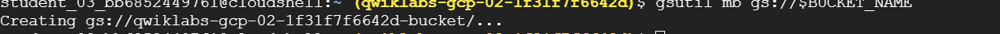
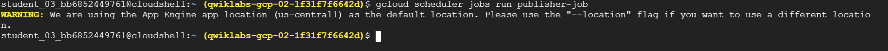

# <https§§§www.cloudskillsboost.google§games§4111§labs§26483>
> <https://www.cloudskillsboost.google/games/4111/labs/26483>

# Stream Processing with Cloud Pub/Sub and Dataflow: Qwik Start

## Setup

```bash
gcloud auth list
gcloud config list project

REGION=us-central1
PROJECT_ID=qwiklabs-gcp-00-0622f9d3d4ef
BUCKET_NAME="${PROJECT_ID}-bucket"

gcloud config set compute/region ${REGION}
gcloud config set project ${PROJECT_ID}
```

FIX: stop and restart dataflow api

## Task 1. Create project resources

```bash

TOPIC_ID=my-id
AE_REGION=us-central

# create bucket
gsutil mb gs://$BUCKET_NAME

# create pub/sub topic
gcloud pubsub topics create $TOPIC_ID

# app engine
gcloud app create --region=$AE_REGION

# Create a Cloud Scheduler job in this project. The job publishes a message to a Pub/Sub topic at one-minute intervals:
gcloud scheduler jobs create pubsub publisher-job --schedule="* * * * *" --topic=$TOPIC_ID --message-body="Hello!"

```



```bash
# strat job
gcloud scheduler jobs run publisher-job
```


```bash
# Use the following commands to clone the quickstart repository and navigate to the sample code directory:

docker run -it -e DEVSHELL_PROJECT_ID=$DEVSHELL_PROJECT_ID python:3.7 /bin/bash

# inside docker image
git clone https://github.com/GoogleCloudPlatform/python-docs-samples.git

cd python-docs-samples/pubsub/streaming-analytics

pip install -U -r requirements.txt  # Install Apache Beam dependencies

```

## Task 2. Review code to stream messages from Pub/Sub to Cloud Storage

https://github.com/GoogleCloudPlatform/python-docs-samples/blob/HEAD/pubsub/streaming-analytics/PubSubToGCS.py

## Task 3. Start the pipeline

```bash

REGION=us-central1
PROJECT_ID=qwiklabs-gcp-00-0622f9d3d4ef
BUCKET_NAME="${PROJECT_ID}-bucket"
TOPIC_ID=my-id

python PubSubToGCS.py \
    --project=$PROJECT_ID  \
    --region=$REGION \
    --input_topic=projects/$PROJECT_ID/topics/$TOPIC_ID \
    --output_path=gs://$BUCKET_NAME/samples/output \
    --runner=DataflowRunner \
    --window_size=2 \
    --num_shards=2 \
    --temp_location=gs://$BUCKET_NAME/temp
```
FIX: they forget to def the env var in docker env and py cmd line is wrong

## Task 4. Observe job and pipeline progress


```bash
gsutil ls gs://${BUCKET_NAME}/samples/
```

## Task 5. Cleanup
```bash
gcloud scheduler jobs delete publisher-job

gcloud pubsub topics delete $TOPIC_ID

gsutil -m rm -rf "gs://${BUCKET_NAME}/samples/output*"
gsutil -m rm -rf "gs://${BUCKET_NAME}/temp/*"

gsutil rb gs://${BUCKET_NAME}
```

Next step / learn more

https://cloud.google.com/dataflow/docs/concepts/beam-programming-model
https://cloud.google.com/dataflow/docs/guides/templates/provided-templates#streaming-templates