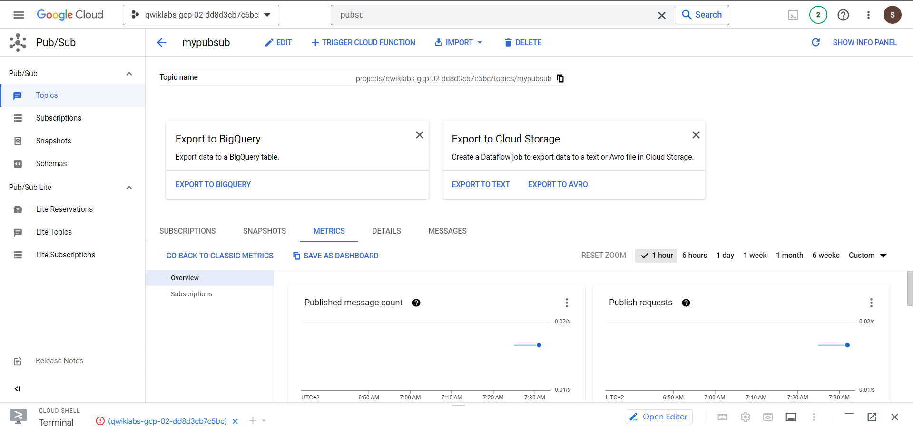
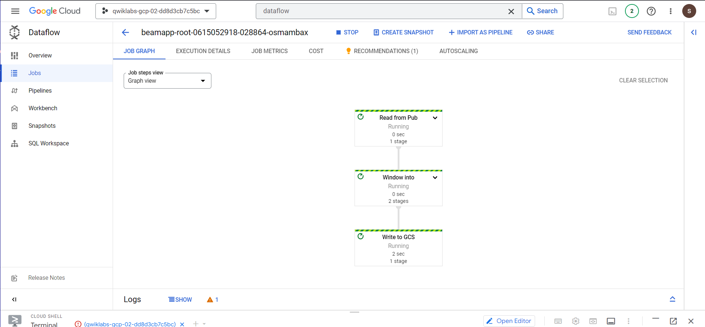
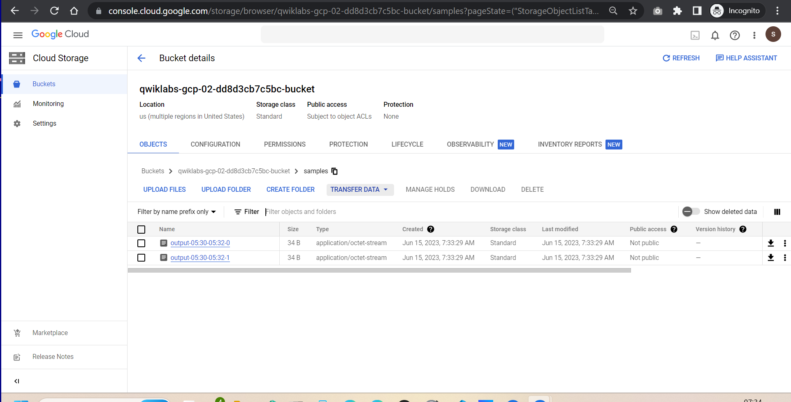
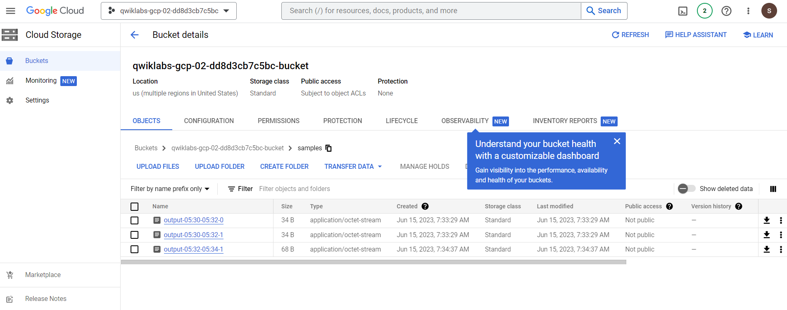

# <https§§§www.cloudskillsboost.google§games§4111§labs§26484>
> <https://www.cloudskillsboost.google/games/4111/labs/26484>

# Create a Streaming Data Lake on Cloud Storage: Challenge Lab


## Setup

```bash
gcloud auth list
gcloud config list project

REGION=us-central1
PROJECT_ID=qwiklabs-gcp-02-dd8d3cb7c5bc
BUCKET_NAME="${PROJECT_ID}-bucket"

gcloud config set compute/region ${REGION}
gcloud config set project ${PROJECT_ID}
```

FIX: stop and restart dataflow api

## Challenge scenario

You are asked to help a newly formed development team with some of their initial work on a live messages streaming project. You have been asked to assist the team with a simulation of streaming live messages into Cloud Storage using Pub/Sub and Dataflow; you receive the following request to complete the following tasks:

Use the command line to create up a Pub/Sub topic.
Use the command line to create a Cloud Scheduler job to publish messages to Pub/Sub on a regular interval.
Use the command line to create a Cloud Storage bucket as the output destination for a Dataflow job.
Use the command line to create and run a Dataflow job to stream data from a Pub/Sub topic to a Cloud Storage bucket, then check the output files in Cloud Storage bucket.

## Task 1. Create a Pub/Sub topic

```bash
TOPIC_ID=mypubsub

# create pub/sub topic
gcloud pubsub topics create $TOPIC_ID
```

## Task 2. Create a Cloud Scheduler job

```bash
AE_REGION=us-central

# app engine
gcloud app create --region=$AE_REGION

# Use the command line to create a Cloud Scheduler job in this project to publish messages at one-minute intervals to the Pub/Sub topic in task 1. Message body: 
gcloud scheduler jobs create pubsub publisher-job --schedule="* * * * *" --topic=$TOPIC_ID --message-body="Hello!"

# strat job
gcloud scheduler jobs run publisher-job
```
## Task 3. Create a Cloud Storage bucket

```bash
# create bucket
gsutil mb gs://$BUCKET_NAME
```


## Task 4. Run a Dataflow pipeline to stream data from a Pub/Sub 

 

```bash
# Use the following commands to clone the quickstart repository and navigate to the sample code directory:

docker run -it -e DEVSHELL_PROJECT_ID=$DEVSHELL_PROJECT_ID python:3.7 /bin/bash

# inside docker image
git clone https://github.com/GoogleCloudPlatform/python-docs-samples.git

cd python-docs-samples/pubsub/streaming-analytics

pip install -U -r requirements.txt  # Install Apache Beam dependencies

```

Start the pipeline

```bash

REGION=us-central1
PROJECT_ID=qwiklabs-gcp-02-dd8d3cb7c5bc
BUCKET_NAME="${PROJECT_ID}-bucket"
TOPIC_ID=mypubsub

python PubSubToGCS.py \
    --project=$PROJECT_ID  \
    --region=$REGION \
    --input_topic=projects/$PROJECT_ID/topics/$TOPIC_ID \
    --output_path=gs://$BUCKET_NAME/samples/output \
    --runner=DataflowRunner \
    --window_size=2 \
    --num_shards=2 \
    --temp_location=gs://$BUCKET_NAME/temp
```
FIX: they forget to def the env var in docker env and py cmd line is wrong

Observe job and pipeline progress






```bash
gsutil ls gs://${BUCKET_NAME}/samples/
```

Cleanup
```bash
gcloud scheduler jobs delete publisher-job

gcloud pubsub topics delete $TOPIC_ID

gsutil -m rm -rf "gs://${BUCKET_NAME}/samples/output*"
gsutil -m rm -rf "gs://${BUCKET_NAME}/temp/*"

gsutil rb gs://${BUCKET_NAME}
```

Next step / learn more

[https://www.cloudskillsboost.google/quests/289](https§§§www.cloudskillsboost.google§quests§289/readme.md)
