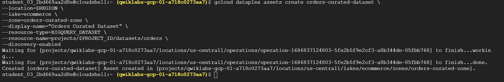
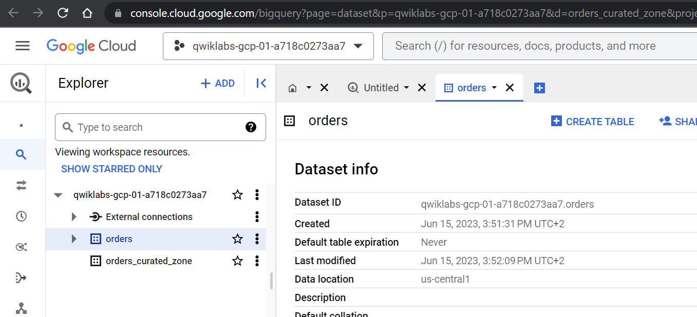

# <https§§§www.cloudskillsboost.google§games§4111§labs§26485>
> <https://www.cloudskillsboost.google/games/4111/labs/26485>

# Dataplex: Qwik Start - Command Line

https://cloud.google.com/dataplex

## Setup and requirements

Enable the Dataplex API and set variables

```bash
gcloud services enable dataplex.googleapis.com 
```


```bash
export PROJECT_ID=$(gcloud config get-value project)
echo $PROJECT_ID

export REGION=us-central1
gcloud config set compute/region $REGION
```


## Task 1. Create a lake

In Dataplex, a lake is the highest organizational domain that represents a specific data area or business unit. 
For example, you can create a lake for each department or data domain in your organization, so that you can organize and provide data for specific user groups.

```bash
gcloud dataplex lakes create ecommerce \
   --location=$REGION \
   --display-name="Ecommerce" --description="Ecommerce Domain"
```


## Task 2. Add a zone to your lake

Zones are subdomains within a lake that you can use to categorize data further.
`For example, you can categorize data by stage, usage, or restrictions.`


```bash
gcloud dataplex zones create orders-curated-zone \
    --location=$REGION \
    --lake=ecommerce \
    --display-name="Orders Curated Zone" \
    --resource-location-type=SINGLE_REGION \
    --type=CURATED \
    --discovery-enabled \
    --discovery-schedule="0 * * * *"
```


## Task 3. Attach an asset to a zone

Data stored in Cloud Storage buckets or BigQuery datasets can be attached as assets to zones within a Dataplex lake.

Create a BigQuery dataset

```bash
bq mk --location=$REGION --dataset orders 
```

Attach the BigQuery dataset to the zone

```bash
gcloud dataplex assets create orders-curated-dataset \
--location=$REGION \
--lake=ecommerce \
--zone=orders-curated-zone \
--display-name="Orders Curated Dataset" \
--resource-type=BIGQUERY_DATASET \
--resource-name=projects/$PROJECT_ID/datasets/orders \
--discovery-enabled 
```





## Task 4. Delete assets, zones, and lakes

 
```bash
# detach bq dataset from the zone
gcloud dataplex assets delete orders-curated-dataset --location=$REGION --zone=orders-curated-zone --lake=ecommerce 

# delete zone
gcloud dataplex zones delete orders-curated-zone --location=$REGION --lake=ecommerce

# delete datalake 
gcloud dataplex lakes delete ecommerce --location=$REGION

```
