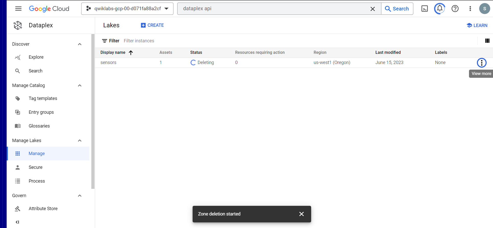

# <https§§§www.cloudskillsboost.google§games§4111§labs§26486>
> <https://www.cloudskillsboost.google/games/4111/labs/26486>

# Dataplex: Qwik Start - Console

## Overview

https://cloud.google.com/dataplex

Dataplex harvests the metadata for both structured and unstructured data, and automatically registers all metadata in a secure, unified metastore. Data and metadata can then be assessed via Google Cloud services such as Data Catalog and BigQuery.

\

```bash
gcloud services enable dataplex.googleapis.com 
```

## Task 1. Create a lake


## Task 2. Add a zone to your lake

 Zones are subdomains within a lake that you can use to categorize data further. For example, you can categorize data by stage, usage, or restrictions.


 For example, the option for Enable metadata discovery under Discovery settings is enabled by default and allows authorized users to discover the data in the zone.


## Task 3. Attach an asset to a zone

Data stored in Cloud Storage buckets or BigQuery datasets can be attached as assets to zones within a Dataplex lake.


add some files anto the gs bucket


look around


### Task 4. Delete assets, zones, and lakes

