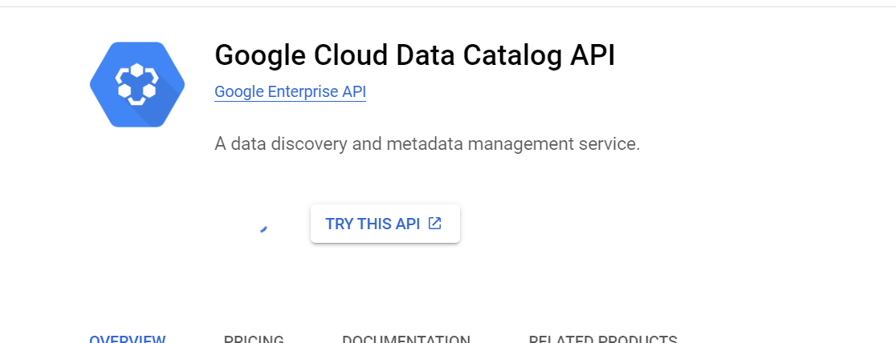
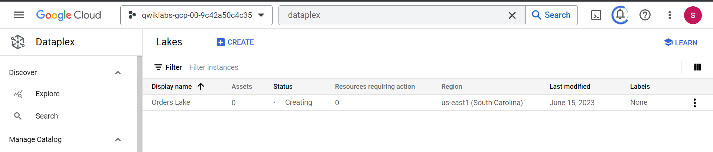
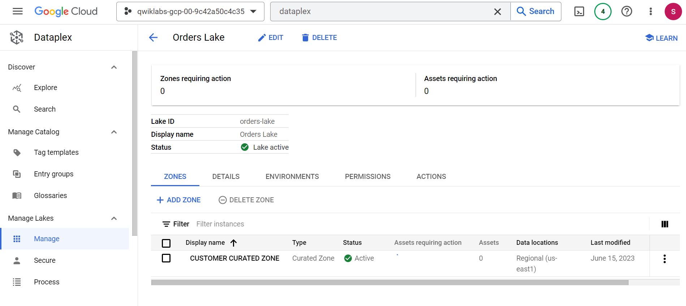
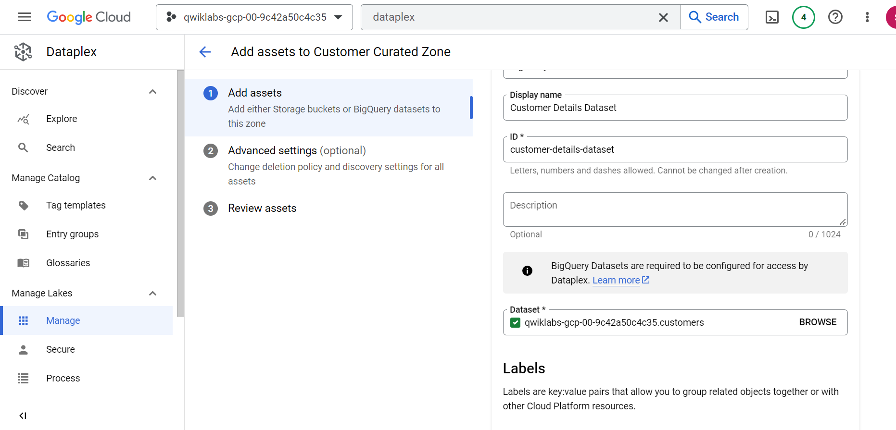
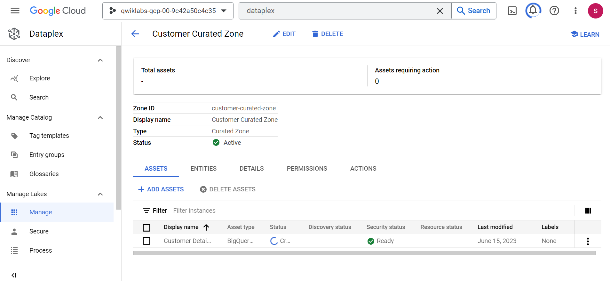
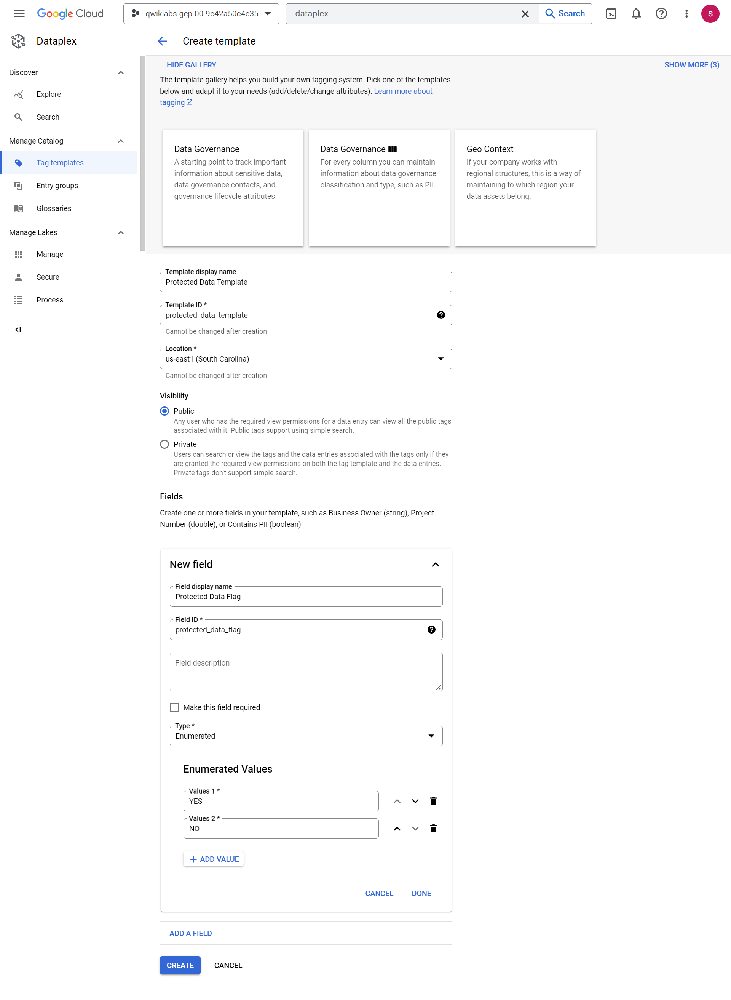
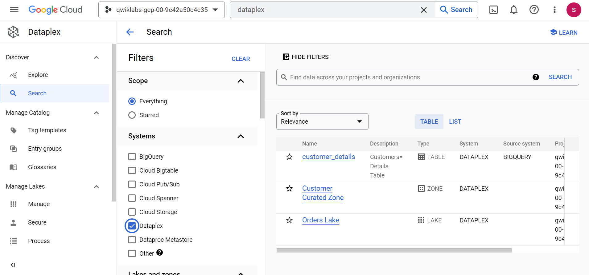
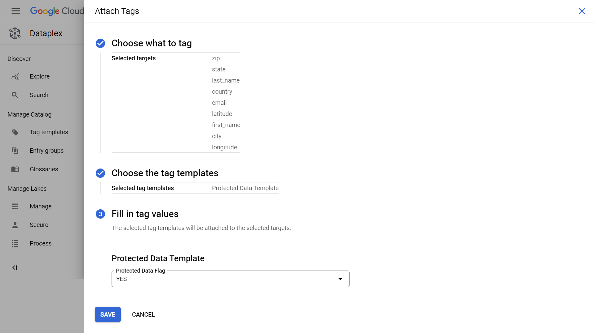
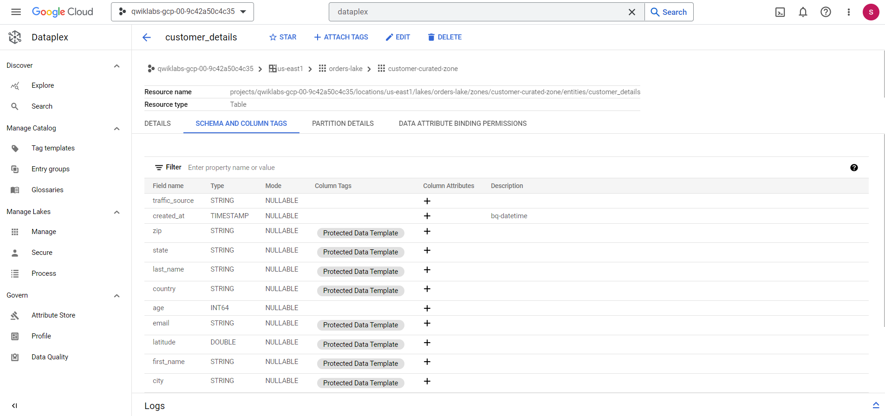

# <https§§§www.cloudskillsboost.google§games§4111§labs§26487>
> <https://www.cloudskillsboost.google/games/4111/labs/26487>

# Tagging Dataplex Assets

## Setup and requirements

Cloud Dataplex API
Cloud Data Catalog API

## Task 1. Create a lake, zone, and asset

you create a new Dataplex lake to store customer order information, add a curated zone to the lake, and then attach a pre-created BigQuery dataset as a new asset in the zone.

create lake

add zone

add asset

## Task 2. Create a tag template

To start tagging data, you first need to create one or more tag templates. A tag template can be a public or private tag template. 

In this task, you create a public tag template to label BigQuery table columns with a protected status. With a public tag template, users who have access to the underlying BigQuery table columns will be able to see the tags applied to the columns

## Task 3. Apply a tag template to Dataplex assets

After you create a tag template, you can use it to attach tags to any number of desired data assets to which you have access.

Click Attach tags.

## Task 4. Search for assets using tags

After you have tagged data assets, you can search for them using Data Catalog within Dataplex.

