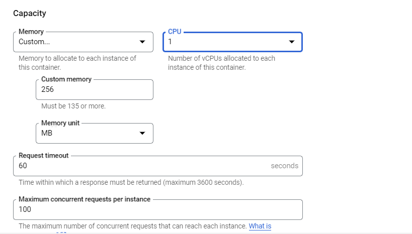

# <https§§§www.cloudskillsboost.google§games§4112§labs§26502>
> <https://www.cloudskillsboost.google/games/4112/labs/26502>

# Cloud Functions 2nd Gen: Qwik Start

[https://cloud.google.com/functions](https§§§cloud.google.com§functions/readme.md)
[https://cloud.google.com/run](https§§§cloud.google.com§run/readme.md)
[https://cloud.google.com/eventarc/docs](https§§§cloud.google.com§eventarc§docs/readme.md)


## Setup and requirements

```bash

gcloud auth list

```

## Task 1. Enable APIs

```bash
export PROJECT_ID=$(gcloud config get-value project)
export REGION=us-east1
gcloud config set compute/region $REGION

gcloud services enable \
  artifactregistry.googleapis.com \
  cloudfunctions.googleapis.com \
  cloudbuild.googleapis.com \
  eventarc.googleapis.com \
  run.googleapis.com \
  logging.googleapis.com \
  pubsub.googleapis.com

```

## Task 2. Create an HTTP function

auth node.js func that responds to http req 
showcase timeout in 10 mins

```bash
# create
mkdir ~/hello-http && cd $_
touch index.js && touch package.json

```

```js
const functions = require('@google-cloud/functions-framework');
functions.http('helloWorld', (req, res) => {
  res.status(200).send('HTTP with Node.js in GCF 2nd gen!');
});
```
```json

{
  "name": "nodejs-functions-gen2-codelab",
  "version": "0.0.1",
  "main": "index.js",
  "dependencies": {
    "@google-cloud/functions-framework": "^2.0.0"
  }
}

```


```bash
# deploy
gcloud functions deploy nodejs-http-function \
  --gen2 \
  --runtime nodejs16 \
  --entry-point helloWorld \
  --source . \
  --region $REGION \
  --trigger-http \
  --timeout 600s \
  --max-instances 1
```


```bash
# test
gcloud functions call nodejs-http-function \
  --gen2 --region $REGION
```


## Task 3. Create a Cloud Storage function

In this section create a Node.js function that responds to events from a Cloud Storage bucket.


### Setup

first grant the pubsub.publisher IAM role to the Cloud Storage service account:

```bash
PROJECT_NUMBER=$(gcloud projects list --filter="project_id:$PROJECT_ID" --format='value(project_number)')
SERVICE_ACCOUNT=$(gsutil kms serviceaccount -p $PROJECT_NUMBER)
gcloud projects add-iam-policy-binding $PROJECT_ID \
  --member serviceAccount:$SERVICE_ACCOUNT \
  --role roles/pubsub.publisher
```

### Create

```bash
mkdir ~/hello-storage && cd $_
touch index.js && touch package.json
```

``` 
const functions = require('@google-cloud/functions-framework');
functions.cloudEvent('helloStorage', (cloudevent) => {
  console.log('Cloud Storage event with Node.js in GCF 2nd gen!');
  console.log(cloudevent);
});


{
  "name": "nodejs-functions-gen2-codelab",
  "version": "0.0.1",
  "main": "index.js",
  "dependencies": {
    "@google-cloud/functions-framework": "^2.0.0"
  }
}

```

```bash
# create bucket
BUCKET="gs://gcf-gen2-storage-$PROJECT_ID"
gsutil mb -l $REGION $BUCKET

# deploy func
gcloud functions deploy nodejs-storage-function \
  --gen2 \
  --runtime nodejs16 \
  --entry-point helloStorage \
  --source . \
  --region $REGION \
  --trigger-bucket $BUCKET \
  --trigger-location $REGION \
  --max-instances 1
```

### test

```bash
# trigger
echo "Hello World" > random.txt
gsutil cp random.txt $BUCKET/random.txt
```

```bash
# check  logs
gcloud functions logs read nodejs-storage-function \
  --region $REGION --gen2 --limit=100 --format "value(log)"
```

## Task 4. Create a Cloud Audit Logs function

[https://cloud.google.com/logging/docs/audit](https§§§cloud.google.com§logging§docs§audit/readme.md)
when a Compute Engine VM instance is created. In response, it adds a label to the newly created VM, specifying the creator of the VM.

### Setup

```bash
# eventarc roles
gcloud projects add-iam-policy-binding $PROJECT_ID \
  --member serviceAccount:$PROJECT_NUMBER-compute@developer.gserviceaccount.com \
  --role roles/eventarc.eventReceiver

# get code
cd ~
git clone https://github.com/GoogleCloudPlatform/eventarc-samples.git

cd ~/eventarc-samples/gce-vm-labeler/gcf/nodejs

```

The index.js file contains the application code that receives the Audit Log wrapped into a CloudEvent

### Deploy
 ```bash
 gcloud functions deploy gce-vm-labeler \
  --gen2 \
  --runtime nodejs16 \
  --entry-point labelVmCreation \
  --source . \
  --region $REGION \
  --trigger-event-filters="type=google.cloud.audit.log.v1.written,serviceName=compute.googleapis.com,methodName=beta.compute.instances.insert" \
  --trigger-location $REGION \
  --max-instances 1
 ```

 ### Test

 

 ## Task 5. Deploy different revisions


## Task 6. Set up minimum instances


## Task 7. Create a function with concurrency




Next Steps / Learn More

[https://cloud.google.com/blog/products/serverless/cloud-functions-2nd-generation-now-generally-available](https§§§cloud.google.com§blog§products§serverless§cloud-functions-2nd-generation-now-generally-available/readme.md)
[https://codelabs.developers.google.com/codelabs/cloud-starting-cloudfunctions-v2#0](https§§§codelabs.developers.google.com§codelabs§cloud-starting-cloudfunctions-v2#0/readme.md)
